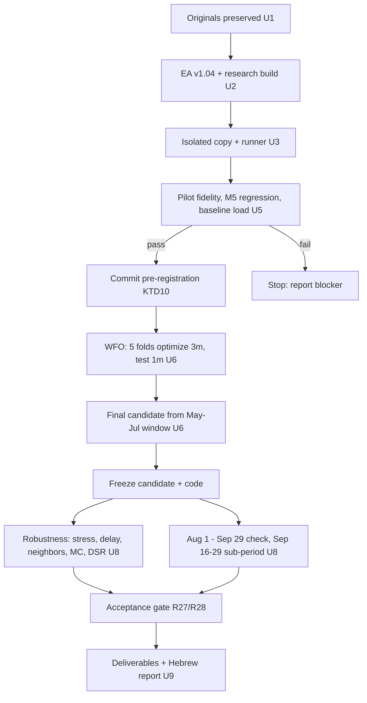

# new_test Robust Parameter Optimization - Plan

## Goal Capsule

- **Objective:** The owner of the MT5 EA `new_test` gets an evidence-backed answer to "is there a parameter set for XAUUSD.s M15 that improves after-cost expectancy and return-to-risk over the original defaults?", delivered as loadable `.set` files, a parameter comparison table, and a Hebrew report that says plainly whether a recommendation is justified.
- **Means:** A reproducible research pipeline that drives the MT5 Strategy Tester headless in an isolated portable copy (KTD1, KTD2), runs a pre-registered walk-forward optimization (KTD6, KTD10), then holdout, Monte Carlo, cost-stress and parameter-stability checks (KTD8, KTD9).
- **Who finishes:** The executing agent runs every unit including the MT5 runs (U5, U6, U8, U9), commits locally (the repo has no remote), and ends with the Hebrew report; merging or live use stays with the user.
- **Product authority:** The user (EA owner). Trading-rule changes beyond R5 need the user's explicit consent before execution.
- **Execution profile:** Research runs are long (MT5 real-tick tests under Wine). Code completion, commits, or a PR are not research completion; the run is complete only when R30-R35 deliverables exist from real MT5 runs, or the report marks the research incomplete with the blocker.
- **Stop conditions:** Stop and ask the user if the isolated copy cannot run the tester without logging into the live account (R3), if M5 regression fails and cannot be fixed without behavior change (R6), or if any step would require touching the live terminal or account.
- **Open blockers:** None. Known ceiling: the R14 sub-period is already verified not independent (a `new_test` M5 test over 2026.09.01-2026.09.28 ran in the live terminal on 2026-09-30 at 17:24), so R28 cannot be met in this research; the best reachable outcome is a candidate delivered for further testing with the forward-test protocol.

---

## Product Contract

### Summary

Optimize the existing SweepOB strategy in `new_test` on XAUUSD.s M15 with real ticks, using a walk-forward protocol fixed before any search. The only code change is a timeframe input whose default keeps the original M5 behavior. The result is a frozen candidate compared with the original code defaults on identical data and risk model, plus a recommended set only if every pre-registered criterion passes.

### Problem Frame

`new_test` is a port of a Pine indicator ("SweepOB-5m"): liquidity sweep, then displacement FVG with a volume filter, structure break, first OB retest, and A/B/C entry confirmation. SL sits at the OB extreme and TP at the nearest untaken pre-sweep pivot. Its parameters were never selected through a documented process. The saved tester profile (`MQL5/Profiles/Tester/new_test.set`) already drifted from the code defaults: `SweepToSetupBars` 96 vs 12, `VolumeMultiplier` 1.5 vs 2.0, `MinVolumeSamples` 15 vs 20, and `OppBreakCancel` is missing. The broker's real ticks for XAUUSD.s start on 2025.11.24, and the user already ran development tests over 2026.01.01-2026.09.15. Clean out-of-sample data is therefore scarce, and any "improvement" found by naive optimization on this history is likely to be selection bias.

### Key Decisions

- **Run on M15 through a new timeframe input whose default is M5.** Governs R5, R6. (session-settled: user-directed — chosen over staying on M5 without code change and over researching both M5 and M15: user wants the strategy on 15-minute bars.)
- **Baseline is the code defaults, not the saved `.set`.** Governs R8, R9. (session-settled: user-directed — chosen over the saved `new_test.set` and over reporting both: the code defaults are the reference.)
- **Data split: WFO on 2025.12.01-2026.07.31; 2026.08.01-2026.09.29 is a non-independent additional historical check.** Governs R12, R13, R14. (session-settled: user-approved — chosen over WFO to 09.15 with a two-week holdout and over no holdout: longer check period, labelled honestly.)
- **Risk model fixed at 1% risk per trade, max 3 positions, leverage 1:100, deposit 10,000 USD, with prop-firm-style loss limits (5% daily, 10% total).** Governs R10, R11, R24. (session-settled: user-approved — chosen over "1% with DD ≤ 20%" and over fixed 0.01 lots: user wants prop-firm-style limits.)
- **Local `/config` runner in an isolated portable MT5 copy, not the built-in MCP or `mt5-quant`.** Governs R1-R4. The built-in MCP (build 6182 installed) is disabled and would have to be enabled inside the live-logged-in terminal, exposing `trade_*` tools. `mt5-quant` force-kills `terminal64.exe`, hardcodes `Period=M1` in optimization, cannot run Model=4 optimizations, forces `ProfitInPips=1` (drops commission and swap), and its macOS optimizer calls Linux-only `taskset`. Its `run_rolling_backtest` is fixed-parameter weekly backtests, not walk-forward.
- **Few, meaningful parameters on one pre-registered grid.** Governs R15, R16. Categorical logic switches (`EntryMode`, `OppBreakCancel`, `OppBreakCancelBeforeTouch`) stay at defaults because they change trade logic more than tuning.

---

### Requirements

**Isolated test environment**

- R1. All tester runs execute in a separate portable MT5 installation outside the live data directory; the live terminal (`Bybit-Live-4`, currently running) is never closed, reconfigured, or attached to.
- R2. The isolated copy contains no account credentials (`accounts.dat`, saved logins) and nothing secret is committed to git.
- R3. The isolated copy runs the tester from locally cached XAUUSD.s history and ticks; if the tester refuses to run offline, work stops and the user is asked before any login or alternative.
- R4. Every run is launched from a generated tester ini through the documented `terminal64.exe /config:` mechanism with `Visual=0`, and the run's report and journal are archived with the exact ini and `.set` used.

**Timeframe input and regression**

- R5. `new_test` gains one input that selects the signal timeframe; its default is M5, and every timeframe-dependent call (chart-period check, `CopyRates`, `iTime`, warm-up, log text) uses that input. No other trading logic changes.
- R6. Before any optimization, the modified EA on M5 is regression-tested against the original EA on identical data, period, and parameters: deal count, deal times, directions, volumes, prices, and final balance must match exactly. A mismatch blocks the research until explained and fixed.
- R7. The original `new_test.mq5` and the saved `new_test.set` are preserved byte-for-byte in the repo and are never overwritten in the MT5 installation.

**Baseline**

- R8. `new_test_original.set` lists every input of the original EA with its code default, including `OppBreakCancel=1` and every key missing from the saved profile.
- R9. The baseline run's report must show that each input loaded with the intended value (report input block compared with the `.set`); the M15 baseline uses the R8 values plus the timeframe input set to M15. An M5 baseline on the same periods is reported for reference only and is never selectable.

**Execution fidelity and costs**

- R10. Every research run uses: symbol XAUUSD.s with the Bybit-Live-4 contract spec, Model=4 (every tick based on real ticks), deposit 10,000, currency USD, leverage 1:100, `LotMode=LOT_RISK`, `RiskPercent=1.0`, `MaxOpenPositions=3`, and `EnableTrading=true`, `DrawObjects=false`, `DebugMode=false`, `PopupAlerts=false`.
- R11. A pilot run verifies from the report and journal that the right EA, set, deposit, currency, leverage, timeframe, and tick model loaded. It also records real-tick coverage, days or minutes where the tester substituted generated ticks, and the commission, swap, and spread the tester applied. The symbol spec (contract size, tick size and value, stops level, commission, swap) is recorded from the spec cached in the isolated copy and compared with the live spec. Running offline never justifies dropping a cost; if commission or swap cannot be reproduced in the tester, it is applied in post-processing from the recorded spec.

**Data windows**

- R12. Development data is 2025.12.01-2026.07.31. Walk-forward uses rolling 3-month training and 1-month out-of-sample windows stepped monthly: train Dec-Feb/test Mar, Jan-Mar/Apr, Feb-Apr/May, Mar-May/Jun, Apr-Jun/Jul (5 folds). These windows are fixed now and never changed after results are seen.
- R13. 2026.08.01-2026.09.29 is an additional historical check that is not independent, because the user's runs covered it up to 09.28. It is run once, after the candidate and code are frozen, and its results never feed selection or changes.
- R14. 2026.09.16-2026.09.29 counts as independent only if tester and terminal logs show it was never tested before this research. It is reported separately and is subject to the same no-feedback rule as R13. Verified during planning: the live tester agent log records a `new_test` test over 2026.09.01-2026.09.28, so this sub-period is not independent; U5 re-confirms it and the report states it.

**Search and selection**

- R15. The only optimized inputs, as a full grid with Optimization=1 (576 passes per window): `PivL` {2,3,4,5}, `PivR` {2,3,4}, `SweepToSetupBars` {6,12,18,24}, `VolumeMultiplier` {1.2,1.5,2.0,2.5}, `ConfirmationBars` {3,6,9}. Because the tester only takes start/step/stop ranges and the `VolumeMultiplier` values are unevenly spaced, each window runs as four complete optimizations of 144 passes, one per fixed `VolumeMultiplier` value, merged into one 576-row grid before scoring. All other inputs stay at R8 defaults. The grid, and therefore the trial count, is never enlarged or re-run with different ranges after results are seen.
- R16. Selection rule applied identically in every training window: discard passes with fewer than T trades or equity drawdown above 10%, where T = 15, or, if the baseline has fewer than 15 trades in that training window, T = max(5, half the baseline's trade count in that window). Only baseline trade counts (never PnL) are read to set T. Score each pass by after-cost recovery factor (net profit / max equity drawdown), with discarded passes scored 0. Smooth each score by the mean over the pass and its grid neighbors at distance 1 on each ordered axis, and choose the highest smoothed score, breaking ties toward the defaults. If no pass survives the filter, that fold uses the baseline set and the event is logged.
- R17. The final candidate is chosen by R16 on the last pre-check training window (2026.05.01-2026.07.31), before R13 or R14 data is run.
- R18. Warm-up and window boundaries: each run starts at its window start and uses the EA's own `WarmupBars` pre-processing from bar history (no trading during warm-up). Positions still open at a window's end are closed by the tester at the end-of-test price, and that is counted in the window where it happens. Training runs never include data after their window end.
- R19. OOS folds are chained chronologically into one equity path: fold k runs with a deposit equal to the ending balance of fold k-1, starting at 10,000. Each month is counted once.
- R20. Every experiment is logged (id, timestamp, purpose, ini, `.set`, period, data window role, result metrics, status including failures) in an append-only experiment log.

**Robustness and uncertainty**

- R21. Monte Carlo uses 10,000 paths with a documented seed and a horizon of one year of trading days (plus the observed OOS length). It includes trade-order shuffling for drawdown and loss-streak distribution. It also includes a stationary block bootstrap of daily OOS PnL on synchronized calendar days, because overlapping positions (up to 3) make trades non-independent. Paths are simulated with the R10 risk model and stop at an R24 breach.
- R22. Cost and execution stress on the stitched OOS: extra round-trip cost of 1× and 2× the median observed spread, a random-delay execution mode run, and commission +50%. Results are reported per scenario.
- R23. Parameter stability: the candidate and each of its distance-1 grid neighbors are re-run on the OOS months outside the final candidate's training window (2026.03 and 2026.04), and the share with positive after-cost PnL is reported. Neighbor results on 2026.05-2026.07 are reported separately and labelled in-sample.
- R24. Loss-limit definitions, stated in the report and used for every breach test: the daily loss limit is breached when equity, including floating PnL, falls below the day's 00:00 broker-server-time balance minus 5% of the initial 10,000 (USD 500). The total loss limit is breached when equity, including floating PnL, falls below a static USD 9,000. Neither limit trails. The report must not claim compliance with any specific prop firm's rules.
- R25. Balance and equity are kept apart: closed-trade drawdown and floating (equity) drawdown are reported separately, and R24 breaches are measured on equity using an intrabar-resolution source that does not change trading behavior (verified by R6-style deal equality).
- R26. Selection bias is quantified: the Deflated Sharpe Ratio of the stitched OOS daily returns is computed with the number of trials from R15 × folds and reported. It gates acceptance only when at least 60 OOS trading days with returns exist.

**Acceptance criteria (fixed before any search)**

- R27. The candidate passes only if all hold on development data. Criteria (b)-(g) measure the walk-forward procedure (stitched OOS of R19, where each month trades its own fold-selected set, compared with the baseline on the same folds and risk model); criterion (j) measures the static delivered candidate. A trade event is all EA entries opened on the same bar in the same direction; (a) and (e) count events, and raw trade counts are reported alongside:
  - (a) at least 30 OOS trade events, as an operational minimum, not evidence of edge;
  - (b) stitched OOS net profit after costs is positive and greater than the baseline's;
  - (c) block-bootstrap 90% confidence interval of mean OOS daily PnL has a lower bound above 0, and the paired bootstrap probability that the candidate's daily PnL minus the baseline's is at most 0 is below 20%;
  - (d) the procedure beats or equals baseline PnL in at least 3 of 5 folds;
  - (e) OOS net profit stays positive after removing the two most profitable trade events, and no single event exceeds 50% of net OOS profit;
  - (f) no R24 breach on the stitched OOS path, and the Monte Carlo probability of any R24 breach within the one-year horizon is at most 10%, with the 95th and 99th percentile equity drawdown reported;
  - (g) OOS net profit stays positive under the 1× spread cost stress of R22;
  - (h) at least 60% of R23 neighbors are profitable after costs;
  - (i) DSR at least 0.90 when R26 makes it gating;
  - (j) the frozen candidate, run on 2026.03-2026.04 (outside its training window) with R19 deposit chaining, has positive after-cost net profit greater than the baseline's on the same months.
- R28. `new_test_recommended.set` is produced only when R27 passes, the R13 check shows no R24 breach and non-negative after-cost PnL, and independent validation is sufficient: R14 is verified independent and contains at least 30 trades with non-negative after-cost PnL and no R24 breach. Otherwise the candidate is delivered for further testing with a written forward-test protocol and is not labelled validated.

**Deliverables**

- R29. `.set` files are UTF-16LE with BOM in MT5 tester format, list every input of the modified EA, and each one is validated by an MT5 run on development data whose report input block matches the file exactly. No holdout data is used for these runs.
- R30. `new_test_original.set` (R8) and `new_test_candidate.set` (R17) are always delivered.
- R31. A parameter table: exact input name, original value, chosen value, range tested, and the reason for the choice.
- R32. A baseline-vs-candidate comparison on the same data and risk model, per fold, stitched OOS, R13 check, and R14 sub-period: net profit, trades, win rate, expectancy per trade, profit factor, recovery factor, balance and equity drawdown, and R24 breaches.
- R33. Reproduction package in the repo: code, generated inis, experiment log, MT5 reports (htm/xml), deal lists, equity series, Monte Carlo outputs, and charts.
- R34. A short Hebrew report that states criteria (b)-(g) measure the re-optimization procedure and (j) the static set: which parameters changed, measured improvement, whether the candidate passed each R27/R28 criterion, limitations, and next step. If there is no robust improvement, it says so explicitly and recommends no change.
- R35. If a blocker prevented the MT5 runs, the report marks the research incomplete and invents no results.

---

### Acceptance Examples

- AE1. **Covers R16.** Given a training window where only 8 of 576 passes have at least 15 trades and equity drawdown of 10% or less, when the rule runs, then all other passes score 0 and the chosen pass is the one with the highest neighbor-smoothed score, which may be a surviving pass surrounded by zeros that loses to a slightly weaker pass in a surviving cluster.
- AE2. **Covers R16.** Given a training window where no pass survives the filter, when the rule runs, then the fold's OOS month runs with the baseline set and the log records "no eligible pass".
- AE3. **Covers R27, R28.** Given a candidate that passes R27 but R14 holds 11 trades, when deliverables are produced, then `new_test_recommended.set` is not written and the report delivers the candidate for further testing with the forward protocol.
- AE4. **Covers R13.** Given the R13 check shows the candidate losing, when the report is written, then the candidate is not changed and the loss is reported as found.
- AE5. **Covers R24.** Given a day where balance at 00:00 is 10,400 and equity dips to 9,890 intraday while positions are open, then a daily-limit breach is recorded (floor 9,900) even though every trade later closes in profit.

### Scope Boundaries

- No trading-rule changes beyond R5; logic switches stay at defaults.
- No optimization of risk, leverage, lot mode, or `MaxOpenPositions`; results are never improved by increasing risk.
- No demo or live forward testing, and no order placement in any account.
- No grid expansion or window change after results are seen (R12, R15).
- M5 is used only for R6 regression and the R9 reference baseline.

### Dependencies / Assumptions

- The broker's real ticks for XAUUSD.s run from 2025.11.24 onward and are cached locally through 2026.09.30; earlier tick history is unavailable, so fewer trades on M15 limit statistical power.
- Tester journals show 2 whole days and about 3,590 minute bars in 2026.01.01-2026.09.15 where real ticks were discarded and generated ticks used; R11 quantifies this per window.
- Broker server time appears to be GMT+2 or GMT+3 (terminal log shows GMT+2 on the host); the exact server offset used for R24 day boundaries is determined from the data.
- Machine has 10 cores; about 576 passes per window × 6 optimization windows is the compute budget.

### Sources / Research

- EA source: `MQL5/Experts/new_test.mq5` v1.03 in the live MT5 data directory (M5 lock at `OnInit`, `CopyRates(_Symbol, PERIOD_M5, ...)` in `OnInit` and `OnTick`, `iTime(_Symbol, PERIOD_M5, 1)`).
- MT5 command-line tester keys: https://www.metatrader5.com/en/terminal/help/start_advanced/start
- MT5 built-in MCP: https://www.metatrader5.com/en/terminal/help/mcp_and_ai/capabilities (build 6060+, HTTP server that must be enabled in terminal options).
- `mt5-quant` source review: https://github.com/masdevid/mt5-quant (`src/optimization/optimizer.rs:190,247` Period=M1; `pipeline/backtest.rs:1747` ProfitInPips=1; `pipeline/backtest.rs:1778-1889` kills terminal).
- Monte Carlo starting point: https://www.mql5.com/en/articles/23980 (trade shuffle only; final profit invariant under shuffle; reuse the Deals-table parsing idea).

---

## Planning Contract

**Product Contract preservation:** changed before any search, within the acceptance-criteria authority the user delegated ("set them before the search starts"): R15 (grid split into four optimizations per window, same 576 values), R16 (trade floor adapts to baseline trade count), R23 and R27h (neighbor stability scored out-of-sample only), R27 (trade events, criterion j for the static set), R13/R14 (verified prior use of Aug-Sep data), R34 (labelling). The three "Deferred to Planning" questions were resolved in place by KTD5, KTD11, and KTD6 and removed from Outstanding Questions.

**Target environment:** repo `nwq-mql5` (this repo, local git, no remote). MT5 live data directory `~/Library/Application Support/net.metaquotes.wine.metatrader5/drive_c/Program Files/MetaTrader 5` is read-only input: logs, cached XAUUSD.s bars and ticks, and existing reports are read, never written.

### Key Technical Decisions

- KTD1. **Isolated copy lives in its own Wine prefix outside the repo, populated by a selective copy.** Governs R1, R2, R3. It holds the terminal, tester and editor binaries, `MQL5/Include`, the XAUUSD.s bars and ticks for `Bybit-Live-4`, and the symbol spec. The post-copy check is an allowlist: the prefix's MT5 directory may contain only the enumerated binaries, `MQL5/Include`, the research `MQL5/Experts` files, `Bases/Bybit-Live-4/{symbols, history/XAUUSD.s, ticks/XAUUSD.s}`, and a freshly generated minimal `config/` with no Login, Password, or community keys. Any other file (for example `accounts.dat`, `community.ini`, `certificates/`, `virtualhosts.dat`, `Bases/*/trades`, `Chats`, `subscriptions`, `mql5.market.personal.dat`) fails the build. A separate prefix (created with the Wine bundled in `MetaTrader 5.app`) avoids sharing the running terminal's wineserver. A full 13 GB copy does not fit the 29 GB free disk; the selective copy is about 1 GB.
- KTD2. **Every run is `terminal64.exe /portable /config:<ini>` with `ShutdownTerminal=1`, waited on by PID.** Governs R1, R4. On timeout the runner shuts down only the isolated prefix with `wineserver -k` under `WINEPREFIX=<isolated prefix>`, after asserting that this path differs from the live prefix, and waits until no process of that prefix remains. It never uses name-based kills (`pkill`, `killall`), `wineboot`, or `wineserver -k` without the isolated `WINEPREFIX`, because those could hit the live terminal. Each run gets a directory holding the ini, `.set`, report, tester journal slice, agent log slice, research CSVs, and a manifest with SHA-256 of the `.ex5`, `.set`, and ini.
- KTD3. **Compile with MetaEditor's command line inside the isolated copy.** Governs R5, R6. The compile log must show 0 errors, and the `.ex5` hash goes into every run manifest, so a report can always be tied to the exact binary.
- KTD4. **Timeframe input: `SignalTF` of type `ENUM_TIMEFRAMES`, default `PERIOD_M5`.** Governs R5. `OnInit` keeps the original guard in the form "chart period must equal `SignalTF`", and every `PERIOD_M5` literal plus the " M5 " log strings are replaced by the input. The 24-hour volume window (86400 s) is time-based and stays as is. Version becomes 1.04.
- KTD5. **Intrabar equity comes from a research build, not from the delivered EA.** Governs R24, R25. A wrapper source defines `RESEARCH_LOG` and includes `new_test.mq5`. The logging code sits under `#ifdef RESEARCH_LOG` and runs at the top of `OnTick`, before the new-bar early return. Per broker-server day it records balance and equity at the first tick, minimum and maximum equity, closing balance and equity, and the median spread. It writes a CSV to the tester agent's local `MQL5/Files` under a research-only `ResearchRunTag` input. It never touches trading state. Under the same define, `OnTester` returns the non-annualized Sharpe of the daily close-to-close returns as the custom criterion, and sends one optimization frame per pass (`FrameAdd`) holding the daily records and per-deal volume, commission, and swap; `OnTesterDeinit` writes all frames of an optimization to one CSV. Training optimizations therefore run on the research build with CSV output per run disabled. The delivered `new_test.ex5` does not contain this code. R6-style deal equality between the research and delivered builds is checked in U5.
- KTD6. **Search uses the tester's complete (non-genetic) optimization over the R15 grid; scoring is in Python.** Governs R15, R16. The optimization XML report (SpreadsheetML) carries per pass the inputs, profit, trades, profit factor, expected payoff, recovery factor, Sharpe, and equity DD%, and the KTD5 frames add daily records and per-deal costs, so R16 scores after-cost recovery factor with the KTD11 correction applied per pass. The tester's own `OptimizationCriterion` is set to custom (6) and not used for ranking. If a needed column is missing, U4's parser fails loudly rather than defaulting.
- KTD7. **OOS chaining by deposit.** Governs R19. Fold k's OOS run uses deposit = fold k-1's final balance, rounded to cents. Baseline folds are chained the same way on their own path.
- KTD8. **Statistics.** Governs R21, R27c. Daily records (close-to-close return plus the intraday minimum-equity return relative to the day's opening balance) are the resampling unit. The stationary bootstrap (Politis-Romano) uses mean block length 5 trading days, 10,000 resamples, and seed 20260930. The Monte Carlo horizon is 252 trading days, and paths stop at the first R24 breach. Trade-order shuffling operates on trade events, each as its realized PnL divided by balance at entry, compounded. Final equity is therefore invariant under shuffle, and the report says so.
- KTD9. **Deflated Sharpe Ratio.** Governs R26. Follows Bailey and López de Prado (2014), with trials N = 576 × 5 = 2,880. The cross-trial Sharpe variance is estimated from the training-grid daily-return Sharpe values carried in the optimization custom column (KTD5), and skew and kurtosis from the stitched OOS daily returns.
- KTD10. **Pre-registration is a committed file.** Governs R12, R15, R16, R27. A machine-readable file holds windows, grid, filters, scoring, acceptance thresholds, seed, and stress levels. It is committed before the first optimization run and read by the pipeline, so code cannot silently drift from the plan. Any later edit to it counts as a protocol deviation and is logged as one.
- KTD11. **Cost fidelity is checked against live-produced evidence, read-only.** Governs R11. Commission and swap in isolated-copy reports are compared with the XAUUSD.s tester reports that the live terminal already produced (`ASGG_*.htm` in the live data directory) and with the cached symbol spec. If the isolated tester applies less than the evidence shows, the difference is added in post-processing per deal and the report says so.
- KTD12. **Artifacts.** Governs R33. Raw run directories live outside git in `runs/` (gitignored), because tick-level logs are large. Curated evidence is committed under `results/`: the reports, optimization XMLs, deal CSVs, and research CSVs for every run that feeds a number in the report, plus the experiment log.

### High-Level Technical Design

Pipeline and data roles:



Data windows (all real ticks, M15):

| Role | Period | Used for selection? |
|---|---|---|
| Fold 1 train / test | 2025.12.01-2026.02.28 / 2026.03 | train only |
| Fold 2 train / test | 2026.01.01-2026.03.31 / 2026.04 | train only |
| Fold 3 train / test | 2026.02.01-2026.04.30 / 2026.05 | train only |
| Fold 4 train / test | 2026.03.01-2026.05.31 / 2026.06 | train only |
| Fold 5 train / test | 2026.04.01-2026.06.30 / 2026.07 | train only |
| Final candidate train | 2026.05.01-2026.07.31 | yes (R17) |
| Additional check, not independent | 2026.08.01-2026.09.29 | never |
| Independent sub-period (if verified) | 2026.09.16-2026.09.29 | never |

Tester `ToDate` is exclusive of the end day, so each window's ini uses the day after its last day.

### Assumptions

- The isolated terminal can resolve the XAUUSD.s spec and run Model=4 from cached data without an account; U5 verifies this first and R3 stops the run if not.
- A complete optimization of 576 passes over 3 months of M15 real ticks fits in a few hours on 10 cores; the pilot measures pass time, and runtime alone never changes the grid.
- The tester provides enough bar history before each `FromDate` for 3,000 M15 warm-up bars; the pilot journal line "Warm-up bars: N" confirms it.

### Risks & Dependencies

| Risk | Mitigation |
|---|---|
| Tester refuses offline or lacks the symbol spec | U5 checks first; R3 stop and ask; no login fallback without consent |
| A runner bug kills the live terminal | KTD2 PID-only termination; a unit test asserts no name-based kill exists |
| Disk fills (29 GB free) | Selective copy (KTD1); research CSVs at daily granularity; runner aborts when free space drops below 5 GB |
| Too few trades for inference | R27a floor; the report states power limits; no grid expansion |
| Generated-tick substitution on some days | R11 records per window; days with substitution are listed in the report |
| Wine prefix creation fails on this macOS | U3 surfaces the error and the run stops to ask the user (Goal Capsule stop condition); nothing is installed under the live prefix without explicit consent |

### Sequencing

U1 → U2 → U3 → U4 → U7 (pure Python, testable before MT5 runs) → U5 → U6 → U8 → U9.

---

## Output Structure

```text
original/                      byte copies of v1.03 source and saved .set (R7)
mql5/Experts/new_test.mq5      v1.04 with SignalTF (R5)
mql5/Experts/new_test_research.mq5   defines RESEARCH_LOG, includes new_test.mq5 (KTD5)
research/
  preregistration.json         frozen protocol (KTD10)
  mt5r/                        Python package: env, runner, ini, setfile, reports, wfo, metrics, stats, mc, stress, deliver
  cli.py                       entry point for every pipeline step
  tests/                       pytest suite with small fixtures
results/                       curated committed evidence (KTD12)
runs/                          raw run directories (gitignored)
deliverables/                  .set files, tables, comparison, charts, report_he.md
```

---

## Implementation Units

### U1. Repository scaffold and preserved originals

**Goal:** Put the original EA and saved profile under version control unchanged, and set up the repo layout and ignore rules.

**Requirements:** R7, R2, R33

**Dependencies:** none

**Files:**
- `original/new_test_v1.03.mq5`
- `original/new_test_saved.set`
- `original/SHA256SUMS`
- `.gitignore`
- `research/config.example.yaml`
- `README.md`

**Approach:**
1. Copy the two files byte for byte from the live data directory and record their SHA-256 values.
2. Ignore `runs/`, local config, Python caches, and any `*.dat` file.
3. `config.example.yaml` holds path placeholders only: live data directory (read-only), isolated prefix path, and Wine binary.

**Test scenarios:**
- A checksum check over `original/` matches the recorded SHA-256 values.
- `git check-ignore` confirms `runs/` and `research/config.yaml` are ignored.

**Verification:** Originals are committed with matching hashes; no secret-bearing file is tracked.

### U2. EA v1.04: signal timeframe input and research logging build

**Goal:** Implement the one allowed code change and the behavior-neutral research build.

**Requirements:** R5, R6, R25, R24

**Dependencies:** U1

**Files:**
- `mql5/Experts/new_test.mq5`
- `mql5/Experts/new_test_research.mq5`
- `research/tests/test_ea_source.py`

**Approach:**
1. Start from `original/new_test_v1.03.mq5` and apply KTD4: every timeframe-bearing site (`OnInit` guard and its messages, warm-up `CopyRates`, `OnTick` `iTime` and `CopyRates`, " M5 " log text, `Comment` text) uses `SignalTF`.
2. Add the KTD5 logging block under `#ifdef RESEARCH_LOG` with its own input, so the delivered compile has exactly one new input.
3. The research wrapper contains only the define and the include.

**Patterns to follow:** existing input groups and naming in `original/new_test_v1.03.mq5`; `Say`/`Print` style for log text.

**Test scenarios:**
- A source scan finds no remaining `PERIOD_M5` literal outside the `SignalTF` default.
- A source scan confirms `SignalTF` defaults to `PERIOD_M5` and that the only input added outside `#ifdef RESEARCH_LOG` is `SignalTF`.
- A diff between v1.03 and v1.04 with the logging block and timeframe sites masked is empty (no incidental logic edits).
- Integration (in U5): the M5 deal equality between v1.03, v1.04, and the research build.

**Verification:** Both files compile with 0 errors in U5; the source tests pass.

### U3. Isolated MT5 environment and runner

**Goal:** Build the credential-free isolated terminal and a runner that executes one tester job safely and archives it.

**Requirements:** R1, R2, R3, R4, R11

**Dependencies:** U1

**Files:**
- `research/mt5r/env.py`
- `research/mt5r/runner.py`
- `research/mt5r/ini.py`
- `research/mt5r/compile.py`
- `research/cli.py`
- `research/tests/test_env.py`
- `research/tests/test_runner.py`
- `research/tests/test_ini.py`

**Approach:**
1. `env` creates the prefix and performs the KTD1 selective copy, generates the minimal `config/`, runs the allowlist check, and writes a manifest of copied files.
2. `ini` renders `[Tester]` keys from the documented list (Expert, Symbol, Period, Model, FromDate, ToDate, ForwardMode=0, Deposit, Currency, Leverage, ExecutionMode, Optimization, OptimizationCriterion, Report, ReplaceReport, ShutdownTerminal, Visual=0) plus `[TesterInputs]` from a `.set`, as UTF-16LE.
3. `runner` launches per KTD2 with a timeout, harvests the report and the journal slice for its run, copies research CSVs out of the agent directories by run tag, and appends to the experiment log (U4).
4. `compile` invokes MetaEditor's CLI per KTD3 and parses the compile log.

**Execution note:** Prove the environment with a smoke run before building more on it; runtime evidence outranks unit tests here.

**Test scenarios:**
- A rendered ini for an M15 Model=4 job contains `Period=M15`, `Model=4`, `Deposit=10000`, `Currency=USD`, `Leverage=1:100`, `Visual=0`, `ShutdownTerminal=1`, and the exclusive `ToDate`.
- The allowlist check rejects a planted `config/accounts.dat`, `config/community.ini`, `config/certificates/`, `config/virtualhosts.dat`, and a `common.ini` carrying a Login key, each separately.
- The runner source contains no `pkill`, `killall`, or `wineboot`, and every `wineserver` call passes the isolated `WINEPREFIX` (static check).
- The timeout path refuses to run when the isolated prefix equals or contains the live prefix (mocked test).
- A run whose report never appears ends as status `failed` with the journal tail captured and is still logged.

**Verification:** The smoke run in U5 produces an archived run directory with manifest, report, and journal.

### U4. Set files, report parsing, experiment log

**Goal:** Read and write MT5 `.set` files and parse every report and journal the pipeline relies on.

**Requirements:** R8, R9, R11, R20, R29

**Dependencies:** U1

**Files:**
- `research/mt5r/setfile.py`
- `research/mt5r/reports.py`
- `research/mt5r/journal.py`
- `research/mt5r/explog.py`
- `research/tests/test_setfile.py`
- `research/tests/test_reports.py`
- `research/tests/test_journal.py`
- `research/tests/fixtures/`

**Approach:**
1. `setfile` extracts every `input` from an `.mq5` (name, type, default, enum values) and writes full `.set` files in tester format (`name=value||start||step||stop||Y/N`, UTF-16LE with BOM). It also reads existing `.set` files, including the saved one that lacks `OppBreakCancel`.
2. `reports` parses the single-test HTML (UTF-16, Hebrew or English labels, located by structure rather than label text): the inputs block, summary metrics, and the deals table with commission and swap. It also parses the optimization XML (KTD6).
3. `journal` extracts real-tick start, "real ticks discarded" lines, generated-tick minutes, "Warm-up bars", "initialised" lines, and the final balance.
4. `explog` is append-only JSONL with a derived CSV view (R20 fields).

**Patterns to follow:** the Deals-table location approach from the MQL5 Monte Carlo article, with the fixes noted in Sources (no off-by-one, include commission and swap).

**Test scenarios:**
- Extracting inputs from `original/new_test_v1.03.mq5` yields 25 inputs, including `OppBreakCancel` default 1 and `EntryMode` default 0.
- Covers R8: writing the original set and re-reading it round-trips every value, and `OppBreakCancel=1` is present.
- Reading `original/new_test_saved.set` reports `OppBreakCancel` as missing.
- A Hebrew-label report fixture and an English-label fixture parse to identical metrics.
- An optimization XML fixture with 3 passes returns 3 rows with all KTD6 columns; a fixture missing Recovery Factor raises.
- A journal fixture with the known 2026 lines returns 2 discarded days and 3,590 generated minutes.

**Verification:** Parsers run on the first real pilot report in U5 without error and agree with the report's own totals.

### U7. Metrics, loss limits, statistics, Monte Carlo, stress

**Goal:** Pure-Python analytics used by selection, acceptance, and reporting.

**Requirements:** R16, R19, R21, R22, R24, R25, R26, R27

**Dependencies:** U4

**Files:**
- `research/mt5r/metrics.py`
- `research/mt5r/limits.py`
- `research/mt5r/wfo.py`
- `research/mt5r/stats.py`
- `research/mt5r/montecarlo.py`
- `research/mt5r/stress.py`
- `research/tests/test_metrics.py`
- `research/tests/test_limits.py`
- `research/tests/test_wfo.py`
- `research/tests/test_stats.py`
- `research/tests/test_montecarlo.py`
- `research/tests/test_stress.py`

**Approach:**
1. `wfo` builds windows from the pre-registration and implements R16 scoring, neighbor smoothing and tie-breaks, plus R19 chaining.
2. `limits` implements R24 on the KTD5 daily records.
3. `stats` implements the KTD8 bootstrap, the paired bootstrap, and KTD9 DSR/PSR.
4. `montecarlo` implements KTD8 paths with breach stopping; `stress` implements R22 post-processing.

**Test scenarios:**
- Covers AE1: on a synthetic 4×3 grid with an isolated high pass surrounded by filtered passes, smoothing selects the cluster pass.
- Trade floor T: baseline count 40 gives T=15; baseline count 12 gives T=6; baseline count 4 gives T=5.
- Merging four 144-row optimization tables yields 576 unique parameter combinations, and a duplicate or missing combination raises.
- Trade events: three entries on the same bar and direction form one event whose PnL is their sum; entries one bar apart form two events.
- Covers AE2: a grid where all passes fail the filter returns "no eligible pass" and the baseline.
- A tie between two smoothed scores resolves to the pass closer to the defaults.
- Covers AE5: day record open balance 10,400 and min equity 9,890 yields a daily breach, while 9,901 does not.
- Total limit: min equity 9,000.00 is not a breach, 8,999.99 is.
- Chaining: fold deposits follow the previous fold's final balance.
- Bootstrap with a fixed seed is reproducible, and on a constant positive series the CI lower bound is positive.
- DSR on a known published example matches within tolerance, and N=1 reduces to PSR.
- Shuffle MC keeps final equity identical across paths while max drawdown varies.
- Block-bootstrap MC stops a path at the first breach and counts it once.
- Stress with a 2× spread cost reduces PnL by exactly 2 × spread × lots × contract size per trade.

**Verification:** All unit tests pass; functions have no MT5 dependency.

### U5. Pilot fidelity, M5 regression, baseline load check

**Goal:** Prove the environment tests what we think it tests before any search.

**Requirements:** R3, R6, R8, R9, R10, R11, R14

**Dependencies:** U2, U3, U4

**Files:**
- `research/cli.py`
- `results/pilot/`
- `results/regression_m5/`
- `results/baseline_load/`
- `results/fidelity.md`
- `results/independence_check.md`

**Approach:**
1. Compile v1.03, v1.04, and the research build in the isolated copy (KTD3).
2. Pilot: v1.04 baseline on M15 for 2026.03 with Model=4. Record R11 items from the report and journal, pass time, and the trade count. Stop per R3 on failure.
3. Regression: v1.03 vs v1.04 vs research build on M5, 2026.03.01-2026.03.31, R8 defaults. Deals are compared field by field, as is the final balance. Also run one small research-build optimization and confirm its frames CSV and custom column are produced and its pass results equal delivered-build single runs for two sampled passes.
4. Baseline load: the report inputs block equals the generated `.set` for every key.
5. Costs per KTD11, spec capture, and server-time offset from the deal and day boundaries.
6. The R14 independence scan reads live terminal, tester, and agent logs (read-only) for any `new_test` or `SweepOB` test whose period reaches 2026.09.16 or later.
7. Any line quoted from the live data directory into `results/` passes through a redactor that masks account numbers and IP addresses.

**Execution note:** Any mismatch here stops the pipeline; do not start U6 on a failed gate.

**Test scenarios:**
- Test expectation: runtime gate; the evidence is the archived runs plus `results/fidelity.md` checklist items, each marked pass or fail with the source line.

**Verification:** `results/fidelity.md` shows all items passing; regression deal lists are identical.

### U6. Pre-registration freeze, walk-forward, final candidate

**Goal:** Run the fixed protocol and freeze a candidate without touching check-period data.

**Requirements:** R12, R15, R16, R17, R18, R19, R20

**Dependencies:** U5, U7

**Files:**
- `research/preregistration.json`
- `research/mt5r/pipeline.py`
- `results/wfo/`
- `results/final_selection/`
- `deliverables/new_test_candidate.set`

**Approach:**
1. Commit `preregistration.json` (KTD10) before the first optimization.
2. For each fold: run the baseline on the training window and read only its trade count (sets T in R16), run the four complete optimizations on train with the research build, apply R16 to the merged grid, then run the selected set and the baseline on the OOS month with chained deposits using the research build.
3. Run the final selection on 2026.05.01-2026.07.31 and write the candidate `.set`.
4. Commit the candidate and code as the frozen point before U8.

**Test scenarios:**
- An integration dry run with a mocked runner produces the expected sequence of ini files with correct dates and deposits and no ini touching dates after 2026.07.31.
- The pipeline refuses to start when `preregistration.json` has uncommitted changes.

**Verification:** Five OOS folds and the final selection are archived and logged, and the freeze commit exists before any check-period run.

### U8. Robustness and check periods

**Goal:** Produce all R21-R27 evidence and the R13/R14 check results for the frozen candidate.

**Requirements:** R13, R14, R21, R22, R23, R24, R25, R26, R27, R28

**Dependencies:** U6

**Files:**
- `results/robustness/`
- `results/check_period/`
- `results/acceptance.json`

**Approach:**
1. Stress: random-delay runs of the stitched OOS for candidate and baseline, then post-processed cost scenarios.
2. Parameter stability per R23, plus criterion (j): the frozen candidate and the baseline on 2026.03-2026.04 with chained deposits.
3. M5 reference baseline per R9: the baseline with the timeframe input at M5 over the five OOS months (chained) and over the R13 period, reported as reference only.
4. Monte Carlo and DSR over the stitched OOS.
5. Check-period runs for candidate and baseline over 2026.08.01-2026.09.29 and over 2026.09.16-2026.09.29.
6. Evaluate R27 and R28 into `acceptance.json`, one entry per criterion with the value, threshold, and pass/fail.

**Test scenarios:**
- Covers AE3: an acceptance evaluation fixture with R27 passing and 11 trades in the sub-period yields `recommended: false` with the reason.
- Covers AE4: the candidate `.set` hash before and after U8 is identical.

**Verification:** `acceptance.json` covers every R27/R28 criterion, and the candidate hash is unchanged.

### U9. Deliverables and Hebrew report

**Goal:** Produce and validate every deliverable.

**Requirements:** R28, R29, R30, R31, R32, R33, R34, R35

**Dependencies:** U8

**Files:**
- `research/mt5r/deliver.py`
- `deliverables/new_test_original.set`
- `deliverables/new_test_candidate.set`
- `deliverables/new_test_recommended.set` (only if R28)
- `deliverables/new_test.mq5`
- `deliverables/parameter_table.md`
- `deliverables/comparison.md`
- `deliverables/charts/`
- `deliverables/report_he.md`
- `deliverables/forward_test_protocol.md` (when not recommended)
- `research/tests/test_deliver.py`

**Approach:**
1. Validate each `.set` by a run of the delivered build on a development window, and compare the report inputs block with the file.
2. Build the tables and charts: stitched OOS equity for candidate vs baseline, per-fold bars, MC drawdown distribution, and a parameter neighborhood heatmap.
3. Write the Hebrew report through the `ce-noslop` discipline, quoting numbers only from `results/`.

**Test scenarios:**
- Covers R28: the recommended file is not written when `acceptance.json` has any failing criterion or insufficient independent validation.
- The parameter table lists all 5 optimized inputs with original value, chosen value, and tested range from the pre-registration.
- Every number in `comparison.md` traces to a file under `results/`, checked by a generator that refuses missing keys.

**Verification:** The deliverables exist, the validation runs match, and the report states the pass or fail of each criterion.

---

## Verification Contract

- `python -m pytest research/tests` passes.
- The MetaEditor compile of `mql5/Experts/new_test.mq5` and `mql5/Experts/new_test_research.mq5` reports 0 errors and 0 warnings introduced relative to v1.03.
- `results/fidelity.md` passes every item: Model=4, M15, deposit 10,000 USD, leverage 1:100, generated-tick share recorded, costs reconciled.
- M5 regression: deal lists of v1.03, v1.04, and the research build are identical.
- Every number in the Hebrew report traces to `results/`, and the experiment log lists every run, including failures.
- No process outside the runner's own PIDs was signalled, and the live data directory's files have unchanged modification times, except logs the live terminal itself writes.

## Definition of Done

- U1-U9 are complete, and research runs actually executed; or the report states the research is incomplete and names the blocker (R35).
- `new_test_original.set`, `new_test_candidate.set`, the parameter table, the comparison, and the Hebrew report exist; `new_test_recommended.set` exists only if R28 holds.
- The pre-registration commit precedes all optimization runs, and the freeze commit precedes all check-period runs.
- No experimental or dead code from abandoned attempts remains in the diff.
- All work is committed locally (no remote).
