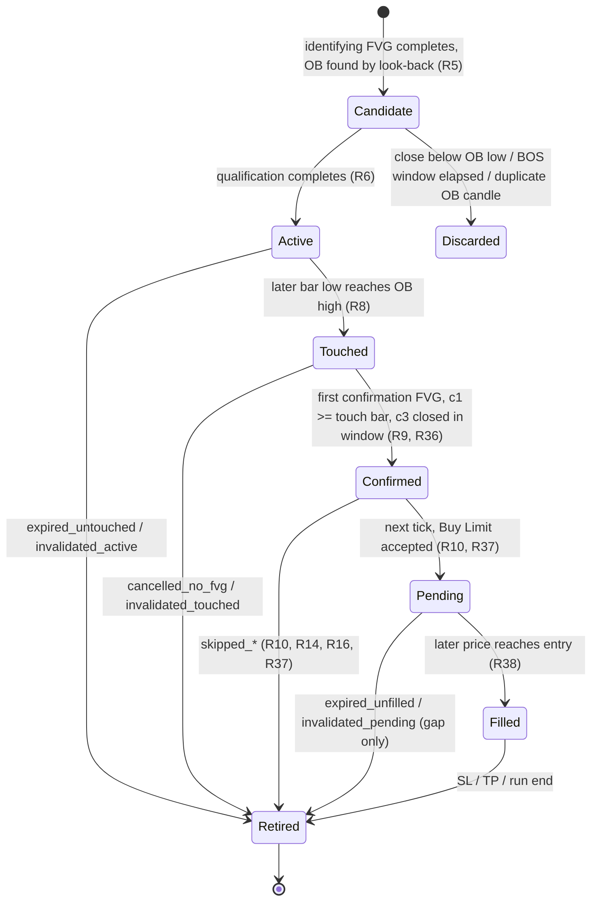
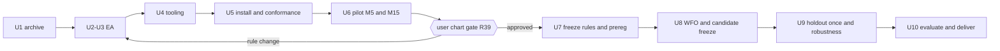
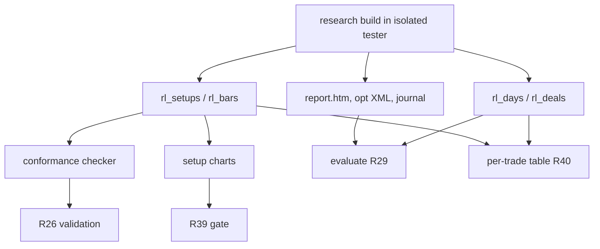

# OB-FVG Retest EA - Plan

## Goal Capsule

- **Objective:** The user gets an MT5 Expert Advisor that trades their Order Block → return → new FVG → retest strategy exactly as they describe it. They also get an evidence-backed answer, from real Strategy Tester runs, to one question: can the strategy reach at least 15-20 trades per month on XAUUSD.s that are profitable after costs, under their prop-firm risk limits? The answer is delivered as loadable `.set` files and a Hebrew report that says plainly what the evidence supports.
- **Means:** The new EA replaces the old `new_test` (SweepOB) strategy, which moves to a separate archive (KTD10). The kept isolated-tester tooling runs a gated research protocol: a frequency pilot, then rule-conformance charts reviewed by the user, then frozen rules and pre-registration, then walk-forward optimization, a frozen holdout, and robustness checks (KTD11, KTD12).
- **Who finishes:** The executing agent implements U1-U6, runs the pilot, and stops at the chart gate (R39). After the user approves, it runs U7-U10, commits locally (the repo has no remote), and ends with the Hebrew report. Live use stays with the user.
- **Product authority:** The user, as strategy owner. Trading rules are the user's. Any rule change beyond R4-R18 and R36-R38 needs the user's explicit consent. A rule change after the chart review is recorded as a change with its reason, before the pre-registration is frozen.
- **Execution profile:** Real MT5 runs are required. Code, tests or commits alone are not research completion. The run completes only when the R31-R34 deliverables exist from real runs, or when the report marks the research incomplete and names the blocker.
- **Stop conditions:**
  - **Hard gate:** stop after the pilot charts (R39) and wait for the user's approval before U7.
  - Stop and ask if any step would touch the live terminal or the live account.
  - Stop and ask if the isolated copy cannot run the tester.
  - Stop and ask if a rule in R4-R18 or R36-R38 turns out to be unimplementable as written.
- **Open blockers:** None.
- **Known ceiling:** No real-tick period is independent (R24), so the best reachable deliverable is `candidate.set` with a forward-test protocol (R30). The user accepted this.

---

## Product Contract

**Product Contract preservation:** changed.

| Requirements | Change | Why |
|---|---|---|
| R1, R3 | Archive instead of delete | User-directed after planning review: keep all original evidence. |
| R5, R6 | Operational OB detection and BOS semantics | Planning review: two implementers would otherwise build different OB sets. |
| R9, R10, R11 | Confirmation, placement timing and late-fill rules | User additions. |
| R17 | Setup log and chart data | Needed for R39 and R40. |
| R24, R30 | Holdout labelled non-independent; recommended `.set` unreachable | User-directed. |
| R27 | EA measures the loss limits but does not enforce them | User-directed. |
| R36-R40 | New | Separated FVG roles, stops-level source, fill-before-close rule, chart gate, per-trade reporting. |
| R41, R42 | New, added at the R39 gate on 2026-10-01 | User decisions: restore the original volume-push requirement on both FVGs, and place after a market-closed refusal. Neither was chosen from pilot profit or loss. |
| R41 | Removed on 2026-10-02 for a new research (AMENDMENT D) | User-approved defined change after exposure to every pilot, including the losing no-filter pilot v1. The 2.0x version and its evidence are archived in `archive/2026-10-02-ob-fvg-volume-2x/`. No other trading rule changes and no filter is added. |
| R41 | Lookback corrected on 2026-10-02 (AMENDMENT C) | User correction: "the last 24 hours" is a wall-clock window before the push bar opens, not a fixed bar count. Not chosen from profit or loss; the multiplier, the frequency threshold and the trading rules are unchanged. |

All other IDs keep their meaning.

### Summary

The work has three parts:

1. Archive the old SweepOB strategy, keeping the strategy-agnostic MT5 test tooling in place.
2. Build a new EA that implements OB → return to the OB → new FVG caused by the return → retest of the new FVG or the OB → entry. The stop sits beyond the OB edge and the target is 2R, long and short.
3. Research it on XAUUSD.s with real ticks:
   - a frequency pilot picks the timeframe;
   - the user reviews rule-conformance charts;
   - rules and pre-registration are frozen;
   - then WFO, a frozen holdout, Monte Carlo, stress and DSR run.

### Problem Frame

The previous strategy (`new_test`, SweepOB) was researched today and failed every pre-registered acceptance criterion. On M15 it barely traded: its volume filter was tuned for M5. The user no longer wants it and has a different entry model. The user wants the old evidence preserved rather than destroyed.

The user's model hinges on sequence and timing. The FVG that confirms an entry must be a new gap caused by price returning to the OB. The entry comes only on a later retest.

The user's practical goal is at least 15-20 trades per month that are profitable after costs. The old research showed how easily a small sample hides whether an edge exists, so frequency is both a goal and a precondition for a statistical conclusion.

Real ticks for XAUUSD.s at Bybit-Live-4 start on 2025.11.24, about ten months of history. All of it was touched by the previous research: the old WFO covered Dec-Jul, and an Aug-Sep check period was also run. `new_test` was also tested in the live terminal over 2026.09.01-09.28 on 2026-09-30 at 17:24. No part of it counts as independent.

### Key Decisions

- **Archive the old strategy, keep the test tooling in place.** Governs R1, R2, R3. (session-settled: user-directed — chosen over deleting the old strategy from the repo: the user requires original evidence to be kept.)
- **The OB definition is switchable between two modes.** The first mode is an impulse that forms an identifying FVG. The second is an identifying FVG plus a break of structure. Governs R5, R6. (session-settled: user-directed — chosen over a single definition, and over break-of-structure-only or ATR-size definitions: the user wants to compare the two.)
- **The entry price is a pre-chosen input with four options.** The options are the proximal edge or midpoint of the confirmation FVG, or the proximal edge or midpoint of the OB. Governs R10. (session-settled: user-approved — chosen over a single fixed entry: the entry zone and price must be chosen in advance and be comparable in the tester.)
- **Setups expire by price and by time, and each OB trades at most once.** Governs R8, R9, R11, R12. (session-settled: user-approved — chosen over price-only invalidation and over reusable OBs: stale OBs and late FVGs are not reactions to the touch.)
- **Scope is the EA plus a full optimization research, gated by a chart review.** Governs R19-R34, R39. (session-settled: user-directed — chosen over the EA with a single verification backtest, over code only, and over optimizing without a rule-conformance review.)
- **The research timeframe is chosen by a frequency pilot before pre-registration.** Governs R20. (session-settled: user-approved — chosen over the timeframe as a grid parameter, over M5 directly, and over M15 directly: targets the ≥15 trades/month goal without inflating trials.)
- **Data split: WFO on 2025.12.01-2026.07.31 and a frozen holdout on 2026.08.01-2026.09.29, labelled non-independent.** Governs R22, R24. (session-settled: user-directed — chosen over classifying the holdout as independent because the model changed: the period was exposed to the previous research and to a live-terminal test.)
- **There is no independent period, so the best deliverable is a candidate plus a forward-test protocol.** Governs R30, R31. (session-settled: user-approved — chosen over issuing a recommended `.set` on non-independent evidence.)
- **Risk model: deposit 10,000 USD, 1% risk per trade, at most 3 exposures, leverage 1:100, loss limits of 5% daily and 10% total.** Governs R14, R16, R27. (session-settled: user-approved — chosen over "1% with DD ≤ 20%" and over fixed 0.01 lots: the user wants prop-firm-style limits.)
- **The loss limits are measured in research, not enforced by the EA.** Governs R27. (session-settled: user-approved — chosen over EA-side enforcement: this EA build is research-only.)
- **A volume push is required on the identifying FVG only: its middle candle's tick volume must be at least 2.0 times the average tick volume of the bars that opened in the 24 wall-clock hours before it.** The confirmation FVG has no volume requirement. Governs R41. (session-settled: user-directed — chosen over no volume filter, over a filter on both FVGs, and over an input that is off by default: the user's original requirement was a push with at least twice the 24-hour average volume on the original identifying FVG. The multiplier is fixed at 2.0 rather than optimized, and the middle candle is chosen over the third candle or a three-candle sum. The user corrected an earlier "both FVGs" answer on 2026-10-01, after a pilot with that version gave 0.25 fills per month on M15. On 2026-10-02 the user corrected the lookback (AMENDMENT C): a real 24-hour time window before the push bar opens, chosen over the earlier fixed count of 96/288 bars, which reached back up to 101 hours across a weekend. The push bar is excluded, no bar from before the window fills a quota, closed-market hours add no zero bars, and history shortages are counted separately. Not chosen from profit or loss.)
- **AMENDMENT D (2026-10-02): the volume filter is removed from identification and entry, for a new research.** Supersedes the R41 decision above. (session-settled: user-approved — chosen over keeping the 2.0x filter, which left every version blocked by frequency at 0.25-1.25 fills per month. The change was made AFTER exposure to all pilots, including v1 without the filter, whose default-parameter P&L was shown to the user on 2026-10-01: M15 net -2,152.53 USD, win rate 32.0%, max equity drawdown 31.1%; M5 net -7,490.24 USD. It is therefore a post-exposure change, not a pre-registered one, and is recorded as such in the pre-registration's `gate_rule_changes`. No other trading rule changes, no new filter is added, and the 2.0x version with all of its evidence is kept in `archive/2026-10-02-ob-fvg-volume-2x/`, git tag `archive/ob-fvg-volume-2x`.)
  - Research hypothesis: the sequence OB → return to the OB → new confirmation FVG → retest of the FVG or the OB, with the stop beyond the OB and a 2R target, shows a robust out-of-sample edge without a volume filter, measured against the no-filter baseline (code defaults).
- **After a market-closed refusal, the order is placed at the first moment it can be placed, while the setup is still valid.** Governs R42. (session-settled: user-directed — chosen over skipping the setup: the order belongs right after detection, and a closed market is a broker condition, not a strategy rule.)
- **Broker placement limits come from the symbol at run time. There is no independent threshold.** Governs R37. (session-settled: user-directed — chosen over a fixed 0.20 USD rule: the user rejected thresholds without an explicit decision.)

---

### Requirements

**Archiving the old strategy**

- R1. The old strategy's material moves to a separate archive. Nothing is deleted. The archive holds:
  - EA sources and preserved originals;
  - results, reports, journals, the experiment log and deliverables;
  - local run archives;
  - the old plan;
  - a snapshot of the old research code and pre-registration.
- R2. Strategy-agnostic tooling stays in place and its tests keep passing:
  - the isolated-copy environment, trade-safety checks and live-terminal guard;
  - the tester runner, ini, compile, `.set` and report parsing;
  - the experiment log;
  - WFO, statistics, Monte Carlo, stress, loss-limit and metrics code.

  Old-EA-specific code in the active tree is replaced for the new EA. Its original lives in the archive.
- R3. The live terminal's MT5 data folder, including its copy of `new_test.mq5`, is not touched. Old EA binaries inside the isolated research copy stay where they are.

**Strategy rules (long; short is the exact mirror)**

- R4. Signals are evaluated only on closed bars of the signal timeframe. No decision uses data from a bar that has not closed. The signal timeframe is an input.
- R5. An Order Block is found from its identifying FVG (R36):
  - When a bullish FVG completes at candle 3, the EA searches back from that FVG's candle 1, inclusive, up to an input number of bars.
  - The most recent bearish candle (close < open) found is the OB. Candle 1 itself may be the OB.
  - The OB zone is that candle's full range, high to low.
  - Each candle becomes an OB at most once.
  - A doji is neither bullish nor bearish.
- R6. An input selects what qualifies the OB:
  - **FVG mode:** the identifying FVG alone qualifies it.
  - **FVG+BOS mode:** a close must also break above a swing high, within an input number of bars after the OB candle. The swing high must meet both conditions:
    - **Look-ahead rule:** it is used only if it was confirmed, meaning all of its right-side confirmation bars had closed, by the close of the bar that breaks it.
    - **Structure rule:** its peak bar lies before the OB candle, so the impulse breaks structure that existed before the impulse began.

  The OB becomes active when its qualification completes: at the identifying FVG's candle-3 close in FVG mode, or at the later of that close and the break close in FVG+BOS mode. A close below the OB low before activation discards the candidate.
- R7. A bullish FVG is a three-candle pattern in which candle 3's low is above candle 1's high. The gap between them is the FVG zone. There is no minimum size.
- R8. An active OB is touched when a bar after its activation bar has a low that reaches the OB's high. The OB expires if it is not touched within an input number of bars after activation.
- R9. After the touch, the EA waits for a confirmation FVG (R36):
  - it is the first new bullish FVG whose candle 1 is the touch bar or later;
  - its candle 3 must close within an input number of bars after the touch, otherwise the setup is cancelled;
  - it is valid only after candle 3 has closed.
- R10. After the confirmation FVG is detected, the EA places a Buy Limit on the first tick after candle 3's close. The price is set by input: confirmation-FVG top, confirmation-FVG midpoint, OB high, or OB midpoint.
  - Only price movement after the order is placed can fill it.
  - If price is already at or beyond the level at placement, the setup is skipped.
  - If the level is closer to price than the broker allows under R37, the setup is skipped.
  - The EA never chases with a market order.
- R11. The pending order is cancelled if it is not filled within an input number of bars. It is also cancelled when a bar closes below the OB low before the fill. The same close-below-OB-low cancellation applies at every stage from activation to placement.
- R12. Each OB produces at most one setup. Once its setup is filled, cancelled, expired or skipped, the OB is retired. Several OBs may be tracked at once, each independently.
- R13. The stop loss sits below the OB low by a buffer set as an input. The take profit sits at entry + 2 × (entry − stop), computed from the intended entry. The R multiple is an input with default 2.0, and it stays at 2.0 in all research runs.
- R14. Position size risks the input percentage (default 1%) of the balance at the moment the order is placed. The stop distance is used for sizing, rounded down to the volume step. The setup is skipped, never clamped, in any of these cases:
  - the volume is below the broker minimum or above its maximum;
  - free margin is insufficient;
  - the tick value is unavailable;
  - the stop violates R37.
- R15. Short setups mirror R5-R14 and R36:
  - the OB is the last bullish candle before a bearish identifying FVG;
  - the touch is a bar's high reaching the OB low;
  - the confirmation is a new bearish FVG;
  - the order is a Sell Limit;
  - the stop is above the OB high;
  - the target is 2R below entry.
- R16. At most 3 exposures exist at once, counting open positions and pending orders. A setup that would exceed the cap is skipped and counted. A confirmation FVG confirms only the most recently activated eligible OB in its direction. An order at the same direction and price as an existing own order is skipped.
- R17. The EA is research-first and live-safe by construction:
  - it uses a magic number;
  - it touches only its own orders;
  - it has no trading side effects in `OnInit`.

  A research-only logging build records daily equity, all deals, a per-stage funnel, and one row per setup. Each setup row holds the stage times and prices, its outcome or skip/cancel reason, and the signal-timeframe bars needed to chart it.
- R18. Default input values are fixed in this plan (KTD12) before any data is examined. They form the baseline recorded in the original `.set`.
- R41. **Removed by AMENDMENT D (2026-10-02); not in force.** The EA has no volume input and no volume condition. Both FVG middle-candle ratios are still logged in `rl_setups` over the 24 h wall-clock window, for information only. The former rule, kept for the archived version, read: An identifying FVG qualifies an OB only if its middle candle (candle 2, the push bar) has a tick volume at least `VolumeMultiplier` (fixed at 2.0) times the average tick volume of the signal-timeframe bars that open in the wall-clock window [push bar open − `VolumeLookbackHours` (24) h, push bar open) (AMENDMENT C, 2026-10-02):
  - The average is the mean over the bars that exist in that window. The push bar itself is excluded, no bar from before the window is used to make up a count, and closed-market hours (the daily break, weekends, holidays) contribute no bars and no zeros. A normal window holds 92 M15 / 276 M5 bars; a window right after the weekend holds only the first bars of the week.
  - If the loaded history starts after the window start, the FVG does not qualify and is counted as `idfvg_volume_no_history`. If the window holds no bar or no volume, the FVG does not qualify and is counted as `idfvg_volume_empty_window`. Both are separate from `idfvg_rejected_volume`. The confirmation FVG (R9) has no volume requirement; its ratio is logged for information only.
- R42. If the broker refuses a placement because the market is closed, the setup stays confirmed and the EA retries on later ticks:
  - at most once per 60 seconds, and at most 120 times;
  - only while no bar has closed beyond the OB and fewer than `OrderExpiryBars` bars have passed since candle 3.

  Each retry re-runs every placement check (R10, R14, R16, R37) with the original entry, SL and TP, and skips with the exact reason if a check fails. A setup never has two orders. If the window or the attempt cap runs out, the setup is skipped as `skipped_market_closed`. The setup row records the time of the first refusal and the number of attempts.
- R36. The identifying FVG and the confirmation FVG are separate objects. The identifying FVG qualifies an OB and always completes before the touch, so it can never confirm an entry. Only a confirmation FVG (R9) can lead to an order.
- R37. The minimum distance between an order's price, its stop, and the market is the broker's stops level, read from the symbol at each placement. The previous research's tester journal recorded "stops level 20 pts": 20 points × 0.01 = 0.20 USD. No other distance threshold exists.
- R38. A fill that happens before a bar closes stays in the results, even if that bar later closes beyond the OB. From the fill on, only the stop loss and take profit manage the position. A fill that lands on the tick where a scheduled cancellation executes is also kept, and is counted separately.

**Research protocol**

- R19. All research runs use the MT5 Strategy Tester in the isolated copy with Model=4, every tick based on real ticks. The account starts at 10,000 USD with leverage 1:100 and the broker's real costs: spread from ticks, commission (verified), and swap.
- R20. A frequency pilot runs the default EA on M5 and M15 over the WFO period. The timeframe choice uses only filled trades per month:
  - the research timeframe is the longer of the two that averages at least 15 filled trades per month;
  - if neither reaches 15, M5 is used and the shortfall is reported. The rules are not loosened.
- R39. Before any pre-registration, the pilot's setups are drawn on charts and the user reviews them. The charts cover:
  - long and short setups;
  - winning and losing trades;
  - rejected setups, each with its reason.

  Each chart marks four stages:
  1. the OB with its identifying FVG;
  2. the return to the OB;
  3. the confirmation FVG;
  4. the retest, with order placement, fill, SL and TP.

  The research stops until the user approves that the code matches the rules.
- R21. After the R39 approval, the rules and a pre-registration record are frozen and committed. The record fixes:
  - the timeframe from R20;
  - the parameters, ranges and grid;
  - the categorical-mode treatment;
  - the selection function;
  - the WFO folds and the trial budget;
  - the R29 criteria;
  - the random seed;
  - any rule change made at the gate, with its reason.

  Nothing in it changes after the first optimization run.
- R22. Walk-forward optimization uses rolling train/OOS folds within 2025.12.01-2026.07.31. OOS segments are chained into one continuous equity path, and candidate selection uses train data only.
- R23. The final candidate is selected by the pre-registered rule and frozen, with a committed `.set`, before the holdout runs.
- R24. The holdout 2026.08.01-2026.09.29 runs exactly once each for the frozen candidate and the baseline. It is reported as a non-independent check. The previous exposure record is carried with it. Its result cannot change the candidate, the parameters or the rules.
- R25. Robustness evidence covers:
  - Monte Carlo with 10,000 paths and a documented seed, using trade-order shuffle and stationary block bootstrap of daily P&L;
  - cost stress, with spread widened by 1× and adverse slippage on stop exits;
  - parameter stability, as the share of profitable neighbours of the candidate;
  - the Deflated Sharpe Ratio over all trials.
- R26. Validation confirms, for every archived run:
  - no look-ahead: the conformance checker (R17 setup rows) holds for every setup;
  - the Model=4 setting;
  - real-tick coverage and the share of generated ticks;
  - symbol specification and costs;
  - that the `.set` values loaded by the tester match the file.
- R27. Loss limits are measured on a continuous equity path and are not enforced by the EA:
  - **Daily breach:** equity falls below the balance at 00:00 server time minus 5% of 10,000 USD.
  - **Total breach:** equity falls below a static 9,000 USD.

  The report does not claim compliance with any prop firm.
- R28. Every run is appended to the experiment log with its ini, `.set`, report and journal facts, including failed runs.
- R29. Acceptance criteria are fixed in R21 before the search. Thresholds are in KTD12.
  - Chained OOS:
    - at least 15 filled trades per month, positive net profit after costs, and better than the baseline;
    - lower confidence bound of daily P&L above 0;
    - a majority of folds positive;
    - profit that survives removal of the two best trades;
    - Monte Carlo breach probability of at most 10%;
    - positive after spread and slippage stress;
    - at least 60% of neighbours profitable;
    - DSR of at least 0.90.
  - Holdout: at least 15 filled trades per month, positive net profit, and no breach.
- R30. No `recommended` `.set` is produced in this research, because no independent period exists (R24). The R29 results are reported in full. The candidate is delivered with a forward-test protocol and marked as not validated.

**Deliverables**

- R31. `original.set` (code defaults) and `candidate.set` (frozen selection).
- R32. A parameter table (default, range, candidate value) and a baseline-vs-candidate comparison on identical data and risk settings, for OOS and holdout.
- R40. Every trade is reported with:
  - direction, intended entry and actual fill price;
  - SL, TP and planned risk-reward;
  - realized R;
  - net result after costs (spread through fills, commission and swap).

  Summary results are always net after costs.
- R33. Reproduction code and commands, the experiment log, MT5 reports, per-run evidence, and charts:
  - the pilot rule-conformance charts;
  - the OOS and holdout equity curves;
  - per-fold results;
  - the Monte Carlo distribution.
- R34. A short Hebrew report states whether the ≥15-20 trades/month goal was met and whether those trades were profitable after costs, with the uncertainty. If there is no edge, it says so explicitly.

**Safety**

- R35. The work never opens, modifies or closes trades on any account. It never starts, stops, reconfigures or attaches to the live terminal. Research runs happen only while the live terminal is closed, and no credentials enter git.

---

### Key Flows

- F1. Long setup lifecycle
  - **Trigger:** A bullish identifying FVG completes, and its OB qualifies under the selected mode (R5, R6, R36).
  - **Steps:**
    1. The OB activates.
    2. A later bar touches the OB high (R8).
    3. The first confirmation FVG with candle 1 at or after the touch bar closes its candle 3 within the window (R9).
    4. On the next tick a Buy Limit is placed at the chosen entry (R10, R37).
    5. A later retest fills it, with the stop below the OB low and a 2R target (R13, R38).
  - **Exits:**
    - The OB is not touched in time (R8).
    - A close below the OB low happens before the fill (R11).
    - No confirmation FVG forms in time (R9).
    - The order is skipped because price is past the entry, the stops level blocks it, or the volume, margin, cap or duplicate rules apply (R10, R14, R16, R37).
    - The order is not filled in time (R11).
  - **Outcome:** The OB is retired after any exit (R12). Every exit is logged with its reason (R17).
  - **Covered by:** R4-R17, R36-R38

- F2. Research sequence
  - **Steps:**
    1. Archive the old strategy (R1-R3).
    2. Build the EA and its logging build (R4-R18, R36-R38).
    3. Run the frequency pilot (R20).
    4. **Chart gate: the user approves (R39).**
    5. Freeze the rules and the pre-registration (R21).
    6. Run the WFO and freeze the candidate (R22, R23).
    7. Run the holdout once (R24).
    8. Run the robustness checks (R25).
    9. Evaluate the criteria (R29, R30).
    10. Produce the deliverables (R31-R34, R40).
  - **Covered by:** R1-R40

### Acceptance Examples

- AE1. **Covers R9, R36.** Given an OB touched at bar t. When a bullish FVG completes whose candle 1 is bar t−1, then it does not confirm the setup. When a later FVG with candle 1 at bar t+2 closes its candle 3 within the window, then it confirms the setup. The OB's own identifying FVG never confirms.
- AE2. **Covers R10, R13.** Given a long setup with the OB at 1995-2000, a confirmation FVG at 2003-2006, entry mode "FVG top" and a buffer of 50 points (0.5). Then the Buy Limit is at 2006, the stop at 1994.5 and the target at 2029. With entry mode "OB high", the Buy Limit is at 2000, the stop at 1994.5 and the target at 2011.
- AE3. **Covers R11, R12.** Given a pending Buy Limit. When a bar gaps from above the entry to a close below the OB low without trading at the entry, then the order is cancelled, the OB is retired, and a later touch of the same zone starts no new setup. Without a gap, the order fills first and R38 applies.
- AE4. **Covers R16.** Given two open positions and one pending order. When a fourth setup confirms, then it is skipped and counted as skipped because of the cap.
- AE5. **Covers R20.** Given a pilot result of 22 fills per month on M5 and 16 on M15, M15 is chosen. Given 11 on M5 and 6 on M15, M5 is chosen and the report states the shortfall.
- AE6. **Covers R38.** Given a Buy Limit filled mid-bar. When that same bar closes below the OB low, then the trade stays open with its SL and TP. It is kept in the results and is not reclassified.
- AE7. **Covers R6.** Given FVG+BOS mode and a swing high whose peak bar precedes the OB candle but whose last confirmation bar closes after the breaking close, then that swing cannot qualify the OB.
- AE8. **Covers R10, R37.** Given a stops level of 20 points and Ask 0.15 above a Buy Limit level, then the setup is skipped as too close. Given a stops level of 0, then it is placed.

### Success Criteria

- The user can take the pilot charts and see, for longs and shorts, winners, losers and rejected setups, each of the four stages placed where R5-R11 and R36-R38 say. They approve the code's conformance before any optimization.
- The research verdict comes from real MT5 runs and is reproducible from committed code, the frozen rules and pre-registration, and the experiment log.
- The Hebrew report answers the goal directly: fills per month, net profitability after costs in OOS and holdout, and how uncertain that is.

### Scope Boundaries

- Deferred for later:
  - session, time-of-day and news filters;
  - trade management such as breakeven, trailing or partial exits;
  - targets other than 2R;
  - a minimum FVG size or a minimum stop distance;
  - multi-symbol research;
  - EA-side loss-limit enforcement for live use.
- Outside this work:
  - live or demo deployment;
  - any change to the live terminal's files;
  - prop-firm compliance claims;
  - a `recommended` `.set` (R30).

### Dependencies / Assumptions

- The isolated MT5 copy under `~/mt5-research` still has the user's login and cached XAUUSD.s real ticks through 2026.09.30. The live terminal stays closed during runs.
- Touch is judged by wick, cancellation by close, and signals on Bid bars, as the strategy description implies. Execution uses the broker's native sides: Ask for buys, Bid for sells.
- With 1% risk and a 2R target, breakeven needs a win rate of about 34% before costs. Spread takes a larger share of R on shorter timeframes and with tighter entries.
- About 14% of minute bars in Dec 2025-Jan 2026 used generated ticks. This affects the pilot and fold 1 (R26).

### Sources / Research

- Symbol and account facts from the previous research's fidelity record:
  - tick 0.01, stops level 20 points, contract size 100;
  - commission 0, with cost in the real-tick spread (median 0.14-0.24 USD);
  - hedging account;
  - build 6230.

  These are carried into the new run constants before archiving (U1).
- The previous exposure record (independence check and Aug-Sep check period) moves to the archive and is cited by R24.

---

## Planning Contract

### Key Technical Decisions

- KTD1. **New EA files mirror the old build pattern.**
  - `mql5/Experts/ob_fvg_retest.mq5` holds the strategy.
  - `mql5/Experts/ob_fvg_retest_research.mq5` is a two-line wrapper that defines `RESEARCH_LOG` and includes it.
  - Research-only code sits in non-nested `#ifdef RESEARCH_LOG` blocks.
  - Every enum member has an explicit integer value, and inputs use `input`, not `sinput`, so `research/mt5r/setfile.py` parses them.
- KTD2. **Deterministic per-bar evaluation order.** For each newly closed bar, the EA processes tracked OBs in activation order, oldest first:
  1. pending-order window count, then the close-below check;
  2. the close-below-OB check for active, touched and confirmed OBs;
  3. the touch check, only on bars after the activation bar;
  4. confirmation FVG detection with this bar as candle 3;
  5. new identifying FVGs and OB activation;
  6. order placement on the next tick for OBs confirmed at this bar, oldest first against the cap.

  Invalidation beats touch on the same bar. Windows count k=1 from the first bar after the reference bar, and an event is valid when k ≤ N. `OnInit` rejects a confirmation window below 2. Governs R4, R8, R9, R11, R12, R16.
- KTD3. **OB detection is FVG-first.** Each completed identifying FVG triggers a backward search from its candle 1 for the most recent opposite candle within `ImpulseWindowBars`, per R5. Dedup is by OB candle time.
  - In FVG+BOS mode, pivots use a strength of `SwingStrength` bars on each side, with a strict comparison.
  - A pivot is usable at a breaking bar only if its confirmation bar is earlier than that bar (R6 look-ahead rule) and its peak bar is before the OB candle (R6 structure rule).
  - The break window starts at the OB candle.

  The old `FindOB` and the old swing and sweep code are not reused. The strict pivot test and the close-based break test are adapted from the old EA. Governs R5, R6, R36.
- KTD4. **Pending-order execution.**
  - Placement happens in `OnTick` on the first tick after the confirmation bar closes, using `CTrade` Buy Limit or Sell Limit.
  - The price is checked against live Ask or Bid, `SYMBOL_TRADE_STOPS_LEVEL` for price and stop (R37), and `SYMBOL_TRADE_FREEZE_LEVEL` before a delete.
  - Expiry is counted by the EA in closed signal bars and executed at the start of `OnTick`. A failed delete retries on every tick.
  - An order that fills before the delete is kept as `filled_late` (R38).
  - SL and TP are attached at placement from the intended entry.
  - Exposure is counted as own positions plus own orders, filtered by magic number and symbol.
  - `OnInit` asserts a hedging account.

  Governs R10, R11, R16, R37, R38.
- KTD5. **Sizing fails closed.** Volume is the risk amount divided by the loss per lot at the stop, rounded down to the volume step. `OrderCalcMargin` is checked against free margin. Any failure skips the setup with a reason code. The old `NormalizeLot`, which clamps up to the minimum, and the old fixed-lot fallback are not copied. Governs R14.
- KTD6. **Warm-up and restart.**
  - Warm-up replays closed bars with trading disabled.
  - A setup that reaches confirmation during warm-up is retired as `warmup_dropped` and excluded from the funnel.
  - On the first live tick, own pending orders that no in-memory setup owns are deleted.
  - Order comments encode direction and OB time and contain no commas.

  Governs R17.
- KTD7. **Reason codes.** Every setup ends with exactly one of these codes:
  - `expired_untouched`
  - `invalidated_active`, `invalidated_touched`, `invalidated_confirmed`, `invalidated_pending`
  - `cancelled_no_fvg`
  - `skipped_price_past`, `skipped_too_close`, `skipped_sl_stops`, `skipped_volume`, `skipped_margin`, `skipped_cap`, `skipped_duplicate`, `skipped_market_closed`, `skipped_broker_reject`
  - `expired_unfilled`
  - `filled`, `filled_late`
  - `warmup_dropped`, `run_end_pending`

  The codes appear in the setup rows and the funnel line. Governs R17, R39.
- KTD8. **Research logging.**
  - The `rl_days` and `rl_deals` CSV schemas and the `OnTester` daily-Sharpe return are kept byte-compatible, so `reports.py` and `evaluate.py` parse them unchanged.
  - New files are `rl_setups_<tag>.csv`, with one row per setup (stage times, prices, reason code, order and position ids, both FVG volume ratios, first market-closed refusal and placement attempts), and `rl_bars_<tag>.csv`, with closed signal-timeframe OHLC and tick volume for charting and the R41 re-check.
  - Setup stage times are recorded in milliseconds: placement from the placing tick's `time_msc` or `ORDER_TIME_SETUP_MSC`, and fill from `DEAL_TIME_MSC`. Second-resolution times cannot order placement against candle 3's close.
  - The `OnInit` print keeps the substrings "Warm-up bars", "tick" and "stops level" that `journal.facts` parses.
  - A `Funnel:` summary line is printed in `OnDeinit`.
  - `runner._collect` already copies any `rl_*_<run_id>.csv`.

  Governs R17, R26, R39, R40.
- KTD9. **Run constants are split from the frozen protocol.** A new `research/run_constants.json` holds the fixed run facts: symbol, server, deposit, leverage, model, risk and display inputs, symbol spec, and date windows. It is committed with U4. `research/preregistration.json` is created only at U7. `pipeline.py` loads constants at import and the pre-registration lazily, so the pilot runs before freezing. Governs R20, R21.
- KTD10. **Archive layout.**
  - Tracked old-strategy files move to `archive/2026-09-30-new-test-sweepob/`, preserving history, with a git tag `archive/new-test-sweepob` on the commit before the move. Moved paths: `original/`, `deliverables/`, `results/`, both `mql5/Experts/new_test*.mq5`, the old plan, and copies of the old-EA-specific research modules, `research/cli.py`, `research/preregistration.json` and the old-only tests.
  - The untracked `runs/` (5.7 GB) moves on the same disk to `archive/2026-09-30-new-test-sweepob/runs/`. It stays git-ignored, because run logs contain the account id.

  Governs R1, R2, R3. (session-settled: user-directed — chosen over deletion: keep original evidence.)
- KTD11. **The chart gate is a hard stop.**
  - `research/mt5r/charts_setups.py` renders candlestick charts from `rl_bars` plus `rl_setups`. It draws the OB box, the identifying FVG, the touch marker, the confirmation FVG box, the entry, SL and TP lines, the placement and fill markers, and a reason label.
  - Selection is deterministic, by seed. From the chosen-timeframe pilot it takes at least 3 long and 3 short filled trades (winners and losers) and 1 example of each common rejection reason.
  - Charts plus a per-setup table are sent to the user, and U7 does not start until the user approves.

  Governs R39. (session-settled: user-directed — chosen over optimizing without review.)
- KTD12. **Pre-registered defaults, grid, selection and thresholds, fixed now, before data.**

  | Input | Default | Research grid |
  |---|---|---|
  | `ObMode` | 0 FVG | {0 FVG, 1 FVG+BOS}, categorical |
  | `EntryMode` | 0 FVG edge | {0 FVG edge, 1 FVG mid, 2 OB edge, 3 OB mid}, categorical |
  | `ObMaxAgeBars` | 96 | {48, 96, 144} |
  | `FvgWindowBars` | 12 | {6, 12, 18} |
  | `OrderExpiryBars` | 12 | {6, 12, 18} |
  | `ImpulseWindowBars` | 2 | fixed |
  | `SwingStrength` | 3 | fixed |
  | `StopBufferPoints` | 10 (0.10 USD) | fixed |
  | `RiskRR` | 2.0 | fixed |
  | `RiskPercent` | 1.0 | fixed |
  | `MaxExposures` | 3 | fixed |

  - The grid is 216 passes per fold, in one arithmetic optimization.
  - Folds are 3-month train and 1-month OOS, rolling, with OOS Mar-Jul 2026 (5 folds). The final selection uses train 2026.05.01-07.31.
  - A pass is eligible when its train fills are at least 15 × train months (45) and its equity drawdown is at most 10%. Score is the recovery factor, smoothed over ordinal neighbours within the same categorical cell. If no pass is eligible, the defaults are used with status `no_eligible_pass`.
  - DSR trials are 216 × 5 plus the pilot runs. The cross-trial Sharpe variance comes from the optimization's Custom column, which is the EA's `OnTester` daily Sharpe for each pass. It is the variance over passes with trades in each training grid, averaged across grids.
  - Thresholds:

    | Criterion | Threshold |
    |---|---|
    | Frequency | ≥ 15 fills per 30.44 days |
    | Bootstrap confidence interval | 95%, block 5 days, 10,000 resamples, seed 20260930 |
    | Positive folds | ≥ 3 of 5 |
    | Top trades removed | 2 |
    | Monte Carlo breach probability | ≤ 10% over 252 days |
    | Spread stress | +1× |
    | Slippage stress | 10 points on every stop exit |
    | Profitable neighbours | ≥ 60% over Mar-Jul |
    | DSR | ≥ 0.90 when ≥ 60 days |

  Governs R18, R21, R22, R29.
- KTD13. **Tooling changes stay minimal and generic.**
  - `wfo.py` gains categorical axes (exact match for smoothing and neighbours) and a per-month trade floor.
  - `metrics.py` and `evaluate.py` take bar minutes from the timeframe.
  - `stress.py` gains a stop-exit slippage term.
  - `evaluate.py` criteria are rewritten to R29.
  - `research/cli.py` is rewritten with the subcommands `install`, `pilot`, `charts`, `freeze-rules`, `wfo`, `freeze`, `holdout`, `robustness` and `deliver`.
  - The holdout subcommand refuses unless the candidate freeze is committed, and refuses when the experiment log already holds a completed holdout run for the same EA hash and `.set` hash.

  Governs R24, R25, R29.

### High-Level Technical Design

Per-OB state machine (long; short mirrors). Reason codes per KTD7.

Research sequence with gates.

Evidence data flow.

### Assumptions

- Signal logic runs on Bid bars with no spread adjustment. A visible retest on the chart may not fill a Buy Limit because Ask sits above Bid. Charts label `retest_seen_no_fill` where a bar reached the level without a fill.
- A gap through the stop fills at the gap price, so realized R can fall below −1 or exceed 2. The "3% worst case" in the risk model is nominal, and MC and the loss limits use realized P&L.
- Setups pending at a fold boundary are lost (`run_end_pending`), as in the old research. Their count is reported.
- Seeing winners and losers on pilot charts exposes the WFO period to the user. Any rule change made at the gate is recorded under R21, and the report lists it.

### Sequencing

The units run in this order:

1. U1.
2. U2, then U3; both touch the same file.
3. U4, which may run in parallel with U2-U3.
4. U5.
5. U6, which ends at the hard gate.
6. After approval: U7, U8, U9, U10.

---

## Implementation Units

| U-ID | Title | Key files | Depends on |
|---|---|---|---|
| U1 | Archive the old strategy | `archive/2026-09-30-new-test-sweepob/`, `research/run_constants.json`, `README.md`, `.gitignore` | — |
| U2 | EA signal state machine | `mql5/Experts/ob_fvg_retest.mq5` | U1 |
| U3 | EA execution, risk and research logging | `mql5/Experts/ob_fvg_retest.mq5`, `mql5/Experts/ob_fvg_retest_research.mq5` | U2 |
| U4 | Research tooling for the new EA | `research/mt5r/*.py`, `research/cli.py`, `research/tests/` | U1 |
| U5 | Install, compile, smoke and conformance | `research/mt5r/conformance.py`, `results/fidelity.md` | U3, U4 |
| U6 | Frequency pilot and chart gate | `research/mt5r/charts_setups.py`, `results/pilot/` | U5 |
| U7 | Freeze rules and pre-registration | `research/preregistration.json` | U6 + user approval |
| U8 | WFO and candidate freeze | `results/wfo/`, `results/final_selection/` | U7 |
| U9 | Holdout and robustness | `results/holdout/`, `results/robustness/` | U8 |
| U10 | Evaluation, deliverables, report | `deliverables/`, `results/acceptance.json` | U9 |

### U1. Archive the old strategy

- **Goal:** Move all old-strategy material into a separate archive without losing any evidence, and leave a green test suite and the carried facts in the active tree.
- **Requirements:** R1, R2, R3; KTD10.
- **Dependencies:** none.
- **Files:**
  - Move to `archive/2026-09-30-new-test-sweepob/`: `original/`, `deliverables/`, `results/`, `mql5/Experts/new_test.mq5`, `mql5/Experts/new_test_research.mq5`, `docs/plans/2026-09-30-1722-feat-new-test-robust-optimization-plan.md`, and `runs/`.
  - Copy into `archive/2026-09-30-new-test-sweepob/research/`: `research/cli.py`, `research/preregistration.json`, `research/mt5r/pipeline.py`, `research/mt5r/deliver.py`, `research/mt5r/evaluate.py`, `research/mt5r/journal.py`, `research/tests/test_ea_source.py`, `research/tests/test_originals.py`, `research/tests/test_setfile.py`, `research/tests/test_deliver.py`.
  - Create `archive/2026-09-30-new-test-sweepob/README.md` and `research/run_constants.json`.
  - Modify `.gitignore` and `README.md`.
  - Remove from the active tree only the old-only tests `research/tests/test_ea_source.py` and the old checksum test; their originals are in the archive.
- **Approach:**
  1. Tag the current commit `archive/new-test-sweepob` before any move.
  2. Use `git mv` for tracked paths, so history follows.
  3. Move `runs/` on the same disk and add an ignore rule for `archive/**/runs/`.
  4. Write `research/run_constants.json` from the fidelity record (symbol spec, commission 0, hedging, build, real-tick start 2025.11.24, date windows).
  5. Write the archive README. It indexes the contents and quotes the exposure facts R24 cites: the live `new_test` test over 09.01-09.28 at 17:24, and the Aug-Sep check period.
  6. Rewrite `test_setfile.py` against an inline EA source string, so it no longer reads the old EA at import.
  7. Keep `test_runs_and_local_config_are_ignored` and extend it to the archived runs path.
- **Patterns to follow:** the `.gitignore` conventions; `research/tests/test_originals.py` for ignore checks.
- **Test scenarios:**
  - The archive contains `results/experiment_log.jsonl`, `original/SHA256SUMS` and both old EA sources, with checksums matching their pre-move values.
  - `git check-ignore` reports `archive/2026-09-30-new-test-sweepob/runs/x/report.htm` and `research/config.yaml` as ignored.
  - The rewritten setfile tests round-trip an inline source with an explicit-int enum and a research-only input.
  - The full suite collects with no import of deleted paths.
- **Verification:** the suite passes, `git log --follow` reaches old history for a moved file, nothing is deleted outright, and the tag exists.

### U2. EA signal state machine

- **Goal:** Implement OB detection, touch, confirmation FVG and invalidation exactly per the rules, with deterministic per-bar ordering and reason codes.
- **Requirements:** R4-R9, R11 (pre-placement stages), R12, R15, R36; F1; AE1, AE3, AE7; KTD2, KTD3, KTD7.
- **Dependencies:** U1.
- **Files:** create `mql5/Experts/ob_fvg_retest.mq5`. Static checks in `research/tests/test_ea_static.py`.
- **Approach:**
  1. Keep per-OB records with absolute bar indices and prices, not rolling-history offsets, because windows exceed 64 bars.
  2. Process closed bars through the KTD2 order.
  3. Run identifying-FVG detection and the backward OB search per KTD3.
  4. Store both FVG objects separately on the record (R36).
  5. Track pivots for BOS with confirmation-bar indices.
  6. Validate inputs in `OnInit`.
- **Patterns to follow:** in the archived old EA (`archive/2026-09-30-new-test-sweepob/mql5/Experts/new_test.mq5`), the new-bar loop and warm-up in `OnTick`/`OnInit`, the strict pivot tests `IsPivotHigh`/`IsPivotLow`, the inline FVG test (without its middle-candle direction check), `RoundTick`, and the one-use OB dedup.
- **Execution note:** Rules are the user's. Where this unit and a rule disagree, the rule wins and the discrepancy is reported, not resolved silently.
- **Test scenarios:**
  - Static: every enum member in the EA has an explicit integer, and every research-only input sits inside a research block.
  - Static: the wrapper is exactly the define plus the include.
  - Static: `setfile.parse_inputs` resolves every default, including `ObMode` and `EntryMode`.
  - Static: the input list contains every KTD12 default.
  - Behavioural cases are proven in U5 against tester output: AE1, AE3, AE7, touch-bar close-below, activation-bar touch ignored, candle 1 of the identifying FVG as the OB, doji skipped, duplicate OB candle.
- **Verification:** MetaEditor compiles with 0 errors in U5, and U5's conformance checker finds 0 rule violations.

### U3. EA execution, risk and research logging

- **Goal:** Place, manage and cancel Limit orders with fail-closed sizing, the exposure cap, late-fill handling, and complete research logs for charts and per-trade reporting.
- **Requirements:** R10, R11, R13, R14, R16, R17, R37, R38, R40; AE2, AE4, AE6, AE8; KTD4-KTD8.
- **Dependencies:** U2.
- **Files:** modify `mql5/Experts/ob_fvg_retest.mq5`; create `mql5/Experts/ob_fvg_retest_research.mq5`. Static checks extend `research/tests/test_ea_static.py`.
- **Approach:**
  1. `OnTick` runs pending deletes first, then new-bar processing, then placements queued from the last closed bar.
  2. Fills are detected by an own order disappearing while an own position with the matching comment exists. Deals carry the order and position ids for R40.
  3. Stops and freeze levels are read at each use.
  4. Port the research block from the archived EA and extend it per KTD8.
  5. Keep the init print substrings.
- **Patterns to follow:** in the archived old EA, the `RESEARCH_LOG` block, `CTrade` setup in `OnInit`, `CountCancel`, and `CountEAPositions` extended to orders.
- **Test scenarios:**
  - Static: no `trade.Buy(` or `trade.Sell(` market calls exist.
  - Static: no volume clamp up to `SYMBOL_VOLUME_MIN` exists.
  - Static: the `rl_days` and `rl_deals` header strings equal the archived EA's.
  - Static: the order comment format contains no comma.
  - Behavioural cases are proven in U5:
    - AE2 prices;
    - AE4 cap skip;
    - AE6 fill kept after a close-below;
    - AE8 stops-level skip;
    - margin skip;
    - placement time in milliseconds at or after candle 3's open time plus the signal period, which is the first moment the bar is closed;
    - fill time in milliseconds strictly after placement time.
- **Verification:** U5 runs produce all four `rl_*` files, and every filled setup row joins to a deal pair.

### U4. Research tooling for the new EA

- **Goal:** Point the kept tooling at the new EA and extend it for the new protocol, without breaking the generic modules.
- **Requirements:** R2, R19-R30, R40; KTD9, KTD12, KTD13.
- **Dependencies:** U1.
- **Files:**
  - Modify `research/mt5r/pipeline.py`, `research/mt5r/env.py` (`install_sources`), `research/mt5r/journal.py` (funnel), `research/mt5r/wfo.py`, `research/mt5r/metrics.py`, `research/mt5r/stress.py`, `research/mt5r/evaluate.py` and `research/mt5r/deliver.py`.
  - Rewrite `research/cli.py`.
  - Create `research/mt5r/trades.py` for the R40 table.
  - Tests: `research/tests/test_pipeline.py`, `test_wfo.py`, `test_stress.py`, `test_evaluate.py`, `test_trades.py`, `test_journal.py`, `test_cli_guards.py`.
- **Approach:**
  1. `BUILDS` maps `delivered` and `research` to the new `.ex5` files.
  2. `evaluate()` implements R29 with KTD12 thresholds read from the pre-registration.
  3. The holdout guard lives in `cli.py`.
  4. Keep `rl_*` parsing unchanged.
- **Patterns to follow:** the existing `research/tests` style and fixtures; `wfo.select` and `merge_grids`; `cli._uncommitted` and `prereg_committed`.
- **Test scenarios:**
  - `pipeline` imports with no `preregistration.json` present, and `run_single` builds the ini from run constants.
  - `wfo` with a categorical axis: smoothing and neighbours never cross `EntryMode` values, and neighbours differ by exactly one ordinal step.
  - `wfo` trade floor: a pass with 44 train fills over 3 months is ineligible, and one with 45 is eligible.
  - `wfo` with no eligible pass returns the defaults with status `no_eligible_pass`.
  - `stress` slippage: 10 points on 3 stop exits of 1 lot reduces net by 30 USD, and TP exits are unchanged.
  - `evaluate` frequency uses fills per 30.44 days: 60 fills over 121 days (15.09) passes, and 59 fails.
  - `evaluate` on an empty OOS returns every criterion failed with numeric fields, not NaN.
  - `evaluate` bar minutes: M5 trade events merge entries within the same 5-minute bar.
  - `trades` joins deals to setup rows: intended entry, fill price, SL, TP, planned RR 2.0, realized R and net (profit + commission + swap) are correct for a winner, a loser and a late fill.
  - The CLI holdout guard refuses when the freeze commit is missing, refuses on a second completed holdout run with the same hashes, and allows a rerun after an `infra_failure` with no report.
  - The journal funnel regex parses the new `Funnel:` line.
- **Verification:** the full suite passes, and `python research/cli.py --help` lists the KTD13 subcommands.

### U5. Install, compile, smoke and conformance

- **Goal:** Get the EA running in the isolated copy and prove, from tester output, that every setup obeys the rules before any pilot numbers are used.
- **Requirements:** R19, R26, R36-R38; AE1-AE4, AE6-AE8.
- **Dependencies:** U3, U4.
- **Files:** create `research/mt5r/conformance.py` and `research/tests/test_conformance.py`, with fixtures of synthetic setup rows and bars. Create `results/fidelity.md` and `results/smoke/`.
- **Approach:**
  1. The `install` subcommand copies sources into the isolated copy and compiles with MetaEditor.
  2. The runner's live-terminal guard and trade-safety preflight must pass first.
  3. Run a one-month smoke test on M15 and on M5 with the research build.
  4. Run the conformance checker over the `rl_setups` rows and `rl_bars`. Per setup, it checks:
     - the stage order: activation, then touch strictly after activation, then confirmation candle 1 at or after the touch, then placement at or after candle 3's open time plus the signal period, then fill strictly after placement (all times in milliseconds);
     - the prices: the OB is the last opposite candle, the confirmation FVG satisfies R7, SL and TP match R13, and the entry matches `EntryMode`;
     - the reasons: each reason code is consistent with the bars.
  5. Record the fidelity facts, including the stops and freeze levels read in the journal.
  6. Run an optimization smoke on the research build over about one week before U7. It optimizes `ObMode` 0..1 and `EntryMode` 0..3, with the ordinal axes fixed. It must produce exactly 8 passes, integer categorical columns from `reports.parse_opt_xml`, and a clean `wfo.merge_grids`. The run is logged in the experiment log.
  7. In `results/fidelity.md`, list for each behavioural case handed over from U2 and U3 how many smoke and pilot setups exercised it. The cases are AE1-AE4, AE6-AE8, touch-bar close-below, activation-bar touch ignored, candle-1 OB, doji skipped and duplicate OB candle. A case with 0 occurrences is marked "not exercised" there and in the R39 chart package. AE8's stops-level-0 branch is marked as not testable on XAUUSD.s.
- **Test scenarios:**
  - The checker flags a setup whose confirmation candle 1 precedes its touch (AE1).
  - It flags a fill timestamp earlier than placement.
  - It flags a TP that is not 2R from the intended entry.
  - It flags a BOS pivot confirmed after the break (AE7).
  - It accepts a valid long and a valid short fixture.
  - It accepts a kept `filled_late` fixture (AE6).
- **Verification:** the compile log shows 0 errors, both smoke runs complete with Model=4, and the conformance report shows 0 violations. The optimization smoke yields 8 clean passes, and every behavioural case has an occurrence count. Any violation stops the run and is reported as a code bug, not a rule change.

### U6. Frequency pilot and chart gate

- **Goal:** Choose the timeframe by fill frequency and show the user rule-conformance charts, then stop.
- **Requirements:** R20, R39, R40; AE5; KTD11.
- **Dependencies:** U5.
- **Files:**
  - Create `research/mt5r/charts_setups.py` and `research/tests/test_charts_setups.py`.
  - Create `results/pilot/` with `pilot_summary.json`, `charts/*.png` and `setups_table.md`.
- **Approach:**
  1. Run the default research build once over 2025.12.01-2026.07.31 on M5 and once on M15.
  2. `pilot_summary.json` records fills per month, the funnel and reason counts only. The timeframe rule applies per R20.
  3. Render charts from the chosen-timeframe run per KTD11, with a companion table per setup per R40.
  4. Send the charts and table to the user.
  5. **Stop and wait for approval.**
- **Test scenarios:**
  - Chart rendering on a fixture draws every stage marker and the reason label.
  - The selection is deterministic for a fixed seed.
  - Given fixture rows with only losing longs, the selection still returns the available categories and reports the missing ones.
  - `pilot_summary.json` contains no profit fields.
- **Verification:** the charts cover long and short, winners, losers and each common rejection reason, and the user has approved in chat.

### U7. Freeze rules and pre-registration

- **Goal:** Fix everything the search depends on, in a commit, before the first optimization.
- **Requirements:** R21; KTD12.
- **Dependencies:** U6 and the user's approval.
- **Files:** create `research/preregistration.json` and `research/tests/test_preregistration.py`.
- **Approach:**
  1. Write the timeframe, KTD12 grid and thresholds, fold dates, trial count, seed and EA source hash, plus any gate rule change with its reason.
  2. Commit it.
  3. The `wfo`, `freeze` and `holdout` subcommands refuse to run on an uncommitted pre-registration.
- **Test scenarios:**
  - The pre-registration validates against the required keys.
  - The EA hash in it equals the hash of the source being compiled.
  - The `wfo` subcommand refuses when the pre-registration has uncommitted changes.
- **Verification:** the commit exists before any optimization entry appears in the experiment log.

### U8. WFO and candidate freeze

- **Goal:** Run the pre-registered walk-forward, chain the OOS results, and freeze the candidate.
- **Requirements:** R22, R23, R28; KTD12.
- **Dependencies:** U7.
- **Files:** `results/wfo/`, `results/final_selection/selection.json`, and the candidate `.set`.
- **Approach:**
  1. Run one 216-pass optimization per fold on train.
  2. Select per KTD12.
  3. Run a single OOS test per fold with a chained deposit. Also run the code-default baseline (the R18 `.set`) once per fold on the same OOS segments, with its own chained deposit. These baseline runs feed R29's "better than the baseline" test and U10's comparison.
  4. Run the final selection on train 2026.05.01-07.31.
  5. Write and commit the candidate `.set`, and validate it against the tester's loaded inputs.
- **Test expectation:** none — execution of U4-tested code. Correctness shows in the input-validation and conformance checks on every OOS run.
- **Verification:** 5 folds are logged with both candidate and baseline OOS runs, the conformance checker shows 0 violations on every OOS run, and the candidate `.set` shows 0 input mismatches.

### U9. Holdout and robustness

- **Goal:** Run the holdout exactly once for the candidate and the baseline, and produce the robustness evidence.
- **Requirements:** R24, R25, R26, R27.
- **Dependencies:** U8.
- **Files:** `results/holdout/` and `results/robustness/`.
- **Approach:**
  1. The `holdout` subcommand runs under its guard.
  2. Monte Carlo (shuffle and block bootstrap) uses the chained OOS.
  3. Spread and slippage stress are applied analytically.
  4. Neighbour static runs cover Mar-Jul.
  5. DSR uses the pre-registered trial count.
  6. Loss limits are evaluated on the continuous equity paths.
- **Test expectation:** none — execution of U4-tested code.
- **Verification:** exactly one completed holdout run each for the candidate and the baseline in the experiment log, and robustness artifacts for every R25 item.

### U10. Evaluation, deliverables, report

- **Goal:** Evaluate R29, and produce the `.set` files, tables, charts, forward-test protocol and Hebrew report.
- **Requirements:** R29-R34, R40.
- **Dependencies:** U9.
- **Files:**
  - `results/acceptance.json`.
  - `deliverables/ob_fvg_retest_original.set`, `deliverables/ob_fvg_retest_candidate.set`, `deliverables/ob_fvg_retest.mq5`.
  - `deliverables/parameter_table.md`, `deliverables/comparison.md`, `deliverables/trades_oos.md`, `deliverables/trades_holdout.md`.
  - `deliverables/forward_test_protocol.md`, `deliverables/report_he.md`, `deliverables/charts/`.
- **Approach:**
  1. Build the per-trade tables from `research/mt5r/trades.py`.
  2. Report every number net after costs.
  3. The report cites the archived exposure record and states that no `recommended` `.set` exists and why.
- **Test expectation:** covered by U4's `test_trades.py` and `test_evaluate.py`. The deliverables are checked by the verification below.
- **Verification:** both `.set` files validate with 0 input mismatches, the report answers the R34 questions, and no `recommended` `.set` exists.

---

## Verification Contract

| Gate | Command or evidence | Applies to |
|---|---|---|
| Python tests | `python -m pytest research/tests` passes | U1, U4-U7 |
| EA compile | MetaEditor log in the isolated copy shows 0 errors | U5 onward |
| Trade safety | runner preflight passes (live terminal closed, Experts and AutoTrading disabled, MCP off) before every run | U5-U9 |
| Rule conformance | `conformance.py` reports 0 violations on smoke, pilot, every OOS run and the holdout | U5, U6, U8, U9 |
| Input fidelity | 0 mismatches between each `.set` and the tester's loaded inputs | U8, U10 |
| Chart gate | the user's approval recorded in chat before U7 | U6 → U7 |
| Freeze order | pre-registration commit precedes the first optimization in the experiment log; candidate freeze commit precedes the holdout | U7-U9 |

## Definition of Done

- **This run (up to the gate):**
  - U1-U6 are complete, with the tests and the conformance checker green.
  - The pilot summary is committed.
  - The charts and table are shown to the user.
  - The run stops at the gate and says so.
- **Full research:**
  - U7-U10 are complete from real MT5 runs.
  - The R31-R34 and R40 deliverables exist.
  - The report states that there is no `recommended` `.set` and why.
- **Always:**
  - Nothing from the old strategy is deleted outright.
  - No abandoned experimental code remains in the active tree.
  - No credentials or account ids are in git.
  - Every run, including failures, is in the experiment log.
