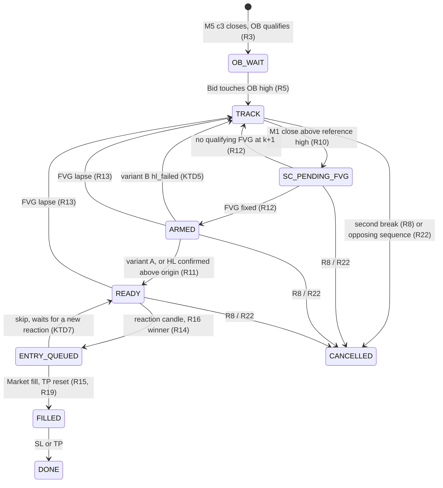
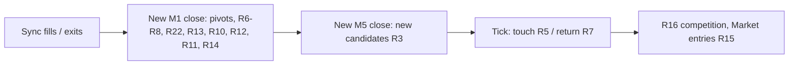

# M5 OB + M1 Structure EA - Plan

## Goal Capsule

- **Objective:** The user gets an MT5 Expert Advisor that trades their M5 Order Block → M1 structure change → M1 FVG retest with a reaction candle, exactly as they specify, in two structure variants. They also get a pre-registered answer from real Strategy Tester runs: does either variant, or the per-fold choice between them, show a robust out-of-sample edge on XAUUSD.s after costs? The answer is a Hebrew report that does not present the new version as a proven improvement.
- **Means:**
  - The failed OB-FVG retest research moves to its own archive (R1).
  - The new EA and an independent M5/M1 conformance checker run through the existing isolated-tester tooling.
  - The protocol is gated: pilot and real-tester charts, a stop for the user's approval, a commit-frozen pre-registration, WFO on December–July, one non-independent run on August–September, robustness checks, then the report and code review.
- **Product authority:** The user, as strategy owner. The trading rules are R3-R23. Any change to them needs the user's explicit consent, and a change made at the chart gate is recorded with its reason before the freeze.
- **Who finishes:** The executing agent builds, verifies, runs the pilot and stops at the chart gate (R27). After approval it runs the research, commits locally (no remote), writes the Hebrew report and completes code review (R34). Live use stays with the user.
- **Execution profile:** Real MT5 runs are required. Code, tests or commits alone do not complete the research.
- **Stop conditions:**
  - **Hard gate:** stop after the pilot charts (R27) until the user approves that the examples represent the strategy. No freeze or optimization before that.
  - Stop and ask if any step would touch the live terminal or account, or if the isolated copy cannot run the tester.
  - Stop and ask if a rule in R3-R23 proves unimplementable as written.
- **Open blockers:** None.
- **Known ceiling:** Every period from December 2025 to September 2026 was already seen by earlier research, so the best possible deliverable is `candidate.set` plus a forward-test protocol on new data (R33).

---

## Product Contract

**Product Contract preservation:** changed: R15, AE7 — "beyond the target" removed and the short-side stop check set to Ask. The target is measured from the fill itself (R19), so it can never already be crossed. A meaning-preserving correction found in planning.

### Summary

A new EA marks Order Blocks with their identifying FVG on closed M5 bars, as the approved definition already does. The first touch of an OB starts M1 monitoring. Entry needs a causal M1 structure change in the trade direction, either a higher high alone (variant A) or a higher high plus a confirmed higher low (variant B). After that it needs a new M1 FVG from that move, then a retest of that FVG with a reaction candle. The order is a Market entry after the reaction candle closes, the stop sits beyond the farther structural level, and the target is fixed at 2R. The research compares A, B and a per-fold choice between them under one frozen protocol.

### Problem Frame

The OB-FVG retest research (M15, Limit entries at the FVG or OB) closed as a failure on 2026-10-02. Out of sample over March–July 2026 the procedure lost 1,502 USD and the baseline lost 1,242 USD, and 2 of 10 acceptance criteria passed. Its post-closure diagnostics found that setups resolved TP-before-SL no more often than random entries with the same side, stop distance and 2R target. A 23% fall in gold explained the long/short split. Spread cost was about 1.5% of R.

That points to entry timing carrying no directional information, not to costs or parameters. The user's new version changes the timing logic itself. Entry now waits for evidence on M1 that price has turned at the zone, and then for a candle that reacts at the new FVG. Whether this adds information is the open question. A failed research is an acceptable outcome.

### Key Decisions

- **No time limit at any stage.** OBs wait for their first touch indefinitely, and setups live until R8 or R22 cancels them or a fill ends them. OB age is logged for diagnosis only. Governs R4. (session-settled: user-directed — chosen over carrying the old 96-bar OB age limit, and over an age limit plus a maximum wait after the touch: the user wants no limit carried from the failed version, and only the agreed structural cancellations.)
- **One entry per reaction candle per direction.** Governs R16. (session-settled: user-directed — chosen over every qualifying setup entering independently up to the cap, and over entering once and cancelling the rest: avoids multiplying exposure on one event while keeping the other setups alive.)
- **August–September runs once, after the freeze, as a non-independent historical check.** Governs R31. (session-settled: user-directed — chosen over adding it to the WFO as extra OOS folds, and over not using it: keeps a run-once period that this strategy's selection never saw, comparable with the previous research.)
- **The existing approved OB/FVG definition, in FVG-only mode, with no added filters.** Governs R3. (session-settled: user-directed — chosen over M5 BOS, a liquidity-sweep requirement or a volume filter, and over inheriting the failed candidate's parameters.)
- **A return after an OB break is a renewed touch, not a close inside the zone.** Governs R7. (session-settled: user-directed — chosen over requiring an M1 close back inside the OB: the user's rule is "break once, then come back to the zone".)
- **The entry FVG may complete one bar after the structure break.** Governs R12. (session-settled: user-directed — chosen over requiring all three FVG candles to close by the break bar: the break bar can be the FVG's middle candle.)
- **Opposing structure is one swing sequence that forms after the touch.** Governs R22. (session-settled: user-directed — chosen over cancelling on any lower high plus any lower low seen during the wait: an old pivot confirmed late, or a low from another move, must not combine with a new high.)
- **M1 pivot strength N = 3, fixed before the pilot and not optimized.** On M1, N = 2 marks five-minute wiggles as swings. N = 3 needs a seven-minute extreme and confirms three minutes after it. N = 5 delays confirmation by five minutes and leaves few structures on M1. The value matches the approved definition's swing default (3) and was not chosen from any result. Governs R9. Shown to the user before the pilot and confirmed at the chart gate (R27).
- **Stop buffer = 20 points (0.20 USD), fixed before the pilot.** It equals the broker's measured stops level and the median XAUUSD.s spread. A stop placed one typical spread beyond the level is not triggered by spread noise alone. It does not inherit the old 10-point buffer and is never widened for results. The short-side spread adjustment keeps both sides symmetric in Bid terms. Governs R18. Shown to the user before the pilot and confirmed at the chart gate (R27).
- **The only optimized axis is the structure variant.** With no time limits, entry modes or filters left, the variant is the strategy's sole free choice. N, the buffer and ImpulseWindowBars are frozen constants, and their sensitivity is reported only as a stability check (R32). Governs R29, R30.

### Requirements

**Archive and build**

- R1. The OB-FVG retest research moves intact to its own archive folder with a git tag, and nothing is deleted. The archive covers its EA source, research-code snapshot, results, deliverables, plan and pre-registration. The shared isolated-tester tooling stays in place.
- R2. The new EA is a separate source with a research-logging build. On the same run, the delivered build and the research build produce identical trades.

**M5 zone**

- R3. The identifying FVG and its OB follow the approved definition on closed M5 bars.
  - A bullish FVG needs candle 3's low above candle 1's high, and it is known only when candle 3 closes.
  - The OB is the most recent opposite-colour candle, searched from candle 1 inclusive back ImpulseWindowBars (2) bars. A doji is neither colour. The OB uses the candle's full high-low range.
  - Each candle becomes an OB at most once.
  - An M5 close beyond the OB between the OB candle and candle 3 discards the candidate.
  - Shorts mirror all of this. There is no M5 BOS, sweep or volume condition.
- R4. An OB has no age limit, and a setup has no time limit after its touch. OB age, in M5 bars and minutes from candle 3's close, is recorded at the touch and at entry, for diagnosis only.

**Touch, break and return**

- R5. The touch is the first tick after candle 3 closes at which Bid reaches the OB's near edge (long: Bid ≤ OB high; short: Bid ≥ OB low). Its tick time is recorded, and no later data from that candle is used.
  - A bar that opens inside or beyond the zone touches at its first tick.
  - The touch starts M1 monitoring and is never an entry.
  - Only M1 events after the touch count for the setup.
- R6. A break is an M1 bar after the touch that closes beyond the OB's far edge (long: close < OB low; short: close > OB high).
  - A wick beyond the edge is not a break.
  - A gap counts only through that close.
  - Consecutive closes beyond the edge before a return belong to one break episode.
- R7. A return is the first tick after a break bar closes at which Bid is back inside the zone (long: Bid ≥ OB low; short: Bid ≤ OB high). A renewed touch suffices. Between a break and its return no entry may happen, while structure tracking and R22 continue.
- R8. A second break, meaning an M1 close beyond the far edge after a return, cancels the setup. The one-break allowance neither resets the setup nor overrides R22.

**M1 swings and structure change**

- R9. M1 pivots are causal.
  - A pivot high is a bar whose high is strictly above the highs of the N bars on each side. A pivot low mirrors this.
  - A pivot exists only once bar p+N has closed. Its peak time and its confirmation time are both recorded.
  - Pivots form one alternating sequence. Of two consecutive same-type pivots, only the more extreme is kept; on a tie, the earlier one.
  - Nothing repaints, and no later confirmation justifies an earlier entry.
- R10. A long structure change (HH) is the first M1 close after the touch above the reference high.
  - The reference high is the latest pivot high in the sequence that is confirmed at that bar's close.
  - The move's origin is the bar with the lowest low from the reference high's peak to the HH bar, inclusive.
  - Shorts mirror this: an LL closes below the reference low, and the origin is the highest high.
- R11. Variant A needs only R10. Variant B also needs a confirmed HL: the first pivot low peaking after the HH bar, which must be above the origin low. Shorts mirror this with an LH. The variant is an EA input.

**Entry FVG**

- R12. The entry FVG is an M1 FVG in the trade direction from the structure-changing move.
  - Its candle 1 is at or after the origin bar, and its middle candle is at or before the HH bar. So it is known no later than the close of the bar after the HH bar.
  - When several qualify, the one with the latest candle 3 is used.
  - FVGs from earlier or later moves never qualify. If none qualifies once the bar after the HH bar has closed, this structure change gives no entry, and the setup waits for a new R10 event.
- R13. An M1 close beyond the entry FVG's far edge before an entry ends that FVG and its structure change (long: close below the FVG's lower boundary). The setup then waits for a new R10 event; this is not a cancellation.

**Reaction and entry**

- R14. A long reaction candle is an M1 bar that touches the entry FVG (low ≤ the FVG's upper boundary), closes green and closes above the FVG's upper boundary. A short reaction candle touches (high ≥ lower boundary), closes red and closes below the lower boundary.
  - The reaction must close on a bar strictly after every confirmation the variant needs has closed: the HH bar, the FVG's candle 3, and in variant B the HL's confirmation bar.
  - If the OB was broken, the reaction must also come after the return.
  - A reaction before those points is never used retroactively.
- R15. Entry is a Market order on the first tradeable tick after the reaction candle closes, after re-checking that the setup is still valid and within limits.
  - There is no Limit order and no fill inside the reaction candle.
  - A setup is skipped, with a reason code, when its stop would already be hit at that tick (long: Bid ≤ stop; short: Ask ≥ stop), or when the order fails broker stop or freeze levels, the lot step or margin.
- R16. One reaction candle opens at most one new trade per direction.
  - Among competing qualifying setups, the one with the latest touch time wins. Ties go to the later OB candle, then the lower setup id.
  - The others stay active under R8 and R22, and need a new reaction candle to enter.
  - The log records the competitors, the winner and those left waiting.
- R17. A setup trades at most once. A fill ends it, and its OB never trades again.

**Stop, target and size**

- R18. The long stop is the lower of the OB's low and the structure low, minus the 20-point buffer.
  - The structure low is the confirmed HL in variant B.
  - In variant A it is the HL if one is confirmed by entry, otherwise the latest confirmed M1 pivot low.
  - The short stop is the higher of the OB's high and the structure high, plus the buffer, plus the spread at entry.
  - The chosen anchor and the buffer are recorded.
- R19. The target is 2R from the actual fill: fill ± 2 × |fill − stop|, set right after the fill. There is no breakeven, trailing stop or partial exit.
- R20. Size is 1% of the balance at entry over the stop distance, rounded down to the lot step.
  - Below the minimum lot, or without enough margin, the setup is skipped and never clamped.
  - Every skip carries a reason code.
- R21. At most 3 positions are open at once. Deposit 10,000 USD, leverage 1:100.

**Opposing-structure cancellation**

- R22. A long setup is cancelled by one bearish swing sequence after the touch.
  - It starts with a lower high: a pivot high H2 that peaked after the touch, below the preceding pivot high H1 in the sequence.
  - It ends with an M1 close below L1, the pivot low between H1 and H2. That close must come after H2 is confirmed.
  - An M1 close above H2 before that voids this lower high, and tracking restarts from the newest pivots.
  - Pivots that peaked before the touch only serve as comparison levels.
  - Shorts mirror this with a higher low and a close above the pivot high between them.
  - R22 applies in every waiting state, including before the first structure change and between a break and its return. It never applies after a fill.
- R23. Cancellation by R8 or R22 is final for the setup.

**Logging, verification and the chart gate**

- R24. The research build logs, per setup:
  - every stage time: touch tick, breaks, returns, pivots with peak and confirmation times, HH/LL, HL/LH, the FVG's three bars, the reaction candle and the entry tick;
  - prices, the stop anchor, OB age, the reason code and the competing setups;
  - the M5 and M1 bars needed to chart and re-check it.
- R25. An independent M5/M1 conformance checker re-derives every rule from the logged bars. It covers synchronization between the timeframes, no pivot used before its confirmation, first and second breaks with returns, cancellation while waiting, entry only after the reaction close, and R16.
- R26. Charts from real tester runs cover both variants, long and short.
  - They show an OB broken and returned, both kinds of cancellation, winners and losers.
  - M5 and M1 panels sit side by side, with identification, confirmation, entry, stop and target times.
  - Examples are picked by a documented, seeded method.
- R27. Hard gate: the work stops after the pilot and charts. Nothing is frozen or optimized until the user approves that the examples represent the strategy. N and the buffer are shown to the user at that point.

**Research protocol**

- R28. A frequency pilot runs December–July on M5/M1 with both variants at the frozen constants, counting fills only. The timeframes never switch to M15, and no rule changes to reach a frequency. A shortfall against 15 fills per month is reported at the gate.
- R29. After approval, a commit freezes the pre-registration before any optimization: rules, fixed constants, grid, trial budget and acceptance criteria.
- R30. WFO runs on December–July in 5 rolling folds of 3-month train and 1-month OOS (March–July).
  - Each fold chooses the variant on its train window only.
  - The report covers variant A alone, variant B alone and the selection procedure separately, under the same windows, costs and risk.
  - The baseline is the code defaults.
- R31. August–September 2026 runs once, after the candidate freeze, labelled "בדיקה היסטורית לא עצמאית".
  - It is never used to choose parameters or the variant, or to change rules.
  - It is reported apart from the WFO.
  - The report states that the WFO periods were also seen by earlier research.
- R32. Robustness covers:
  - stability: the frozen candidate with N ± 1 and the buffer halved and doubled, reported only, never selected;
  - costs and stress: extra spread, plus slippage on stop exits and on Market entries;
  - Monte Carlo: trade shuffle and block bootstrap;
  - DSR with the pre-registered trial count;
  - the random-entry comparison and MFE/MAE diagnostics from the previous research, as non-gating diagnostics.
  
  Every experiment, failures included, is logged. No search widens automatically when results are poor.
- R33. The deliverables are:
  - the code;
  - `.set` files validated on the delivered build;
  - a comparison table;
  - a Hebrew report;
  - the evidence.
  
  The ceiling is `candidate.set` plus a forward-test protocol on unseen data; `recommended.set` is never produced. Without a robust edge, the report states there is no recommendation and the work stops.
- R34. Code review and fixes are completed even if the research fails.
- R35. Every run goes through the isolated runner and its guards. The live terminal and account are never touched, closed or traded.

### Key Flows

- F1. Long setup to fill (variant B)
  - **Trigger:** An M5 bullish FVG's candle 3 closes, and an OB qualifies (R3).
  - **Steps:**
    1. Bid touches the OB high, and M1 monitoring starts (R5).
    2. An M1 close goes above the reference pivot high (R10), and the entry FVG is fixed by the bar after the break (R12).
    3. A pivot low above the origin is confirmed after the HH (R11).
    4. A later M1 candle touches the FVG and closes green above it (R14).
    5. A Market buy goes in on the next tradeable tick (R15), with the stop per R18 and the target per R19.
  - **Covered by:** R3, R5, R9-R12, R14, R15, R18-R20
- F2. Break, return, then entry or cancellation
  - **Trigger:** After the touch, an M1 close falls below the OB low (R6).
  - **Steps:** Entry is blocked while structure tracking continues. Then one of three things happens:
    - Bid re-enters the zone (R7), and the flow continues as in F1.
    - A second close below the OB low after the return cancels the setup (R8).
    - A completed bearish sequence cancels it at any point (R22).
  - **Covered by:** R6-R8, R22, R23

### Acceptance Examples

- AE1. **Covers R12.** The HH close happens on bar k, and bar k is also the middle candle of a bullish FVG whose candle 3 is bar k+1. When bar k+1 closes, the FVG qualifies as the entry FVG. An FVG whose middle candle is bar k+1 does not qualify.
- AE2. **Covers R6, R7.** After the touch, bar j's low goes below the OB low, but bar j closes inside the zone: no break. Bar m closes below the OB low: a break. A later tick with Bid back at the OB low is the return, even though no bar has closed inside the zone yet.
- AE3. **Covers R22.** Before the touch, pivot high H0 and pivot low L0 exist. After the touch, a pivot low L1 below L0 confirms, then a pivot high H2 below H0 confirms, and later a bar closes below L1. The setup is cancelled. If the close below L1 had come only after a close above H2, nothing is cancelled and tracking restarts.
- AE4. **Covers R22.** Mixing moves is forbidden. A close below an old low L0 happens during one decline, and a lower high forms later in a different swing that never closes below its own preceding low. No cancellation.
- AE5. **Covers R14, R11.** In variant B, a candle touches the FVG and closes green above it at 10:05. The HL is confirmed at 10:07. The 10:05 candle never triggers an entry; only a qualifying candle closing after 10:07 can.
- AE6. **Covers R16.** Two long setups from overlapping OBs, touched at 09:10 and 09:40, both qualify on the same reaction candle. Only the 09:40 setup enters. The 09:10 setup needs a later reaction candle.
- AE7. **Covers R15, R18.** A short's reaction candle closes at Friday 23:54, and the next tradeable tick is Monday 01:00, with Ask already above the stop. The setup is skipped with a reason code, and no order is sent.

### Success Criteria

- The conformance checker reports 0 violations on every pilot, WFO, stability and August–September run, or every violation is explained as a checker artefact and fixed before the result is reported.
- The user approves, at the chart gate, that the examples represent the strategy.
- The Hebrew report answers the research question for A, B and the selection procedure separately. It says "no recommendation" when the pre-registered criteria fail, and never presents the new version as a proven improvement.

### Scope Boundaries

- No OB age limit, wait limit, FVG window or order expiry.
- No M15 or other timeframe switch, and no rule change to reach a frequency.
- No M5 BOS, liquidity sweep or volume filter, and no other filter the user did not request.
- No breakeven, trailing stop, partial exit, or Limit entry.
- No grid widening after results, and no use of August–September for any choice.
- No live trading, no live-terminal control, and no `recommended.set`.
- The volume-filter versions and the M15 OB-FVG retest stay archived. They are not re-run or extended here.

### Dependencies / Assumptions

- The isolated MT5 copy (`C:\mt5r`, build 6231, user-logged-in, English UI) runs M1-based tests with Model 4 real ticks.
- In December 2025–January 2026 about 14.3% of minutes came from generated ticks (`research/run_constants.json`). This affects M1 structure more than it affected M15, so it is reported per fold.
- The broker's stops level (20 points at the last read) is read at run time, not assumed.

### Outstanding Questions

**Deferred to Planning**

- How the acceptance criteria and the selection trade floor adapt to a two-choice grid (KTD12 analogue), fixed in the pre-registration before any optimization.
- The Market-entry slippage value for the stress test, and the retry behaviour when the first tick after the reaction is refused as market-closed.
- How the M5 and M1 logs are laid out so that R25's checker and R26's charts share one source.

### Sources / Research

- Approved OB/FVG definition: `mql5/Experts/ob_fvg_retest.mq5` (NewCandidate) and `docs/plans/2026-09-30-2310-feat-ob-fvg-retest-ea-plan.md` (R5-R7, KTD3).
- The failed research and its diagnostics: `deliverables/report_he.md`, `results/diagnostics/wfo_diagnostics.json`.
- The isolated runner and its guards: `research/mt5r/runner.py`, `research/mt5r/env.py`. Run constants: `research/run_constants.json`.
- The user's four schematic images (M5 context, M1 confirmation variants, FVG reaction entry, setup cancellation). They illustrate order and rules only, not distances, durations or parameters.

---

## Planning Contract

### Key Technical Decisions

- KTD1. **A new EA source runs on the M1 chart and reads M5 through CopyRates.** `mql5/Experts/ob_m1_structure.mq5` plus a research wrapper (`#define RESEARCH_LOG` + `#include`), as before. The tester's chart period is M1, so OnTick sees every M1 close. Orders are CTrade Market `Buy`/`Sell` with SL. No Limit or pending order exists. Positions are managed only by SL and TP (R15, R19).
- KTD2. **Fixed processing order on every tick, mirrored by the checker.**
  1. Sync fills and exits.
  2. Process a newly closed M1 bar.
  3. Process a newly closed M5 bar, which only creates candidates.
  4. Run tick-level touch and return checks.
  5. Run R16 competition and send queued Market entries.
  
  Within one M1 close, each setup runs:
  1. pivot sequence update;
  2. break episode (R6) and second break (R8);
  3. R22 completion or void;
  4. R13 lapse;
  5. R10 event;
  6. R12 FVG decision;
  7. R11 HL;
  8. R14 reaction.
  
  Cancellations always beat an entry on the same bar.
- KTD3. **One global causal M1 pivot sequence, not one tracker per setup.**
  - Setups hold pivot ids. Every decision uses the sequence as it stood at that close.
  - Compression (R9) never rewrites a recorded event; a replaced pivot keeps its id and gets `replaced_by`.
  - An outside bar that is a strict pivot high and a strict pivot low appends first the type opposite to the current last element, so both survive, and is logged.
- KTD4. **The touch bar's own close is the first post-touch close.** So the touch bar can be a break, an HH or an R22 close. A pivot that peaks on or before the touch bar is pre-touch, a comparison level only, because its extreme may precede the touch tick. Origins and FVG candle 1 may predate the touch; only closes and pivots used as events must be post-touch (R5).
- KTD5. **One live structure change per setup.**
  - A newer R10 event, a close above a newer pivot high than the current reference, replaces the live one and is logged `sc_superseded`.
  - A reference pivot yields at most one R10 event per setup.
  - The HL is the first pivot low peaking after the HH bar, if it is above the origin low. In variant B, a first pivot low not above the origin low is logged `hl_failed`, and the setup waits for a new R10 event. In variant A this never ends the structure change: R18 uses the HL if one exists by entry, otherwise the latest confirmed pivot low.
  - When R12 picks an FVG whose candle 3 closed before bar k+1, bar k+1 may itself be the reaction.
- KTD6. **The return and break rules apply literally, bar by bar.** A later bar that wicks back into the zone and closes beyond it again is a return followed by a second break, so R8 cancels. This is shown at the chart gate. Under R14, the reaction bar may be the bar containing the return tick or any later bar, since its close comes after the return. The checker verifies this at bar level.
- KTD7. **Entry mechanics.**
  - The order is sized from the request price (Ask long, Bid short) and the structural SL (R18, R20).
  - It is sent with SL and a provisional TP, and `PositionModify` sets TP to fill ± 2R (R19).
  - The request price, fill, both distances and the attempts are logged.
  - A `TRADE_RETCODE_MARKET_CLOSED` refusal is retried on every later tick while the setup stays valid. M1 closes in between still run R8 and R22. There is no attempt cap, consistent with R4.
  - A skip ends nothing: it consumes that reaction candle only, and the setup keeps waiting for a new reaction candle until R8, R22 or a fill ends it (R4). A skipped R16 winner consumes the candle with no fallback to the next competitor. This applies to every skip code, including the cap (R21) and a crossed stop (AE7).
- KTD8. **Warm-up replays 30 calendar days of M5 and M1 closed bars with trading off.**
  - OBs identified in warm-up and still untouched carry into the live run.
  - A setup touched during warm-up ends as `warmup_dropped`, because warm-up has no ticks, only bars.
  - Warm-up bars are logged with a flag, so the checker rebuilds pivots and OBs from the same first bar.
  - The 30 days are pre-registered and identical in every run. With no age limit (R4), warm-up length decides which old OBs exist, so it is fixed rather than tuned.
- KTD9. **Per-tick work stays bounded.** The highest untouched long OB high and the lowest untouched short OB low are cached, and the OB list is scanned only when Bid crosses a cached edge. Returns are checked only for setups in a break episode.
- KTD10. **Logs are event-shaped.** The research build writes:
  - `rl_setups`: one row of final facts per setup;
  - `rl_events`: setup id, kind, bar time, tick msc, price, reference id;
  - `rl_pivots`: id, type, peak time, confirmation time, level, replaced_by;
  - `rl_bars_m1` and `rl_bars_m5`, with the warm-up flag;
  - `rl_days` and `rl_deals`, unchanged formats.
  
  Curated results keep the M1 bars gzipped. Optimization passes log only the funnel and OnTester.
- KTD11. **The checker is an independent replay.** `research/mt5r/conformance_m1.py` rebuilds every rule from the logged bars, replaying the pivot sequence bar by bar under KTD2-KTD6, and compares the result with the event log.
  - Touch and return are verified at minute level: the claimed tick lies in a bar whose Bid range reaches the edge, and no earlier bar qualified.
  - Synchronization is verified by checking each M5 bar against the aggregate of its M1 bars.
  - The old single-timeframe checker stays with the archive.
- KTD12. **Chart examples come from real tester runs.** Each variant gets seeded categories (seed 20260930), long and short:
  - broken-and-returned;
  - second-break cancel;
  - opposing-structure cancel;
  - return-and-break in one bar (KTD6);
  - winner;
  - loser;
  - stacked entries from one structure, where the R16 losers entered on later candles.
  
  The M5 panel spans from the OB candle to the exit or cancellation. The M1 panel spans from the earlier of 30 minutes before the touch and the earliest pivot the setup's events reference, to the exit or cancellation. The M1 window is shaded on the M5 panel.
- KTD13. **The pipeline gains a strategy profile instead of a fork.** `research/mt5r/pipeline.py` points EA_SRC, BUILDS and the grid at the new EA. `research/mt5r/env.py` EA_SOURCES points at the new sources. The old-EA-specific CLI, pipeline constants and tests are snapshotted into the archive (R1). Shared modules stay in place, not archived. They change only where U6, U9 and U10 list them: env, curate, journal, wfo and evaluate.
- KTD14. **The pre-registration is planned now and written only after the gate (R29).**
  - Grid: `StructureVariant` ∈ {A=0, B=1}, the only optimized input.
  - Selection on train: at least 15 fills per month, maximum equity drawdown 10%, score = recovery factor, ties to A (the code default and baseline).
  - DSR trials: 2 × 5 folds plus this strategy's pilot runs.
  - Acceptance follows the previous KTD12 set: frequency, net above 0 and above baseline, bootstrap CI, positive folds, top-2 removal, loss limits with MC, cost stress, DSR. Three changes:
    - stability (KTD15) replaces the grid-neighbour criterion;
    - cost stress adds 10 points of slippage on every Market entry;
    - August–September is reported apart and is not an acceptance criterion (R31).
  - The final candidate is selected on May–July.
- KTD15. **Stability runs perturb one frozen constant at a time on the candidate over March–July:** N ∈ {2, 4} and buffer ∈ {10, 40} points. They are reported as the share of profitable perturbations (criterion ≥ 0.60), never used for selection (R32).
- KTD16. **Reason codes:**
  - final reasons: `cancelled_second_break`, `cancelled_opposing_structure`, `filled`, `run_end_waiting`, `run_end_untouched`, `warmup_dropped`;
  - skip events, which never end a setup (KTD7): `skipped_stop_crossed`, `skipped_stops_level`, `skipped_volume`, `skipped_margin`, `skipped_cap`, `skipped_broker_reject`, `lost_competition`.
  
  Lifecycle events: `touch`, `break`, `return`, `sc_hh`, `sc_superseded`, `fvg_fixed`, `fvg_none`, `fvg_lapsed`, `hl`, `hl_failed`, `reaction`, `entry_attempt`.

### High-Level Technical Design

Setup lifecycle (long; short mirrors). "Waiting" covers every state before FILLED, where R8 and R22 apply.

`BROKEN` is an orthogonal flag (R6/R7): it is set by a far-edge close and cleared by the return tick. While it is set, no entry is allowed; a second far-edge close after one return cancels.

Per-tick order (KTD2):

### Assumptions

- The M1 bars of XAUUSD.s are Bid-based (SYMBOL_CHART_MODE Bid), as the M15 bars were. U7 verifies this, and KTD11's minute-level touch check depends on it.
- CopyRates returns M1 and M5 bars from before the test start for the 30-day warm-up (KTD8). U7 verifies this on the first smoke run.
- Tester speed with Model 4 on an M1 chart stays within hours for an 8-month run. KTD9 bounds per-tick work.

### Sequencing

U1 → U2 → U3 → U4 and U5 (in parallel) → U6 → U7 → **chart gate (R27)** → U8 → U9 → U10. Nothing after the gate starts without the user's approval.

---

## Implementation Units

### U1. Archive the OB-FVG retest research

- **Goal:** Move the failed M15 research out of the active tree intact (R1).
- **Requirements:** R1, R35.
- **Dependencies:** none.
- **Files:**
  - `archive/2026-10-03-ob-fvg-retest-m15/` (new, with `README.md`) holding: `mql5/Experts/ob_fvg_retest.mq5`, `mql5/Experts/ob_fvg_retest_research.mq5`, `deliverables/`, `results/` (pilot, smoke, compile, wfo, final_selection, holdout, robustness, diagnostics, code_review, gate_review, v1_before_gate_changes, acceptance.json, set_validation.json, input_checks.json, fidelity.md), `research/preregistration.json`, `docs/plans/2026-09-30-2310-feat-ob-fvg-retest-ea-plan.md`, and a `research/` snapshot of the old-EA-specific code and tests;
  - `research/tests/` (old-EA tests move to the snapshot);
  - `results/experiment_log.*` (stays active and continuous; a copy goes to the archive).
- **Approach:**
  1. Tag `archive/ob-fvg-retest-m15` at the commit before the move.
  2. `git mv` the evidence.
  3. Copy the research snapshot.
  4. Move local `runs/` folders under the archive's git-ignored `runs/`.
  5. Write the README in the style of `archive/2026-09-30-new-test-sweepob/README.md`.
  
  Shared tooling stays (KTD13). `mql5/Experts/ob_fvg_retest copy.mq5` is the user's file and is not touched.
- **Patterns to follow:** `archive/2026-09-30-new-test-sweepob/`, `archive/2026-10-02-ob-fvg-volume-2x/`.
- **Test scenarios:**
  - The archived EA's sha256 matches the source at the tag.
  - After the move, `python -m pytest research/tests -q` passes on the shared-tooling tests that remain.
- **Verification:**
  - `git status` shows renames, not deletions.
  - The README lists every moved path and the tag.

### U2. EA signal engine (M5 zone, touch/break/return, M1 structure, entry FVG, reaction, cancellation)

- **Goal:** Implement R3-R14 and R22-R23 as the KTD1-KTD6 state machine.
- **Requirements:** R3-R14, R16-R17, R22-R23. Settled decisions via their governed Rs: R4, R7, R12, R16, R22.
- **Dependencies:** U1.
- **Files:**
  - `mql5/Experts/ob_m1_structure.mq5` (new);
  - `mql5/Experts/ob_m1_structure_research.mq5` (new);
  - `research/tests/test_ea_m1_static.py` (new).
- **Approach:**
  - Inputs, all with explicit enum ints because `setfile.py` parses them: `StructureVariant` (A=0 default, B=1), `ImpulseWindowBars` 2, `SwingStrengthM1` 3, `StopBufferPoints` 20, `RiskRR` 2.0, `RiskPercent` 1.0, `MaxExposures` 3, `WarmupDays` 30, `MagicNumber`, `TradeComment`.
  - OB identification reuses the approved logic of the archived `NewCandidate`, without the BOS branch.
  - One global pivot sequence (KTD3).
  - The per-setup state follows the High-Level Technical Design.
  - The edge caches follow KTD9.
- **Execution note:** Static source tests first, as in `research/tests/test_ea_static.py`. Behaviour is proven by the U4 checker on tester output in U7.
- **Patterns to follow:** archived `ob_fvg_retest.mq5` (NewCandidate, IsPivotHigh/Low, research blocks, funnel printing).
- **Test scenarios:**
  - Every enum member has an explicit int.
  - The input list and defaults match the KTD list above.
  - There is no `BuyLimit`, `SellLimit` or pending order, and no volume, BOS or age input.
  - Research code sits only in `#ifdef RESEARCH_LOG` blocks.
  - OnInit calls a state reset before warm-up.
  - The per-tick handler calls the steps in the KTD2 order.
  - Every KTD16 code appears in the source.
  - Pivot confirmation requires bar p+N closed: a static check that the confirmation index is `n - SwingStrengthM1`.
- **Verification:**
  - Both builds compile with 0 errors and 0 warnings in the isolated MetaEditor (U7).
  - Static tests pass.

### U3. EA execution, risk and research logging

- **Goal:** Implement R15 and R17-R21 entries and the KTD10 logs.
- **Requirements:** R2, R15, R17-R21, R24, R35.
- **Dependencies:** U2.
- **Files:**
  - `mql5/Experts/ob_m1_structure.mq5`;
  - `research/tests/test_ea_m1_static.py`.
- **Approach:**
  - Entry mechanics follow KTD7.
  - Sizing reuses the archived R14 code: balance × 1% / (stop distance × tick value), rounded down, skip never clamp, margin check.
  - The cap counts open positions (R21).
  - R16 competition orders by touch time, then OB candle time, then setup id, and logs `lost_competition`.
  - The logs follow KTD10. OnTester returns the daily Sharpe, as before.
  - The funnel is printed on short lines, which `journal.py` merges.
- **Test scenarios:**
  - Static check: `trade.Buy` and `trade.Sell` appear only in the entry routine, and each call carries an SL.
  - TP is modified after the fill from the deal price.
  - No clamp to the minimum volume.
  - The `rl_setups`, `rl_events`, `rl_pivots`, `rl_bars_m1` and `rl_bars_m5` headers equal the contract.
  - The `rl_days` and `rl_deals` headers equal the archived EA's.
  - There is no constant stops distance: the stops level is read at entry.
- **Verification:** U7 shows identical deals for the delivered and research builds on one month.

### U4. Independent M5/M1 conformance checker

- **Goal:** Re-derive every rule from the logged bars and compare with the event log (R25, KTD11).
- **Requirements:** R5-R16, R18-R19, R22, R25.
- **Dependencies:** U3, for the log contract.
- **Files:**
  - `research/mt5r/conformance_m1.py` (new);
  - `research/tests/test_conformance_m1.py` (new);
  - `research/tests/fixtures/m1/` (new synthetic CSVs).
- **Approach:**
  - Replay M1 bars from the first logged bar, including warm-up, with the KTD2 per-bar order and the KTD3 pivot sequence.
  - Compute each setup's expected trajectory and compare it with `rl_events` and `rl_setups`.
  - Violations use one rule name per R.
  - An `occurrences()` count shows which cases were exercised.
- **Execution note:** Test-first on synthetic bars built for each Acceptance Example.
- **Test scenarios:**
  - Covers AE1. A break bar that is also the FVG middle candle qualifies the FVG at k+1, and the claimed FVG passes. An FVG with its middle candle at k+1 is flagged `fvg_not_in_move`.
  - Covers AE2. A wick below the OB low with a close inside is not a break; a claimed break is flagged. A later Bid-range touch counts as a return without a close inside.
  - Covers AE3. LH then a close below L1 → `cancelled_opposing_structure` expected. Close above H2 first → no cancellation expected, and a claimed cancellation is flagged.
  - Covers AE4. A close below an old L0 plus an LH from another swing → no cancellation expected.
  - Covers AE5. In variant B, a reaction before the HL confirmation bar is not an entry; an entry claimed there is flagged.
  - Covers AE6. Two setups qualify on one reaction candle; the later touch must be the winner, and the other is `lost_competition`.
  - Covers AE7. An entry whose stop was already crossed at the first tick must log `skipped_stop_crossed`, and the setup keeps waiting.
  - Pivot causality: an event using a pivot before its confirmation bar closed is flagged.
  - Return-and-break within one bar (KTD6) → `cancelled_second_break` expected.
  - An M5 OHLC that is not the aggregate of its M1 bars is flagged `tf_sync`.
  - A touch claimed in a bar whose low does not reach the OB high, or after an earlier qualifying bar, is flagged.
  - A TP that is not fill ± 2 × |fill − SL| is flagged. An SL anchor that is not the R18 minimum minus the buffer is flagged.
- **Verification:**
  - All tests pass.
  - On the U7 tester runs the checker reports 0 violations, or each one is diagnosed as a checker artefact and fixed.

### U5. M5 + M1 charts from tester output

- **Goal:** Gate charts with both timeframes and all stage times (R26, KTD12).
- **Requirements:** R26, R27.
- **Dependencies:** U3, for the log contract.
- **Files:**
  - `research/mt5r/charts_m1.py` (new);
  - `research/tests/test_charts_m1.py` (new).
- **Approach:**
  - Two stacked panels on a shared time axis. The M5 panel shows the OB and the identifying FVG. The M1 panel shows pivots with peak and confirmation markers, the HH/LL and HL/LH, the entry FVG, the reaction candle, the entry, SL and TP, and break and return markers.
  - Selection uses the KTD12 categories with seed 20260930. Missing categories are listed.
  - A markdown table gives the stage times and prices per example.
- **Patterns to follow:** `archive/.../research/mt5r/charts_setups.py` from the U1 snapshot (palette, `draw_setup` structure).
- **Test scenarios:**
  - Each category picks deterministically under the seed.
  - A category with no candidates is listed as missing.
  - The rendered PNG exists and the table has one row per example.
  - The M5 window spans OB candle to exit, and the M1 window follows KTD12.
- **Verification:** Charts render on U7 pilot output and are visually checked before they are sent to the user.

### U6. Pipeline and CLI for the new EA (pre-gate commands)

- **Goal:** Run install, smoke, conformance, pilot and charts for the new EA through the guarded runner (R28, R35, KTD13).
- **Requirements:** R2, R25-R28, R35.
- **Dependencies:** U1-U5.
- **Files:**
  - `research/mt5r/pipeline.py`, `research/mt5r/env.py`, `research/mt5r/curate.py` (gzip of M1 bars), `research/mt5r/journal.py` (new funnel keys);
  - `research/cli.py`;
  - `research/run_constants.json` (strategy block: chart period M1, zone period M5, warm-up days);
  - `research/tests/test_pipeline.py`, `research/tests/test_cli_guards.py`.
- **Approach:**
  - `pilot` runs both variants over December–July on M1.
  - `charts` renders from both pilot runs.
  - `smoke` covers a one-month window for each variant.
  - A build-equivalence check is included.
  - The existing guards stay: live terminal, the trade-safety check, refusing the holdout window after pre-registration, and the EA hash.
  - Post-gate commands (`freeze-rules`, `wfo`, `freeze`, the August–September check, `robustness`, `deliver`) are adapted in U8-U10, not here.
- **Test scenarios:**
  - The ini for a pilot run has `Period=M1` and the new expert.
  - `pilot_summary` has no profit fields and reports fills per month per variant.
  - `install` refuses while the live terminal runs.
  - Curation gzips `rl_bars_m1`, and the checker reads it back.
- **Verification:** `python -m pytest research/tests -q` passes.

### U7. Build verification, pilot and gate charts → STOP

- **Goal:** Real-tester evidence for the chart gate (R27, R28).
- **Requirements:** R2, R25-R28.
- **Dependencies:** U6. The live terminal is closed; if it is open, ask the user and never close it.
- **Files:** `results/smoke/`, `results/pilot/`, `results/pilot/charts/` (generated).
- **Approach:**
  1. `install`, which compiles both builds.
  2. A one-month smoke run per variant, with the checker.
  3. Delivered vs research build: identical deals.
  4. Verify the Bid chart mode and that warm-up bars exist before the start.
  5. The pilot, both variants, December–July.
  6. Charts.
  7. Commit the evidence (account-id scan first).
  8. Send the charts with N = 3 and the 20-point buffer and the KTD6 and stacking examples. **STOP for approval.**
- **Test scenarios:** Test expectation: none — this is an execution unit; its proof is the checker's 0 violations and the identical-deals check.
- **Verification:**
  - Conformance reports 0 violations on smoke and pilot.
  - The evidence is committed.
  - The user has the charts.

### U8. Freeze rules and pre-registration (after approval)

- **Goal:** A commit-frozen protocol before any optimization (R29, KTD14).
- **Requirements:** R29.
- **Dependencies:** U7 and the user's approval.
- **Files:** `research/mt5r/pipeline.py` (`build_prereg` for the variant grid), `research/cli.py`, `research/preregistration.json`, `research/tests/test_pipeline.py`.
- **Approach:**
  - The pre-registration records the rules' EA hash, the constants (N, buffer, ImpulseWindowBars, warm-up days), the grid, the folds, the selection, the acceptance criteria (KTD14, KTD15), the trial count, the August–September window label, and any gate changes with reasons.
  - It is committed before the WFO.
- **Test scenarios:**
  - The pre-registration has a grid of exactly `StructureVariant` [0, 1].
  - The DSR trials equal 10 plus the pilot runs.
  - August–September is not in acceptance.
  - `freeze-rules` refuses if the pre-registration exists.
- **Verification:** The pre-registration commit precedes the first WFO log entry.

### U9. WFO, candidate freeze and August–September check (after U8)

- **Goal:** R30 and R31 evidence.
- **Requirements:** R30, R31.
- **Dependencies:** U8.
- **Files:** `research/cli.py`, `research/mt5r/wfo.py` (two-choice grid), `results/wfo/`, `results/final_selection/`, `deliverables/*.set`, `results/aug_sep_check/`.
- **Approach:**
  - Per fold, a 2-pass optimization on train selects the variant.
  - OOS runs cover the procedure, fixed A and fixed B, with chained whole-dollar deposits (`tester_deposit`).
  - The final selection uses May–July. The candidate, baseline and both variant `.set` files are frozen and committed.
  - August–September runs once for the candidate and both variants, labelled "בדיקה היסטורית לא עצמאית".
- **Test scenarios:**
  - Selection with equal scores picks A.
  - Folds with no eligible pass fall back to A.
  - The August–September command refuses a second completed run.
- **Verification:** Input-load checks (`research/verify_inputs.py`) show 0 mismatches. The checker shows 0 violations on every OOS run.

### U10. Robustness, deliverables, Hebrew report, code review (after U9)

- **Goal:** R32-R34.
- **Requirements:** R32, R33, R34.
- **Dependencies:** U9.
- **Files:** `research/cli.py`, `research/mt5r/evaluate.py` (stability criterion, entry slippage), `research/wfo_diagnostics.py` (adapted random-entry null), `deliverables/report_he.md`, `deliverables/forward_test_protocol.md`, `results/acceptance.json`.
- **Approach:**
  - Run the KTD15 stability set.
  - Cost stress adds entry slippage.
  - MC uses shuffle and block bootstrap.
  - DSR uses the Custom-column variance.
  - Diagnostics as in R32.
  - The report covers A, B and the procedure separately, and August–September apart.
  - Code review and fixes follow, with tester re-verification that the fixed EA trades the same.
- **Test scenarios:**
  - The entry-slippage stress lowers net by points × volume × contract size per entry.
  - The stability share is computed over the 4 perturbations only.
  - `recommended.set` is never written.
- **Verification:** `acceptance.json` exists, the checker reports 0 violations on every KTD15 stability run (or each one is diagnosed as a checker artefact and fixed), the report is committed, and the review findings are applied or recorded.

---

## Verification Contract

| Gate | Command / evidence | Applies to |
|---|---|---|
| Unit and static tests | `python -m pytest research/tests -q` | U1-U6, U8-U10 |
| Compile | `python research/cli.py install`: 0 errors and 0 warnings on both builds | U2, U3, U7 |
| Conformance | `python research/cli.py smoke`, then `pilot`: 0 checker violations | U7, U9, U10 |
| Build equivalence | identical deals for the delivered and research builds, one month | U7 |
| Input load | `python research/verify_inputs.py`: 0 mismatches | U9, U10 |
| Secrets | account-id scan of new `results/` and `deliverables/` files before each commit: 0 hits | every commit |
| Live safety | the runner refuses while the live terminal runs; nothing closes it | every tester step |

## Definition of Done

- **Pre-gate (this run):**
  - U1-U7 done, and all tests pass.
  - Both builds compile cleanly.
  - Conformance reports 0 violations on smoke and pilot.
  - Pilot fills per month are reported per variant.
  - The charts and the N/buffer values are sent to the user, and work stops.
  - Commits are local, and no abandoned experimental code remains in the diff.
- **Post-gate (after approval):**
  - U8-U10 done.
  - The pre-registration is committed before the WFO.
  - August–September ran once and was reported apart.
  - The Hebrew report states the result or "no recommendation".
  - Code review fixes are applied or recorded.
  - There is no `recommended.set`.
