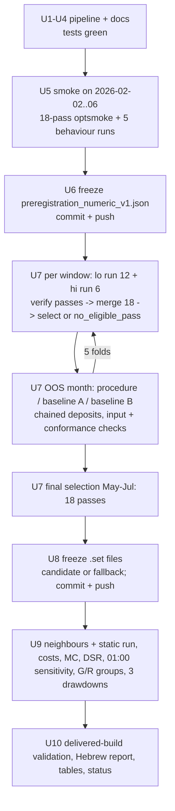

# M5 OB + M1 Structure Numeric Grid Research - Plan

## Goal Capsule

- **Objective:** The user learns, from a pre-registered train-only selection over a fixed 18-combination grid, whether choosing the structure variant, the M1 pivot strength and the stop buffer improves out-of-window results over the fixed defaults, with "no improvement" an acceptable answer.
- **Means:** a new, separate research version ("numeric v1") on the unchanged `ob_m1_structure` EA, run only in the isolated MT5 Strategy Tester.
- **Product authority:** the user approved this scope on 2026-10-04 in full; a plan that stays inside it needs no further approval round. Trading rules, the grid, the folds and the thresholds are fixed by that approval.
- **Open blockers:** none.

---

## Product Contract

### Summary

A new research version selects StructureVariant, SwingStrengthM1 and StopBufferPoints per fold on train data only, by a rule frozen and pushed before any research run. Its out-of-window results are compared with two fixed baselines, A and B at N=3 and buffer 20, then put through the existing robustness checks. The output is a Hebrew report, validated `.set` files and at most a candidate with a forward-test protocol.

### Problem Frame

The previous research (plan `docs/plans/2026-10-03-0013-feat-m5-ob-m1-structure-ea-plan.md`, protocol `research/preregistration.json`) chose only between variants A and B, with N=3 and the 20-point buffer fixed. Neither variant met the 10% train equity-drawdown limit in any window, so the protocol fell back to A everywhere and the research failed. Its stability check moved N and the buffer one at a time, and those runs swung from +964 to −1848 USD. Whether a controlled choice of these two constants helps out of window is therefore still open.

The pipeline was built for a two-choice grid and cannot answer that question as it stands. MT5 optimizes with uniform start/step/stop ranges, but the buffer values 10, 20, 40 are not evenly spaced. The candidate is mapped to the fixed series by its variant alone. The stability perturbations are fixed around N=3 and buffer 20, so for a candidate with N=2 one "neighbour" would repeat the candidate.

All of December 2025 to July 2026 has been seen in earlier research and pilots, and August–September 2026 has been used as a non-independent check. No period in this history is blind.

### Key Decisions

- **Grid and fixed inputs as approved.** (session-settled: user-directed — chosen over widening the grid or adding parameters: the user fixed the exact grid and forbade further ranges, filters or exit/risk changes.) Governs R5, R6.
- **Same folds and final window.** (session-settled: user-directed — chosen over new or extended windows: comparability with the previous research.) Governs R12.
- **Train-only selection with the existing thresholds.** (session-settled: user-directed — chosen over softening the floor or the 10% train equity-DD limit to obtain an eligible pass.) Governs R13, R14, R15.
- **Two fixed baselines, A and B at N=3 / buffer 20, in every fold.** (session-settled: user-directed — chosen over a single baseline.) Governs R17.
- **August–September is not re-run and not presented as a holdout.** (session-settled: user-directed — chosen over a second look at the same months.) Governs R23.
- **Previous research left untouched; new version, protocol, folders and run IDs.** (session-settled: user-directed — chosen over resetting the old guards to allow more runs.) Governs R1, R2.
- **"Improvement" means beating both fixed baselines out of window.** The previous research already showed fixed B ahead of fixed A out of window, so beating A alone could reflect that exposure rather than the selection. This is stricter than the previous protocol. Governs R19.
- **The primary DSR trial count is conservative.** It counts every train pass of this research plus every evaluated configuration of the previous research on the same history. Because these trials are positively dependent, the count overstates the effective number of trials, which makes passing harder. Governs R21.
- **Neighbours are one grid step on an ordinal axis around the final candidate.** The variant is categorical and is not a neighbour axis. Values outside the grid are never run. Governs R20.
- **Pre-registration checks run on a train-only window.** The window is 2026-02-02 to 2026-02-06: real ticks, inside folds 1–3 train, and outside every OOS month. Governs R9, R10.

### Requirements

**Separation from the previous research**

- R1. The previous research's plan, protocol, EA hash record, results, deliverables and run evidence stay byte-identical; its CLI guards (one-time freeze, committed candidate, holdout refusal) are not reset or bypassed.
- R2. The new research has its own version name, plan, pre-registration file, results root, deliverables folder and run-ID prefix, so no new run can overwrite or be mistaken for an old one.
- R3. The EA source and its research build are not changed; the new pre-registration records the same EA source hash, and every new run is refused when the installed tester copy differs from it.
- R4. `CLAUDE.md` states that selecting parameters on train data by a pre-frozen rule is allowed, while out-of-window results and robustness checks may never change a choice, and that simulated trades in the isolated tester are allowed while the trading ban covers connected accounts.

**Grid and pipeline correctness**

- R5. The grid is exactly StructureVariant {0, 1} (categorical), SwingStrengthM1 {2, 3, 4} and StopBufferPoints {10, 20, 40}: 18 combinations per train window.
- R6. All other inputs are fixed: ImpulseWindowBars 2, RiskRR 2.0, RiskPercent 1.0, MaxExposures 3, WarmupDays 30, deposit 10,000 USD, leverage 1:100, and the existing display inputs.
- R7. Every train window runs exactly the 18 grid combinations, never a value outside the grid such as buffer 30. After merging the tester output, each combination appears exactly once, with none missing, extra or duplicated, or the window fails.
- R8. Every optimization axis has an explicit default (StructureVariant 0, SwingStrengthM1 3, StopBufferPoints 20), and every selected or fallback candidate carries all three values into OOS runs, robustness runs, `.set` export and delivered-build validation.
- R9. Before the freeze, tester runs on the train-only check window show that changing N changes the logged pivots and structure events, and that changing the buffer changes stop distances, each by the expected amount.
- R10. The optimization smoke test and the pass-count checks expect the new grid's pass count and fail on any shortfall.
- R11. For every run, the inputs the tester actually loaded and the number of completed passes are checked against the tester's own output (report inputs, optimization table, frames, journal), and a run with missing passes, unexpected inputs, cached-only results or an empty report is never recorded as successful.

**Protocol freeze and selection**

- R12. Folds stay as before: five folds of three train months and one OOS month, OOS March–July 2026; the final selection uses May–July 2026 train data only. That is 108 train passes (18 × 5 folds + 18 final).
- R13. A pass is eligible only when it meets the existing train trade floor (15 per month × 3 months) and a tester maximum equity drawdown of at most 10% on the train window.
- R14. Among eligible passes, the selection score and tie-break are frozen in the pre-registration before any research run: recovery factor with neighbour smoothing within the same variant, ties to the smaller distance from the defaults, then to the lowest axis indices.
- R15. When no pass is eligible, the window reports `no_eligible_pass`. Any default carried forward to complete the evaluation is labelled a fallback, never an improved or selected candidate.
- R16. The pre-registration, committed and pushed before the first research run, records the exact grid, all fixed inputs, the train and test windows, selection, ties, fallback, neighbours, acceptance criteria, the DSR trial count with its reasoning, and the run budget. The budget lists, separately, the 108 train passes, the smoke and behaviour checks, the OOS runs, the robustness runs and the delivery validation.

**Comparison and robustness**

- R17. Three OOS series run in every fold with chained deposits: the procedure (each fold's selection or fallback), fixed baseline A (0, 3, 20) and fixed baseline B (1, 3, 20). Each run's deposit chain, trade records and loaded parameters are verified.
- R18. The candidate's own series is identified by all of its parameters, never mapped to a fixed baseline because its variant matches.
- R19. Acceptance requires the procedure to meet every pre-registered criterion, including an OOS net result above both fixed baselines. The other criteria carry over from the previous protocol: fill frequency, positive net, bootstrap CI, strict majority of positive folds, top-event removal, loss limits with Monte Carlo, cost stress with entry and stop slippage, neighbour stability and DSR.
- R20. Neighbour stability runs every grid point one step away from the final candidate on SwingStrengthM1 or StopBufferPoints, over March–July. It never counts a run identical to the candidate, and it never feeds back into selection.
- R21. DSR uses the daily Sharpe returned by OnTester. Its primary trial count is documented in the pre-registration: the trials counted, the prior trials included, the dependence assumptions, and a sensitivity figure using the 18 distinct configurations.
- R22. Results are reported for all folds, for folds whose training includes generated ticks (1–2), and for folds trained on real ticks only (3–5). Three drawdowns are reported apart: the tester's, one rebuilt from daily records, and one on closed trades. The 01:00 quote-only-minute sensitivity is reported as before and is never used for a choice.

**Validation limits and deliverables**

- R23. March–July results are presented as outside the train window but not blind or independent. August–September is neither run nor presented as a holdout.
- R24. Even if every criterion passes, the output is at most a `candidate.set` and a forward-test protocol on new data, with no `recommended.set`. A failed research says explicitly that no improvement was found within the tested grid.
- R25. Deliverables include a Hebrew report, a parameter table, per-fold results, the baseline comparison, the robustness results, `.set` files for the original, the two baselines and the candidate or fallback, each validated against the delivered build, plus simplification and code review of the changed code.

**Process and synchronization**

- R26. Every run goes through the isolated runner and its guards. If the live terminal is open, the user is asked to close it, and it is never closed, started or attached to by the agent.
- R27. After each verified unit of work, a focused commit is pushed to the working branch per `CLAUDE.md`, and `docs/PROJECT_STATUS.md` is updated. Each report names the branch, the full SHA and the commit link.
- R28. Every train window reports its expected, completed, failed and cached combinations, its run time, its number of eligible passes, and the selected parameters with the reason for the choice.

### Acceptance Examples

- AE1. **Covers R7.** Given the buffer axis {10, 20, 40}, when a train window's optimization is merged, then exactly 18 unique (variant, N, buffer) rows exist and no row has buffer 30; a missing or duplicated row stops the window.
- AE2. **Covers R15, R17.** Given no eligible pass in fold 2, when its OOS runs, then the procedure runs the defaults labelled `fallback (no_eligible_pass)`, and the report never calls them a selected or improved candidate.
- AE3. **Covers R18.** Given a final candidate (0, 2, 40), when robustness runs, then its series is the candidate's own, not fixed baseline A, although both have variant 0.
- AE4. **Covers R20.** Given a final candidate (1, 2, 10), when neighbour stability runs, then the neighbours are (1, 3, 10) and (1, 2, 20) only, and no run repeats (1, 2, 10).
- AE5. **Covers R20.** Given a final candidate (0, 3, 20), then the neighbours are (0, 2, 20), (0, 4, 20), (0, 3, 10) and (0, 3, 40).
- AE6. **Covers R19.** Given a procedure that beats fixed A but not fixed B out of window, then acceptance fails on the baseline criterion.

### Success Criteria

- The 108 train passes, all OOS runs and all robustness runs complete, with loaded inputs and pass counts verified against tester output (R11).
- A reader of the Hebrew report can tell, from one table per fold, what was selected or fell back and why, and whether the selection beat both baselines.
- The research reaches a final verdict, positive or negative, without a second optimization round.

### Scope Boundaries

- No change to trading rules, entries, exits, risk, filters, time limits or the EA source.
- No grid values or parameters beyond R5, and no range widening after seeing results.
- No re-run of August–September 2026 and no new holdout claim.
- No `recommended.set`, no live or demo trading, and no change to the live terminal.
- No change to the previous research's files, results or guards.
- A further optimization round, new folds or a new strategy version each need a new user approval.

### Dependencies / Assumptions

- The isolated tester at `C:\mt5r` (build 6231) and its tick history for December 2025 to July 2026 stay as they were in the previous research (real ticks from February 2026; generated ticks in December and partly January).
- The live terminal is closed during runs; if not, work pauses for the user.
- From the previous research, every train pass had a tester equity drawdown between 13.8% and 54.6%, so a `no_eligible_pass` in some or all windows is a plausible outcome. It is reported as found.
- Pushes go to `https://github.com/AriGabay/nwq-mql5.git` on the working branch, which is public, so nothing secret or local is committed (`CLAUDE.md`).

### Outstanding Questions

**Deferred to Planning**

- How the non-uniform buffer axis is split into uniform tester ranges, and how the split runs are merged and checked (R7).
- The research version name, run-ID prefix and folder layout (R2).
- How the new commands share code with the previous research's commands without reopening their guards (R1, R2).
- How the behaviour checks of R9 measure "expected amount" from the research logs and the independent checker.
- The exact DSR trial count and its arithmetic, within the rule in Key Decisions (R21).

### Sources / Research

- Previous plan and protocol: `docs/plans/2026-10-03-0013-feat-m5-ob-m1-structure-ea-plan.md`, `research/preregistration.json`.
- Optimization audit of the previous research: `results/diagnostics/optimize_audit.md`.
- Current state and the list of code changes a numeric grid needs: `docs/PROJECT_STATUS.md`.
- EA use of the axes: `mql5/Experts/ob_m1_structure.mq5` (pivots use SwingStrengthM1 near line 880; the stop buffer is applied in `StopFor` near line 1398).
- Quote-only minute: `docs/solutions/tooling-decisions/mt5-tester-quote-only-minute-at-session-open.md`.

Product Contract preservation: Product Contract unchanged.

---

## Planning Contract

### Key Technical Decisions

- KTD1. **A separate study module and CLI, not a parameterized rewrite of the old commands.** New code lives in `research/mt5r/numeric_v1.py` (the study definition: grid, defaults, baselines, folds, paths, run-ID prefix, pre-registration builder) and `research/numeric_cli.py` (the new commands). The old `research/cli.py` keeps its commands, paths and guards. Shared helpers in `research/cli.py` that hard-code the old results root gain an optional root/destination argument whose default is the old path, so the old commands behave exactly as before. Rationale: R1 forbids reopening the old guards, and a study switch on the old commands would route new runs through guard code written for one frozen protocol. Governs R1, R2.
- KTD2. **Names.** Study `numeric_v1`; pre-registration `research/preregistration_numeric_v1.json`; results root `results/numeric_v1/` (`smoke/`, `wfo/`, `final_selection/`, `robustness/`, `set_validation/`, `diagnostics/`); deliverables `deliverables/numeric_v1/`; every run ID and every tag passed to the runner or the session probe starts with `nv1_` (`nv1_f3_grid_lo`, `nv1_f3_oos_procedure`, `nv1_neighbour_2`, `nv1_session_probe_wfo`, `nv1_validate_<set>`), because the runner deletes `runs/<id>` before each run. The study writes its own experiment log, `results/numeric_v1/experiment_log.jsonl` (and `.csv`). `explog` takes an optional path whose default stays the old file, so the old log is never appended to. Governs R1, R2.
- KTD3. **The buffer axis runs as two optimizations per window.** The "lo" run optimizes StructureVariant 0..1 step 1, SwingStrengthM1 2..4 step 1 and StopBufferPoints 10..20 step 10, which is 12 passes. The "hi" run optimizes the same two axes with StopBufferPoints fixed at 40, which is 6 passes. Both use the same window, deposit and fixed inputs. The merged table takes every pass's inputs from the frames file (`rl_frames_<run>.csv`, which carries the full input string of each pass). It cross-checks them against the optimization XML, filling the XML's missing StopBufferPoints column of the "hi" run from its fixed value. It then requires exactly the 18 grid tuples once each (`wfo.merge_grids`). Rationale: MT5 ranges are start/step/stop only, so a single run cannot produce {10, 20, 40}. A 10..40 step 10 range would add 30 (R7), and a 10..40 step 30 range would skip 20. Governs R5, R7.
- KTD4. **Pass-completion check per optimization run, read from the tester's own output.** "Expected" is the product of the run's ranges. "Completed" is the number of frames P-rows. The check also matches the XML row count and the manager log's `total passes N`, and requires the cache line to report N new records. A run whose passes came from the tester cache produces no frames and fails the check. "Failed" is expected minus completed. A window with any shortfall stops `wfo` before selection. Run time comes from the manifest. Rationale: R11 and R28, using the evidence the optimization audit showed to be reliable (`results/diagnostics/optimize_audit.md`). Governs R10, R11, R28.
- KTD5. **Selection reuses `wfo.select` unchanged.** The score is the recovery factor on eligible passes (0 otherwise). It is smoothed over the pass and its existing one-step neighbours on SwingStrengthM1 and StopBufferPoints within the same variant (index steps on the grid, so 20→40 is one step). Ties go to the smallest distance from the defaults (0, 3, 20), with ordinal axes in index steps and 1 for a different variant, then to the lowest axis indices in the order (StructureVariant, SwingStrengthM1, StopBufferPoints). The pre-registration records this as text and the code already implements it for several axes. Governs R13, R14.
- KTD6. **Fallback is a status, not a candidate.** A window without an eligible pass returns `no_eligible_pass` with the defaults. Its OOS run is recorded with `"role": "oos_procedure_fallback"`, and every table labels it `fallback`. The final freeze writes `ob_m1_structure_nv1_candidate.set` only when the final selection is `selected`; otherwise it writes `ob_m1_structure_nv1_fallback.set`, whose header says fallback, not validated and not improved. Governs R15, R24.
- KTD7. **Series identity is the full parameter tuple.** The fixed baselines are A = (0, 3, 20) and B = (1, 3, 20). The candidate's series name is derived from its tuple, for example `candidate_0_2_40`. The procedure series is always its own series even when every fold fell back. Rationale: the old `{0: "fixed_a", 1: "fixed_b"}` mapping would merge a (0, 2, 40) candidate into baseline A (R18). Governs R17, R18.
- KTD8. **Neighbour stability set.** The set is `wfo.neighbors(final_params, grid, categorical=["StructureVariant"])`: every one-step move on SwingStrengthM1 or StopBufferPoints that stays inside the grid. It excludes any tuple equal to the candidate, so there are 2, 3 or 4 runs. Each runs over 2026-03-01 to 2026-07-31 with a 10,000 USD deposit, plus one static run of the final candidate or fallback itself. The stability share is the fraction of neighbours with net > 0, and it must be ≥ 0.60. It is an acceptance criterion of the procedure and is never read by selection. Governs R20.
- KTD9. **DSR trial count: 126 primary, 18 sensitivity.** The 126 comes from four groups:
  - the 108 train passes of this research (18 × 6 windows);
  - the previous research's 12 train passes (2 × 6 windows);
  - its 2 pilot runs;
  - its 4 stability perturbations.

  Every one of these evaluated a configuration of this strategy on December–July. The previous OOS runs, the August–September runs, the tick-coverage runs and the session probe are excluded: they re-ran configurations already counted, or they are not strategy evaluations. Trials share data and overlapping configurations, so the effective number is lower and 126 overstates it, which makes the DSR stricter. The sensitivity figure uses the 18 distinct configurations. `var_sr` is the output of `evaluate.trial_sharpe_variance` over this research's six merged `scored_grid.csv` files: the per-window sample variance of the OnTester daily Sharpe (the optimization `Custom` column) over passes with trades, averaged over the six windows, the same estimator as the previous protocol. Governs R21.
- KTD10. **Acceptance compares against two baselines.** `evaluate.evaluate` gains an optional mapping of named baselines. When it is given, the `oos_net` criterion passes only if net > 0 and net > every baseline's net, and each margin is reported. The old single-baseline call stays as it is for the old research. All other criteria and thresholds carry over from `research/preregistration.json` "acceptance" unchanged. Governs R19.
- KTD11. **Behaviour checks use the independent conformance checker on a train-only window.** The window is 2026-02-02 to 2026-02-06. The research build runs five single tests there: (0, 3, 20), (0, 2, 20), (0, 4, 20), (0, 3, 10) and (0, 3, 40). The checker re-derives pivots with the run's own N and stops with the run's own buffer. A run passes when it has zero violations and more than zero checked cases for the checker's `pivot_causality_r9` and `sl_r18` rules (rule IDs from the previous research's EA plan, not this plan's R-IDs). Across runs, the pivot sets for N = 2, 3, 4 must differ. For each buffer value, every logged stop must sit exactly that many points beyond its anchor (plus the logged spread for shorts), which is what the checker's `sl_r18` rule asserts. Rationale: the checker is independent of the EA and already parameterized by N and buffer (`research/mt5r/conformance_m1.py`). Governs R9.
- KTD12. **No new holdout exposure.** Every `numeric_cli` command that sets a test window refuses any window overlapping August–September 2026. The guard compares parsed dates, not strings. The window is recorded in the new pre-registration as `excluded_window` ["2026.08.01", "2026.09.29"], in the CLI's dot format, and not as a holdout. Governs R23.
- KTD13. **Delivered-build validation.** Each of the four `.set` files runs once on the delivered build over 2026-03-01 to 2026-03-31 with a 10,000 USD deposit: the original (code defaults), baseline A, baseline B, and the candidate or fallback. Validation compares the inputs the report loaded with the `.set`. For each `.set`, its research-build run over the same window and deposit must produce the same deals: fold-1 OOS for baselines A and B and for any fold-1 procedure tuple, and one extra research-build run for a final tuple not already run there. Governs R8, R25.

### High-Level Technical Design

The study runs as a gated sequence. Each gate is a commit-and-push per `CLAUDE.md`, and no research run happens before the pre-registration is committed and pushed.

Run budget, directional:

| Stage | Tester runs | Passes |
|---|---|---|
| U5 optimization smoke (lo + hi) | 2 | 18 |
| U5 behaviour checks | 5 | — |
| U7 train grids (6 windows × lo + hi) | 12 | 108 |
| U7 OOS (5 folds × 3 series) | 15 | — |
| U9 static candidate + neighbours | 3–5 | — |
| U9 session probe over the OOS runs | 1 | — |
| U10 delivered-build validation + at most one research-build twin | 4–5 | — |

### Assumptions

- The tester produces the optimization XML and frames for a run with a fixed (non-optimized) StopBufferPoints exactly as for an optimized axis, except that the fixed input has no XML column. KTD3 fills that column from the fixed value, and the frames confirm it.
- Every new optimization has a new cache key (new ranges or windows), so no pass comes from the cache on the first run. A rerun of the same window would hit the cache and fail KTD4. It then needs a decision from the user, because the user asked not to delete the cache.
- The tick history and coverage figures from the previous research (`results/pilot/tick_coverage.json`) still describe the isolated copy, so no new coverage runs are needed. Groups G (folds 1–2) and R (folds 3–5) carry over.

### Sequencing

U1 → U2 → U3 → U4 can land as separate commits with tests. U5 needs U2–U4. U6 needs U5's evidence. U7 needs U6 pushed. U8 needs U7. U9 needs U8. U10 needs U9. U11 closes.

---

## Implementation Units

### U1. Working rules and status

**Goal:** `CLAUDE.md` states the train-only selection rule and the tester-vs-account trading rule, and `docs/PROJECT_STATUS.md` names the new research as active.

**Requirements:** R4, R27

**Dependencies:** none

**Files:**
- `CLAUDE.md`
- `docs/PROJECT_STATUS.md`

**Approach:**
1. In "Evidence and protocol", replace "Do not choose rules or parameters by P&L" with: selection by a rule frozen before the runs, on train data only, is allowed; out-of-window results, robustness runs and the August–September check may never change a choice; a rule change still needs approval.
2. In "MT5 safety", state that simulated trades in the isolated Strategy Tester are allowed and that the ban covers every connected account.
3. Add the active study, its plan path and the next step to `docs/PROJECT_STATUS.md`.

**Test expectation:** none -- documentation only.

**Verification:** both documents read consistently with R4, and the diff touches only these two files.

### U2. Study definition and guards

**Goal:** a `numeric_v1` study object that owns the grid, defaults, baselines, folds, paths, run-ID prefix, pre-registration builder and guards, without changing any old file's behaviour.

**Requirements:** R1, R2, R3, R5, R6, R8, R12, R16, R23; KTD1, KTD2, KTD9, KTD12

**Dependencies:** none

**Files:**
- `research/mt5r/numeric_v1.py` (new)
- `research/numeric_cli.py` (new; command skeleton and guards)
- `research/cli.py` (optional root/destination arguments only, defaulting to old paths)
- `research/tests/test_numeric_v1.py` (new)

**Approach:**
1. Grid {StructureVariant: [0, 1], SwingStrengthM1: [2, 3, 4], StopBufferPoints: [10, 20, 40]}; defaults (0, 3, 20); categorical [StructureVariant]; baselines A and B per KTD7. The folds and final window come from `research/mt5r/pipeline.py` `FOLDS` and the final train range of `research/preregistration.json`, copied as literals so a later edit of the old file cannot move them.
2. `build_prereg()` fills every R16 field, including the run budget (HTD table) and the DSR arithmetic (KTD9).
3. Guards, by stage:
   - **Every command:** the installed tester copy matches the repository EA source (`installed_ea_matches`). Test windows never overlap `excluded_window` (KTD12). Every run ID and tag passed to the runner or the probe starts with `nv1_`.
   - **Pre-freeze commands** (`optsmoke-nv1`, `behaviour-nv1`): they also require the repository EA source hash to equal the previous registration's `ea_source_sha256`, since the EA is unchanged (R3). They refuse once `research/preregistration_numeric_v1.json` exists.
   - **Post-freeze research commands:** they also require the new pre-registration to be committed and unchanged, with its `ea_source_sha256` equal to the repository source.
   - `freeze-rules-nv1` refuses to overwrite an existing pre-registration.
4. Reused helpers in `research/cli.py` (`oos_record`, `conformance_report`, `_stitch_runs`, `session_sensitivity`, `evaluate.load_run`) take an optional results root or destination. Their defaults keep the old paths.

**Patterns to follow:** `research/mt5r/pipeline.py` `build_prereg`; `research/cli.py` `prereg_committed`, `installed_ea_matches`, `refuse_holdout_window`.

**Test scenarios:**
- The grid product has 18 tuples, and no tuple has buffer 30.
- Defaults and baselines are inside the grid; defaults equal baseline A.
- `build_prereg()` carries the exact grid, the fixed inputs (R6), the five folds, the final window May–July, `excluded_window` 2026-08-01..2026-09-29, `passes_total` 108, `dsr_trials` 126 with its four components summing to 126, and `dsr_trials_sensitivity` 18.
- A post-freeze command refuses when the pre-registration file is missing, uncommitted, or registers a different EA hash.
- A pre-freeze command runs without the new pre-registration and refuses once it exists.
- The window guard refuses 2026.07.20..2026.08.05 and accepts 2026.07.01..2026.07.31 (the CLI's dot format).
- Every run ID or probe tag built by `numeric_v1` starts with `nv1_`, including the session-probe tag and the validation run IDs.
- `explog` called with the study's path writes there, and called without it writes to the old log.
- The old `research/cli.py` helpers called without the new argument resolve to the old paths (regression guard for R1).
- `research/preregistration.json` and the old results paths are not written by any `numeric_v1` function (a test with a temporary root).

**Verification:** `python -m pytest research/tests -q` passes, including all old tests unchanged.

### U3. Split-range optimization, merge and pass verification

**Goal:** one call runs a window's two optimizations, verifies completion against tester output, and returns the 18-row grid with the full inputs of every pass.

**Requirements:** R7, R10, R11, R28; KTD3, KTD4

**Dependencies:** U2

**Files:**
- `research/mt5r/gridrun.py` (new)
- `research/mt5r/wfo.py` (no change expected; `merge_grids` is reused)
- `research/tests/test_gridrun.py` (new)
- `research/tests/fixtures/` (small frames, XML and log excerpts for the lo/hi runs)

**Approach:**
1. Derive the two range sets from the grid (KTD3), not from hand-written literals.
2. Call `pipeline.run_optimization` for each run, with the study's run IDs and destination.
3. `verify_optimization(run_dir, expected)`: completed = frames P-rows, matching the XML rows and the manager log's `total passes` and `new records saved to cache`. The daily log holds every run of the day, so the check reads only this run's section, from the last `complete optimization started` onward, as `journal.run_facts` now does. It records seconds, and it fails on a shortfall, an extra pass, a pass whose frames inputs contain a value outside the grid, or a missing report.
4. Merge: take every pass's tuple from frames, check that the XML row of the same pass carries the same values (filling the hi run's StopBufferPoints from its fixed value), then `wfo.merge_grids` on the 18 expected tuples.
5. Write a per-window record: expected 18, completed, failed, cached, seconds per run, and the eligible-pass count after selection (filled by U4's caller).

**Patterns to follow:** `research/cli.py` `grid_for_window`; the log reading in `results/diagnostics/optimize_audit.md`; `research/mt5r/reports.py` `read_frames`, `parse_opt_xml`.

**Test scenarios:**
- Covers AE1. Lo frames with 12 passes and hi frames with 6 merge into 18 unique tuples; no tuple has buffer 30.
- Range derivation yields lo = (10, 10, 20) and hi = fixed 40, with expected counts 12 and 6.
- Hi XML without a StopBufferPoints column merges with 40 filled, and frames confirm 40 for every hi pass.
- A frames file with 11 lo passes fails, with failed = 1.
- A manager log reporting `total passes 12` with no `new records saved to cache` line fails as cached (KTD4).
- A daily log holding the lo run's section followed by the hi run's section yields the hi run's counts for the hi run.
- A frames pass whose input string has StopBufferPoints=30 fails.
- An XML row whose SwingStrengthM1 disagrees with the frames row of the same pass fails.
- A duplicated tuple across the two runs fails in `merge_grids`.

**Verification:** tests pass. U5's real optsmoke produces a verified 18-row grid.

### U4. Selection record, neighbours, series identity and acceptance against two baselines

**Goal:** selection, fallback labelling, neighbour sets and acceptance behave per R13–R20 on the 18-tuple grid.

**Requirements:** R13, R14, R15, R17, R18, R19, R20; KTD5, KTD6, KTD7, KTD8, KTD10

**Dependencies:** U2

**Files:**
- `research/mt5r/numeric_v1.py` (series naming, neighbour set, selection record)
- `research/mt5r/evaluate.py` (optional named baselines; the old call unchanged)
- `research/tests/test_numeric_v1.py`
- `research/tests/test_wfo.py`
- `research/tests/test_evaluate.py`

**Approach:**
1. The selection record wraps `wfo.select`. It adds the reason: the top smoothed score and tie path for `selected`, or the count of passes failing the trade floor and the DD limit for `no_eligible_pass`.
2. Neighbour set and series naming per KTD7 and KTD8.
3. `evaluate.evaluate(..., bases={"baseline_a": ..., "baseline_b": ...})` implements KTD10. The old positional `base` path keeps its output byte-identical.

**Test scenarios:**
- On a 3-axis grid with exactly one eligible pass, that pass is selected, and the reason names its smoothed score.
- Two eligible passes with equal smoothed scores pick the one closer to (0, 3, 20). On equal distance, they pick the lower index tuple.
- With no eligible pass, the status is `no_eligible_pass`, the params are (0, 3, 20), and the reason counts failures per threshold (Covers AE2).
- Smoothing for (1, 2, 10) averages only (1, 2, 10), (1, 3, 10) and (1, 2, 20), and never a variant-0 pass.
- Covers AE4. The neighbours of (1, 2, 10) are (1, 3, 10) and (1, 2, 20).
- Covers AE5. The neighbours of (0, 3, 20) are four tuples, and none equals the candidate.
- Covers AE3. The series name of (0, 2, 40) differs from baseline A's.
- Covers AE6. A procedure with net 500 against baseline A 300 and baseline B 800 fails `oos_net`, and the margins are reported.
- The old single-baseline `evaluate` output is unchanged on the existing test fixtures.

**Verification:** tests pass. Old `test_evaluate.py` and `test_wfo.py` cases pass without edits.

### U5. Pre-freeze smoke: 18-pass optimization and behaviour checks

**Goal:** tester evidence on a train-only window that the split grid runs completely, that its inputs load, and that N and the buffer change EA behaviour, before anything is frozen.

**Requirements:** R9, R10, R11, R26; KTD3, KTD4, KTD11

**Dependencies:** U2, U3, U4

**Files:**
- `research/numeric_cli.py` (`optsmoke-nv1`, `behaviour-nv1`)
- `results/numeric_v1/smoke/` (evidence)

**Approach:**
1. `optsmoke-nv1` runs the lo and hi optimizations over 2026-02-02..2026-02-06. It requires the U3 verification to pass with 18 merged tuples, and it writes `optsmoke.json` with the per-run completion record.
2. `behaviour-nv1` runs the five KTD11 single tests on the research build, the input-loaded check on each report, and the conformance checker on each run. It writes `behaviour.json` with violations, checked counts per rule, pivot counts per N, and logged stop-minus-anchor distances per buffer.
3. The live-terminal guard runs before every tester call (R26). If the terminal is open, stop and ask the user to close it.

**Execution note:** this is the first real tester contact. Prefer reading the tester's own output (frames, XML, logs) over assumptions about MT5 column layout, and adjust U3 only through its tests.

**Test expectation:** the U3 and U4 unit tests cover the logic; this unit's proof is the tester evidence above.

**Verification:**
- `optsmoke.json` shows expected 18, completed 18, failed 0, cached 0.
- `behaviour.json` shows zero violations and non-zero checked counts for the pivot and stop rules in all five runs, different pivot sets across N = 2, 3, 4, and stop distances matching 10, 20 and 40 points.
- No metric from these runs is written into the pre-registration's selection rule.

### U6. Freeze the pre-registration

**Goal:** `research/preregistration_numeric_v1.json` is written once, committed and pushed before any research run.

**Requirements:** R16, R27; KTD9, KTD12

**Dependencies:** U5

**Files:**
- `research/preregistration_numeric_v1.json` (new; written by `freeze-rules-nv1`)
- `docs/PROJECT_STATUS.md`

**Approach:** `freeze-rules-nv1` writes the file from `build_prereg()`, including the U5 evidence paths and their SHA-256 hashes. It refuses if the file exists. After the account-number scan, commit and push. Every later `numeric_cli` research command refuses unless this file is committed and identical to `origin/<branch>` after a fetch.

**Test scenarios:**
- `freeze-rules-nv1` refuses when the file already exists.
- A research command refuses while the file is uncommitted.

**Verification:** the pushed SHA contains the file, and `git fetch` shows the local and remote branch heads equal.

### U7. Walk-forward runs and the final selection

**Goal:** five folds and the final window run per the frozen protocol, with full per-window reporting.

**Requirements:** R11, R12, R13, R14, R15, R17, R18, R22, R26, R28; KTD4, KTD5, KTD6, KTD7

**Dependencies:** U6

**Files:**
- `research/numeric_cli.py` (`wfo-nv1`)
- `results/numeric_v1/wfo/`
- `results/numeric_v1/final_selection/`

**Approach:**
1. Per fold: U3 grid → U4 selection record → three OOS runs (procedure, baseline A, baseline B) with chained deposits per series → for each OOS run, input-loaded check, conformance check and the tester balance and equity drawdowns.
2. Each window's verified grid record (merged 18-row grid, completion record, `selection.json`) is saved before its OOS runs. On resume, a window with a verified record is reused and its optimization is never re-run, because a re-run would come from the tester cache and fail KTD4. Only a window with no verified record is optimized. Completed OOS runs recorded in `folds.json` are not re-run either. A window that fails KTD4 stops the command and reports it.
3. After fold 5, the final selection runs on May–July (18 passes).
4. Commit and push after the command completes, with the per-window table added to `docs/PROJECT_STATUS.md`.

**Patterns to follow:** `research/cli.py` `cmd_wfo`, `select_on`, `oos_record`.

**Test scenarios:**
- With injected selection records, the OOS loop passes all three tuple values to every run and chains each series' deposit from its own previous final balance.
- The fallback role and label propagate to `folds.json` and the per-window table (Covers AE2).
- A resume after a failed OOS run of fold 3 starts no optimization for folds 1–3 and reuses fold 3's saved grid record.

**Verification:**
- Every window shows 18/18/0/0.
- All 15 OOS runs have zero input mismatches and zero conformance violations, or the violations are listed.
- The final selection exists with its status and reason.

### U8. Freeze the delivered parameter sets

**Goal:** the original, baseline A, baseline B and candidate-or-fallback `.set` files exist, carry all three parameters, and are committed and pushed before robustness runs.

**Requirements:** R8, R15, R24; KTD6

**Dependencies:** U7

**Files:**
- `research/numeric_cli.py` (`freeze-nv1`)
- `deliverables/numeric_v1/*.set`
- `results/numeric_v1/final_selection/freeze.json`

**Approach:** reuse `setfile.write_set` and `tested_values`. The file name and header follow KTD6. `freeze.json` records the EA and pre-registration hashes and the hashes of each `.set`. The command refuses if any `.set` already exists and is committed.

**Test scenarios:**
- A selected (0, 2, 40) writes `..._candidate.set` with SwingStrengthM1=2 and StopBufferPoints=40.
- `no_eligible_pass` writes `..._fallback.set` with a header containing "fallback", and no file named candidate.

**Verification:** the `.set` contents parsed back equal the intended values, and they are pushed.

### U9. Robustness and acceptance

**Goal:** acceptance, neighbour stability, costs, Monte Carlo, DSR, the 01:00 sensitivity, the G/R groups and the three drawdowns are computed per the frozen protocol.

**Requirements:** R17, R19, R20, R21, R22, R23; KTD7, KTD8, KTD9, KTD10

**Dependencies:** U8

**Files:**
- `research/numeric_cli.py` (`robustness-nv1`)
- `results/numeric_v1/robustness/`
- `results/numeric_v1/acceptance.json`

**Approach:**
1. Static run plus neighbour runs (KTD8) over March–July.
2. Stitch the three series and evaluate the procedure against both baselines (KTD10). Report baselines A and B under the same criteria.
3. Group R evaluation reported separately.
4. The DSR uses 126 trials with `var_sr` from this research's 108 passes, and also reports 18 trials (KTD9).
5. Drawdowns: tester (per run, the maximum across folds), daily-record and closed-trade (`evaluate.drawdowns`).
6. Session sensitivity via the probe over the new OOS run IDs, with the tag `nv1_session_probe_wfo` (output `results/numeric_v1/robustness/nv1_session_probe_wfo/`).
7. Commit and push.

**Patterns to follow:** `research/cli.py` `cmd_robustness`.

**Test scenarios:**
- The neighbour runs for a fixture candidate equal KTD8's set, and none repeats the candidate.
- The acceptance JSON carries both baseline margins and the DSR at 126 and at 18.
- The candidate series name never equals `baseline_a` or `baseline_b` unless the tuples are equal.

**Verification:** `acceptance.json` has every criterion evaluated or marked not evaluable with a reason.

### U10. Delivery validation, report and status

**Goal:** validated `.set` files, a Hebrew report and the tables the user asked for, plus `PROJECT_STATUS` and the final push.

**Requirements:** R22, R23, R24, R25, R27; KTD13

**Dependencies:** U9

**Files:**
- `research/numeric_cli.py` (`deliver-nv1`)
- `deliverables/numeric_v1/report_he.md`
- `deliverables/numeric_v1/parameter_table.md`
- `deliverables/numeric_v1/folds.md`
- `deliverables/numeric_v1/comparison.md`
- `deliverables/numeric_v1/forward_test_protocol.md` (only when a candidate passed every criterion)
- `deliverables/numeric_v1/charts/`
- `results/numeric_v1/set_validation.json`
- `docs/PROJECT_STATUS.md`

**Approach:**
1. KTD13 validation, with run IDs `nv1_validate_<set>`.
2. Tables: parameters (fixed and grid), per-window selection (R28), per-fold results for the three series, the baseline comparison, robustness, and the three drawdowns.
3. Hebrew report: verdict first. If any criterion fails, it states that no improvement was found within the tested grid. It also states the OOS limits (R23), groups G/R, the fallback labels and the DSR arithmetic.
4. `deliver-nv1` refuses to write any `*recommended*.set`.

**Test scenarios:**
- The report builder states "לא נמצא שיפור במסגרת הגריד שנבדק" when `passed_all` is false.
- No `recommended` file is written in either outcome.
- The set-validation comparison reports a mismatch when one input differs.

**Verification:** `set_validation.json` has zero mismatches and identical deals for each research twin, and the report renders its tables.

### U11. Simplification, review and learning

**Goal:** the new and changed code is simplified and reviewed, findings are applied or recorded, and a learning is captured if one qualifies.

**Requirements:** R25, R27

**Dependencies:** U10

**Files:** the files changed in U2–U10.

**Approach:** run `ce-simplify-code` and `ce-code-review` through the calling pipeline. Unapplied findings go to the report's code-review section and to `docs/PROJECT_STATUS.md`. Push.

**Test expectation:** none -- review unit. Re-run the full suite after any fix.

**Verification:** the suite passes after the fixes, and the residual findings are recorded.

---

## Verification Contract

| Check | Command or evidence | Applies to |
|---|---|---|
| Unit tests | `python -m pytest research/tests -q` | U2–U4, U6–U10, every fix |
| Old research untouched | `git diff --name-only <base>..HEAD -- research/preregistration.json results deliverables ":(exclude)results/numeric_v1" ":(exclude)deliverables/numeric_v1"` is empty (old results, deliverables, `results/experiment_log.*` and the old pre-registration unchanged) | every push |
| Old run folders untouched | no new run ID or probe tag lacks the `nv1_` prefix (U2 test) | U2, U9, U10 |
| Pass completion | per-window record: expected 18, completed 18, failed 0, cached 0 | U5, U7 |
| Inputs loaded | `pipeline.check_inputs_loaded` empty for every single run; frames inputs inside the grid for every pass | U5, U7, U9, U10 |
| Behaviour | `results/numeric_v1/smoke/behaviour.json` per U5 Verification | U5 |
| Conformance | zero violations per OOS, robustness and behaviour run, or listed in the report | U5, U7, U9 |
| No secrets | account-number scan of the staged diff (number not printed); no `research/config.yaml`, `runs/`, `*.dat` | every commit |
| Sync | after each push, local HEAD equals `origin/feat/new-test-robust-optimization` | every push |

## Definition of Done

- U1–U11 are complete. The pre-registration was pushed before the first research run.
- Every train window reports 18/18/0/0 with its run time, eligible count, selection or `no_eligible_pass`, and reason.
- The procedure, baseline A and baseline B OOS series exist for all five folds with verified inputs and chained deposits.
- `acceptance.json`, the Hebrew report, the tables and the validated `.set` files exist. The report's verdict matches `passed_all`, and a failure says that no improvement was found within the tested grid.
- No `recommended.set`. August–September was not run. The old research's files are byte-identical.
- No dead-end or experimental code remains in the diff. The suite passes. `docs/PROJECT_STATUS.md` is current. The final commit is pushed and its full SHA was reported to the user.
