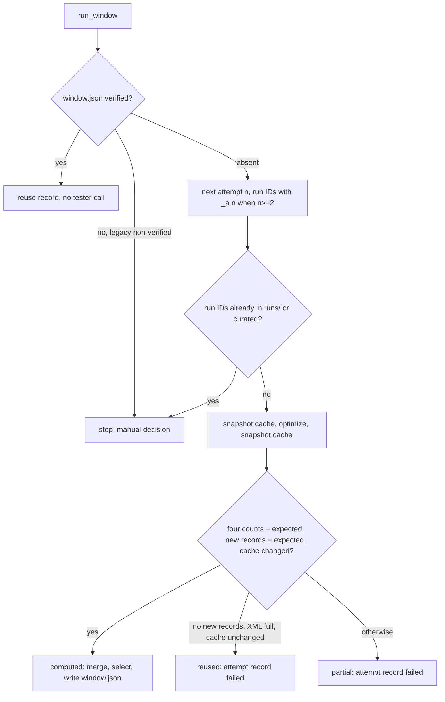

# numeric_v1 Diagnosis and Recovery Attempts - Plan

## Goal Capsule

- **Objective:** The user can tell, from evidence already stored, whether the failure of numeric_v1 comes from unstable strategy performance, from too much exposure at 1% risk with up to three positions, or from both. The user then decides the next step from that evidence and not from the profit B already showed. The research pipeline can also recover a failed optimization window without losing evidence or mistaking cached results for new ones.
- **Product authority:** the user's request of 2026-10-04, which approves this diagnosis, these reliability fixes, and PR + merge to `main`. The request does not approve a new optimization, a re-run of the finished research, a change to its frozen protocol, a wider grid, a trading-rule change, or a change to RiskPercent, MaxExposures or the acceptance thresholds.
- **Open blockers:** none for the analysis and the code. A new MT5 run to verify recovery against the real tester is not approved. It is proposed with a budget only (R17).
- **Means:** a read-only analysis module and command over the stored numeric_v1 evidence (KTD1), a written Hebrew diagnosis, and changes to the window runner and the pass verification for attempts and provenance (KTD8, KTD9).
- **Stop conditions:** stop and report if any step would:
  - run the tester;
  - write under an existing evidence path;
  - change `research/preregistration_numeric_v1.json`.
- **Who finishes:** `ce-work` implements and verifies. LFG simplifies, reviews, commits, pushes, and opens and merges the PR to `main` with a merge commit.

---

## Product Contract

### Summary

The work has three parts:

- A read-only diagnosis of the finished numeric_v1 research, drawn only from its stored evidence, delivered as the Hebrew report `deliverables/numeric_v1/diagnosis_he.md`.
- Two wording corrections in what was already reported.
- Recovery-attempt support for optimization windows, which states for each result whether it was computed fresh or reused from the tester cache.

### Problem Frame

numeric_v1 tested 18 combinations in six overlapping train windows. In every window the lowest train equity DD (11.6%–18.5%) was above the 10% limit, so no pass was eligible and the defaults ran as a fallback. The procedure's OOS result equalled baseline A (−468.51$), while baseline B made +1,129.53$.

That outcome alone does not separate two explanations:
- the strategy's performance is not stable across windows and parameters;
- the same edge exists but 1% risk with up to three concurrent positions makes the drawdown too deep for the limit.

Each explanation leads to a different next step: a rules change or a risk study. B's profit was already seen, so choosing B now would be selection on exposed data.

Two earlier statements also need correction. The final chat summary said "the selection never ran". In fact the checks and the selection rule ran, found no eligible pass, and applied the fallback. The report's criteria table labels the net criterion "above both baselines" for every series, but B is compared to A only.

Recovery is the last gap. A window that fails half-way cannot be re-run under the same run ID, because the tester may answer from its cache and the check would reject that. A new run ID is not proven to avoid the cache, so the pipeline must find out from the evidence where each result came from.

### Key Decisions

- **Stored evidence only.** The diagnosis reads stored files and runs no tester. Governs R1, R10. (session-settled: user-directed — chosen over a new optimization or re-running the finished research: the research is closed and its protocol frozen.)
- **No candidate after the fact.** The best train combination is reported as a row, never named a candidate, and B is not chosen for its exposed profit. Governs R3, R18. (session-settled: user-directed — chosen over picking the best combo or B: that would be selection on seen data.)
- **Lower risk only as a labelled estimate.** The estimate scales the stored results arithmetically and is never presented as an MT5 result. Governs R9. (session-settled: user-directed — chosen over presenting scaled results as a simulation: lot rounding, margin, executable trades and equity chaining would change.)
- **R reconstructed from the stored stop.** The planned risk of each trade is rebuilt from entry, stop, volume and the instrument's contract size, because the dollar risk itself is not stored. Governs R5.
- **Corrections recorded, not silently rewritten.** The criteria wording in the numeric_v1 report is corrected in place with a dated correction note. Criteria and results stay exactly as they were, and git keeps the original text. Governs R12.
- **A cache hit is a distinct, failing outcome.** A recovery attempt whose passes came from the cache is labelled "reused" and is never accepted as a verified window. Governs R15, R16.

### Requirements

**Train-window diagnosis**

- R1. Build a table for every combination × every train window (18 × 6 = 108 rows) from the six stored `scored_grid.csv` files. Each row shows the parameters, net, trades, equity DD, recovery factor, daily Sharpe and the exact rejection reason: below the trade floor, above the DD limit, or both, with the shortfall.
- R2. For each combination, count the train windows where it was profitable. Measure how much its results vary across windows, and how much they differ from its grid neighbours within the same window.
- R3. Treat the windows as overlapping. Never sum train profits into a cumulative return, never treat windows as independent samples, and never test the best combination's significance as though it had been chosen in advance.

**Trade diagnosis on the stored baselines A and B**

- R4. Compute each baseline's OOS trade statistics, March–July:
  - net expectancy in R;
  - win rate;
  - average win and average loss, in R and in dollars.
- R5. Split R4 by direction (long/short) and by OOS month.
- R6. Measure how losses concentrate by the number of positions open at entry, and when several entries come from different OBs on the same structure.
- R7. Measure what costs (commission, swap, spread) and outlier trades contribute to net, and the effect of the 01:00 minute, using the existing session-sensitivity evidence.
- R8. Mark every metric in the report as either computed from stored data or not computable because the data was not stored. Name the missing data, for example trade-level records of the train windows or intraday equity.
- R9. Show what lower risk would mean as an accounting estimate only. The estimate is labelled as such everywhere it appears, and RiskPercent, MaxExposures and the acceptance thresholds stay unchanged.
- R10. Read the evidence without changing it: no file under the existing `results/numeric_v1/` or `results/` paths is modified, and new outputs go to a new diagnosis folder.

**Report corrections**

- R11. Correct "the selection never ran" wherever it appears in repository text. The correct statement is that the checks and the selection rule ran, no pass was eligible, and the fallback was applied.
- R12. In the numeric_v1 report, state the net condition actually applied to each series:
  - the procedure is compared with A and B;
  - B is compared with A;
  - A has no baseline comparison.

  Criteria, values and pass/fail results stay unchanged.

**Recovery attempts**

- R13. A train window can be retried under a new attempt ID. Each attempt has its own run IDs and folders. Earlier attempts' records stay as they are, and the tester cache is never deleted.
- R14. A window already verified is never re-optimized, by any attempt.
- R15. Every optimization result records its provenance as one of:
  - computed fresh;
  - reused from the tester cache;
  - partial or inconsistent.

  The classification uses the tester's own output and the cache folder's state before and after the run. It never relies on the run ID being new.
- R16. Only a fresh, complete computation can verify a window. A reused or partial result fails with its provenance stated.
- R17. Unit tests cover R13–R16 without MT5. A real-tester check of recovery is only proposed, with a defined budget and window, and is not run without the user's approval.

**Final report**

- R18. `deliverables/numeric_v1/diagnosis_he.md` (Hebrew) contains:
  - the findings, each with the evidence behind it;
  - what numeric_v1 proved and what remains unknown;
  - one reasoned proposal for the next step, or the conclusion that no further research is justified now.

  Any strategy change or new risk study is proposed only, for separate approval.

### Acceptance Examples

- AE1. **Covers R1.** **Given** a combination with 40 trades and 12.3% equity DD in a window, **then** its row reads "below the trade floor (40 < 45) and above the DD limit (12.3% > 10%)".
- AE2. **Covers R15, R16.** **Given** a retry whose log has no "new records saved to cache" line while its XML has every pass and the cache folder is unchanged, **then** its provenance is "reused from the tester cache" and the window is not verified.
- AE3. **Covers R13, R14.** **Given** a window whose attempt 1 failed, **when** it is retried, **then** attempt 2 gets its own run IDs and folder and attempt 1's record is unchanged. **Given** a verified window, **then** no attempt runs.
- AE4. **Covers R9.** **Given** the estimate at half the risk, **then** every table and sentence that shows it says it is an accounting estimate and not an MT5 result.

### Scope Boundaries

- No new optimization, no re-run of the finished research, and no change to `research/preregistration_numeric_v1.json`.
- August–September 2026 is not run or read as a holdout.
- No wider grid, no trading-rule change, and no change to RiskPercent, MaxExposures or acceptance thresholds.
- No candidate, no `recommended.set`, and no choice of B.
- A risk study or a strategy change is a separate proposal requiring the user's approval.

### Dependencies / Assumptions

- Each baseline OOS run folder under `results/numeric_v1/wfo/` holds deals, setups (stop, volume, structure pivot, exit), daily records and events, and its `record.json`.
- The train windows store only per-pass aggregates (`scored_grid.csv`, the optimization XML and frames), not trades.
- The contract size of XAUUSD.s is 100 ounces per lot (`trades.CONTRACT_SIZE`, confirmed on stored deals; KTD4).

### Sources / Research

- `deliverables/numeric_v1/report_he.md`, `results/numeric_v1/acceptance.json`, `results/numeric_v1/wfo/windows.csv`.
- `docs/solutions/tooling-decisions/mt5-optimization-non-uniform-grid-split-and-pass-verification.md`: cache keying and the four-count completion check.
- `research/mt5r/gridrun.py` (`verify_optimization`), `research/numeric_cli.py` (`run_window`, `CRIT_HE`), `research/mt5r/evaluate.py` (net criterion with named baselines).
- `docs/plans/2026-10-04-1851-feat-ob-m1-numeric-grid-research-plan.md`: the frozen research this diagnoses.

Product Contract preservation: scope unchanged. Two citation fixes: the No-candidate Key Decision now governs R3, R18 instead of R14, and AE2 states the cache-unchanged condition that R15 and KTD8 use.

---

## Planning Contract

### Key Technical Decisions

- KTD1. **A pure analysis module plus one read-only command.**
  - `research/mt5r/diagnosis_nv1.py` holds functions that take DataFrames or paths and return tables. A new `diagnose-nv1` command in `research/numeric_cli.py` reads the stored evidence and writes only under the new folder `results/numeric_v1/diagnosis/`.
  - The command does not call `start()`, `env.load_config()` or the runner, so it cannot start the tester or touch the live terminal. Its outputs are derived and deterministic, so a rerun regenerates them. Governs R1–R10 (per the Product Contract Key Decision "Stored evidence only").
- KTD2. **Rejection reasons come from the frozen selection thresholds.**
  - The thresholds are read from `research/preregistration_numeric_v1.json` (`selection.trade_floor` = 45, `selection.max_equity_dd_pct` = 10.0), not re-typed.
  - A row is eligible exactly when `wfo.select` would count it eligible: trades ≥ floor and equity DD ≤ the limit.
  - The text states each failing condition with its shortfall, for example "40 < 45" or "12.3% > 10%".
  - The daily Sharpe is the `custom` column, which is the OnTester daily Sharpe stored in `scored_grid.csv`. Covers R1.
- KTD3. **Variation measures that fit overlapping windows.** All per-combination measures across the 6 windows are descriptive, never tests:
  - count of profitable windows;
  - median, min and max net;
  - rank of the combination among the 18 in each window, and the Spearman rank correlation of the 18 nets between consecutive windows.

  Neighbour variation per window is the mean absolute net difference to the combination's grid neighbours (`nv.neighbours`). The report states that consecutive windows share two of their three months. Covers R2, R3.
- KTD4. **Trade records come from the existing `trades.trade_table`.**
  - The per-trade table is built with `research/mt5r/trades.py` `trade_table(setups, deals)`, which already does three things:
    - joins `rl_setups` to `rl_deals` by `position_id`;
    - sums profit, commission and swap into `net`;
    - computes `realized_r = net / (|entry − stop| × volume × trades.CONTRACT_SIZE)`.

    It also keeps positions without exit deals.
  - The diagnosis merges in the extra setup columns it needs by `position_id`: fill and exit time, `ref_pivot_id`, `ob_time`, exit kind. It also adds an OOS-month column.
  - No second join or R formula is written. The ×100 contract size is also borne out by stored data: on `nv1_f1_oos_baseline_a`, deal profit equals Δprice × volume × 100 to within 1e-11 for all 180 positions. Covers R4, R5.
- KTD5. **Concurrency and shared structure from position intervals.**
  - The concurrency of a trade is the number of other positions of the same series whose [fill, exit) interval contains its fill time.
  - Loss concentration: the share of total loss and of losing trades by concurrency level (0, 1, 2).
  - Overlap clusters: maximal chains of overlapping positions. Report each cluster's summed PnL as % of the balance at its first entry, and list the worst clusters.
  - "Different OBs on the same structure" = filled positions sharing a `ref_pivot_id` with different `ob_time`. Their stats are compared with single-entry structures. Covers R6.
- KTD6. **Costs, outliers and the 01:00 minute reuse stored evidence.**
  - Swap and commission are summed from the deals.
  - The spread and slippage cost comes from the existing `cost_stress` values in `results/numeric_v1/acceptance.json`.
  - Outliers: net with and without the 5 largest wins and the 5 largest losses in dollars, alongside the existing `top_events_removed` criterion value.
  - The 01:00 minute: the existing `session_sensitivity` per series in `acceptance.json`, plus a count of fills between 01:00 and 01:01 server time.
  - Nothing is recomputed in MT5. Covers R7.
- KTD7. **The lower-risk estimate replays closed-trade returns arithmetically.**
  - For each series and factor k ∈ {0.5, 0.25}, rebuild a closed-trade equity path from 10,000: each trade's return relative to the balance before it, multiplied by k, in exit-time order across the 5 folds.
  - Report net and closed-trade DD.
  - Report the share of trades whose volume × k would round to below 0.01 lot or move by more than 10% when rounded to 0.01. This shows where the arithmetic breaks.
  - Every table and heading carries the label "אומדן חשבונאי, לא הרצת MT5". Covers R9.
- KTD8. **Provenance from tester output and the cache folder, never from the run ID.**
  - `gridrun` takes a snapshot (name, size, mtime) of the window's own cache files, before and after each optimization.
    - The files are `<cfg.mt5_dir>/Tester/cache/<research ex5 stem>.<symbol>.<period>.<start YYYYMMDD>.<ini.next_day(end) YYYYMMDD>.*.opt`.
    - The name parts are built from `pipeline.BUILDS["research"]`, the chart period and `ini.next_day`, not re-typed.
    - The tester names the file after the ini ToDate, which is the end date + 1 day. Train 2025.12.01–2026.02.28 is cached as `ob_m1_structure_research.XAUUSD.s.M1.20251201.20260301.40.<hash>.opt` (verified in `C:\mt5r\Tester\cache`).
  - The cache change is one of: new, modified or unchanged.
  - Provenance, evaluated in this order:
    1. computed: the four counts equal `expected`, the new-records line reports `expected`, and the cache changed;
    2. reused: no new records are reported, the XML holds every pass, and the cache is unchanged;
    3. partial: every remaining case.
  - Only computed verifies (R16).
  - Records written before this change have no snapshot. They are not re-verified, and keep their existing status. Covers R15, R16.
- KTD9. **Attempt layout.**
  - Attempt 1 keeps today's run IDs (`nv1_<tag>_grid_<part>`), so the finished windows stay valid. Attempt n ≥ 2 adds `_a<n>`.
  - An attempt is reserved before its first tester call by exclusively creating `<window dir>/attempts/a<n>.started.json`, which holds the run IDs and the start time. Its outcome goes to a separate, exclusively created `attempts/a<n>.json`. Neither file is ever overwritten.
  - Every started attempt counts toward the next number. A started attempt with no outcome file counts as failed ("interrupted"), so a crash between the runner creating `runs/<id>` and the outcome write never blocks the next attempt.
  - `window.json` is written only once a window verifies.
  - Before an attempt, its run IDs must not exist in `runs/` or in the curated destination. This matters because the runner deletes `runs/<id>` before reuse.
  - A legacy `window.json` that is not verified stops the run for a manual decision, so it is not overwritten.
  - The tester cache is never deleted. Covers R13, R14.
- KTD10. **Report corrections in place with a dated note.**
  - `build_report` renders the net criterion per series: the procedure vs A and B, B vs A, A alone.
  - `deliverables/numeric_v1/report_he.md` gets the same wording plus a dated correction note in its criteria section. Criteria, values and pass/fail stay untouched.
  - The phrase "the selection never ran" does not appear in the repository, so R11 is met by an explicit correction in `diagnosis_he.md` and in the chat summary. Covers R11, R12.

### High-Level Technical Design

The provenance and attempt decision runs at each optimization of a window (KTD8, KTD9):

### Assumptions

- The user asked to stop only for genuinely blocking decisions, so the plan-time choices in KTD3, KTD5–KTD7 and KTD9 were not put to the user before writing. Each is recorded as a KTD and can be revised.
- The authored `diagnosis_he.md` interprets the generated tables. Its conclusions cite the generated files rather than restating code-derived numbers by hand where a table exists.

### Sequencing

U1 and U2 are independent of the analysis. U3 depends on U2. U4–U6 build the analysis module. U7 depends on U4–U6 and writes the outputs and the report.

---

## Implementation Units

### U1. Per-series net condition in the numeric_v1 report

- **Goal:** the criteria section states the comparison each series actually faced, without changing criteria or results.
- **Requirements:** R12 (KTD10).
- **Dependencies:** none.
- **Files:** `research/numeric_cli.py`, `deliverables/numeric_v1/report_he.md`, `research/tests/test_numeric_cli.py`.
- **Approach:**
  1. In `build_report`, replace the shared `oos_net` label with a neutral criterion name.
  2. Add, under the table, one line per series naming its net condition, derived from the accepted structure: `baselines` keys when present, `baseline_net` otherwise.
  3. Edit `report_he.md` to the same text, and add a dated correction note saying criteria and results are unchanged.
- **Patterns to follow:** `CRIT_HE`, `_ok`, the existing verdict test.
- **Test scenarios:**
  - an acceptance where the procedure has baselines A and B, B has A, and A has none renders three distinct condition lines naming exactly those comparisons;
  - the rendered pass/fail cells equal the input `pass` values for every series.
- **Verification:** the report diff touches only the criteria section and the correction note. `acceptance.json` is unchanged.

### U2. Result provenance in pass verification

- **Goal:** every optimization record states whether it was computed fresh, reused from the cache, or partial, and only computed can verify.
- **Requirements:** R15, R16 (KTD8).
- **Dependencies:** none.
- **Files:** `research/mt5r/gridrun.py`, `research/tests/test_numeric_v1.py`.
- **Approach:**
  1. Add a cache snapshot helper and a cache-change classifier.
  2. `verify_optimization` takes optional before/after snapshots and adds `provenance` and `cache_change` to its record. Status `ok` requires `provenance == "computed"` when snapshots are given.
  3. Without snapshots the behaviour is unchanged, and `cache_change` is `not_checked`.
- **Patterns to follow:** the existing fixtures in `test_numeric_v1.py` that build a fake run directory with frames, XML and log.
- **Test scenarios:**
  - Covers AE2: no new-records line, a full XML and an unchanged snapshot give `reused` and status `failed`;
  - all four counts equal, new records equal and a new `.opt` file appear in the snapshot: `computed` and `ok`;
  - counts equal but the cache unchanged: `partial` and `failed`;
  - an existing `.opt` that grew counts as `modified`, a cache change;
  - snapshots not given: today's behaviour, with `cache_change` `not_checked`;
  - the snapshot ignores `.opt` files of other EAs or other windows;
  - a window ending 2026.02.28 matches a cache file dated `20260301` and not one dated `20260228`.
- **Verification:** the existing verification tests pass unchanged, and the new ones pass.

### U3. Recovery attempts in run_window

- **Goal:** a window that failed can be retried under a new attempt with its own IDs and folders, and nothing earlier is overwritten.
- **Requirements:** R13, R14, R16 (KTD9).
- **Dependencies:** U2.
- **Files:** `research/numeric_cli.py`, `research/mt5r/numeric_v1.py` (attempt run-ID helper), `research/tests/test_numeric_cli.py`.
- **Approach:**
  1. `run_window` computes the next attempt from the `attempts/a<n>.started.json` reservations and reserves it before any tester call.
  2. It refuses existing run IDs and refuses a legacy non-verified `window.json`.
  3. It wraps each optimization in cache snapshots via `cfg.mt5_dir`, and writes `attempts/a<n>.json` exclusively.
  4. On failure it raises with the provenance. On success it writes `window.json` and `selection.json` as today.
- **Patterns to follow:** `test_resume_reuses_a_verified_window_and_starts_no_optimization` (monkeypatched `pipeline.run_optimization`, `gridrun.verify_optimization`, `curate.curate`).
- **Test scenarios:**
  - Covers AE3: with `attempts/a1.json` failed, the next call uses run IDs ending `_a2`, writes `attempts/a2.started.json` and `a2.json`, and leaves the a1 files byte-identical;
  - an interrupted attempt (`a1.started.json` present, no `a1.json`, `runs/<a1 id>` existing) does not block: the next call uses the `_a2` IDs and leaves the a1 files unchanged;
  - Covers AE3: a verified `window.json` starts no optimization;
  - a run ID that already exists under `runs/` stops before any tester call;
  - a non-verified legacy `window.json` stops with a message and is not modified;
  - a reused provenance from U2 fails the attempt, records the provenance, and writes no `window.json`;
  - attempt 1 keeps today's run-ID names.
- **Verification:** no test reaches the runner. Existing resume tests pass.

### U4. Train-window diagnosis tables

- **Goal:** the 108-row table, the per-combination summary and the variation measures, as data.
- **Requirements:** R1, R2, R3 (KTD2, KTD3).
- **Dependencies:** none.
- **Files:** `research/mt5r/diagnosis_nv1.py` (new), `research/tests/test_diagnosis_nv1.py` (new).
- **Approach:**
  - Load the six `scored_grid.csv` files (`results/numeric_v1/wfo/f1..f5_selection/`, `results/numeric_v1/final_selection/`) with their window name and train dates from `windows.csv`.
  - Add the rejection text, the per-combination summary, the consecutive-window rank correlations and the neighbour variation.
  - Never compute a cumulative train return.
- **Test scenarios:**
  - Covers AE1: 40 trades and 12.3% DD give both reasons with their shortfalls;
  - 50 trades and 9% DD give "eligible";
  - exactly 45 trades and exactly 10.0% DD are eligible, matching the selection rule;
  - a 3-window, 2-combination fixture gives the expected profitable-window counts and medians;
  - the neighbour variation of a combination uses only its `nv.neighbours`;
  - the summary has no column summing net across windows.
- **Verification:** on the real files, 108 rows, 0 eligible, and the per-window minimum DD equals `windows.csv`.

### U5. Baseline trade diagnosis

- **Goal:** trade-level statistics for A and B across the 5 OOS folds.
- **Requirements:** R4, R5, R6, R7, R8 (KTD4, KTD5, KTD6).
- **Dependencies:** none.
- **Files:** `research/mt5r/diagnosis_nv1.py`, `research/tests/test_diagnosis_nv1.py`.
- **Approach:**
  - Build the trade table per KTD4 (`trades.trade_table` plus the extra setup columns) from each `results/numeric_v1/wfo/nv1_f<k>_oos_baseline_{a,b}/` folder, with an OOS-month column.
  - Compute:
    - the overall, direction and month splits;
    - concurrency and overlap clusters;
    - shared-structure entries;
    - costs, outliers and the 01:00 counts.
  - Return a "computed / not stored" list for R8 alongside the tables.
- **Test scenarios:**
  - the extra setup columns merge onto the `trades.trade_table` rows by `position_id`, and the month column comes from the fold;
  - three positions where B opens while A is open and C after both close give concurrency 0, 1, 0, and one cluster {A, B};
  - two fills with the same `ref_pivot_id` and different `ob_time` count as a shared-structure group, and the same OB time does not;
  - a fill at 01:00:30 counts in the 01:00 minute, and one at 01:01:00 does not.
- **Verification:** on real data, total dollar PnL per series equals the stitched OOS net in `acceptance.json` to the cent, which checks the join.

### U6. Lower-risk accounting estimate

- **Goal:** what lower risk would mean arithmetically, clearly labelled as an estimate.
- **Requirements:** R9 (KTD7).
- **Dependencies:** U5.
- **Files:** `research/mt5r/diagnosis_nv1.py`, `research/tests/test_diagnosis_nv1.py`.
- **Approach:** compute the scaled closed-trade path and the lot-rounding check per KTD7. The output table carries the estimate label in its title field.
- **Test scenarios:**
  - k = 1 reproduces the unscaled closed-trade net and DD;
  - k = 0.5 on a fixture of +1% and −1% returns gives the expected compounded path;
  - 0.03 lot at k = 0.5 → 0.015, which rounds to 0.02 (+33%) and is flagged; 0.01 lot at k = 0.5 rounds below the minimum and is flagged;
  - the result's label contains "אומדן".
- **Verification:** the estimate's k = 1 row matches U5's closed-trade figures.

### U7. diagnose-nv1 command, outputs, Hebrew diagnosis and status

- **Goal:** the evidence tables on disk, and the Hebrew diagnosis with findings, unknowns, one recommendation and the budgeted recovery check proposal.
- **Requirements:** R8, R10, R11, R17, R18.
- **Dependencies:** U1–U6.
- **Files:**
  - `research/numeric_cli.py` (command);
  - `results/numeric_v1/diagnosis/` (new: CSV tables, `summary.json`);
  - `deliverables/numeric_v1/diagnosis_he.md` (new);
  - `docs/PROJECT_STATUS.md`;
  - `research/tests/test_numeric_cli.py`.
- **Approach:**
  1. The command writes the U4–U6 tables and a `summary.json` with the headline numbers.
  2. The report is authored from those outputs. It includes:
     - the correction of "the selection never ran" (R11);
     - the not-stored list (R8);
     - a recovery verification proposal (R17) on the train-only smoke window 2026.02.02–02.06. It runs only after the user approves and the live terminal is closed:
       - **Command:** a dedicated post-freeze check command, proposed together with the check and not built in this work. The existing `optsmoke-nv1` refuses after the freeze.
       - **Steps:** attempt 1 runs the "lo" part on a new smoke tag, under a runner timeout short enough to stop it before completion. Attempt 2 then runs "lo" and "hi".
       - **Budget:** 3 optimizations, at most 12 passes each, about 10 minutes; new run IDs and its own results folder.
       - **Expected result:** attempt 1 is recorded as partial and interrupted, attempt 2 as computed and verified, and attempt 1's files stay unchanged.
  3. Update `docs/PROJECT_STATUS.md` with the diagnosis outcome and the next step.
- **Test scenarios:**
  - the command run against a temporary copy of a minimal evidence tree writes only under its diagnosis folder;
  - it never calls `start`, `env.load_config` or the runner (monkeypatched to raise).
- **Verification:**
  - `git status` after running the command on real data shows changes only under `results/numeric_v1/diagnosis/`;
  - every number quoted in `diagnosis_he.md` traces to a generated file.

---

## Verification Contract

| Gate | Command / check | Applies to |
|---|---|---|
| Unit tests | `python -m pytest research/tests -q` (264 before this work; all must pass) | U1–U7 |
| Evidence untouched | `git diff --stat` shows no change under `results/` except the new `results/numeric_v1/diagnosis/`, and none in `research/preregistration_numeric_v1.json` | U1, U7 |
| Join check | U5 per-series PnL total = stitched OOS net in `results/numeric_v1/acceptance.json` | U5 |
| No tester | No command in this work calls the runner; tests monkeypatch it to raise | U3, U7 |
| Public repo | staged diff scanned for the account number before each commit | all |

---

## Definition of Done

- U1–U7 are implemented. All tests pass, including the new scenarios.
- `deliverables/numeric_v1/diagnosis_he.md` exists, answers the instability-vs-exposure question with cited evidence, separates computed from not-stored data, labels every lower-risk figure as an estimate, and ends with one recommendation or a no-further-research conclusion.
- The numeric_v1 report states the per-series net condition, with a correction note. Its criteria and results are unchanged.
- Recovery attempts and provenance are in the pipeline with tests. The real-tester check is proposed, not run.
- `docs/PROJECT_STATUS.md` is updated.
- The work is merged to `main` via PR with a merge commit, and no abandoned experimental code is left in the diff.
