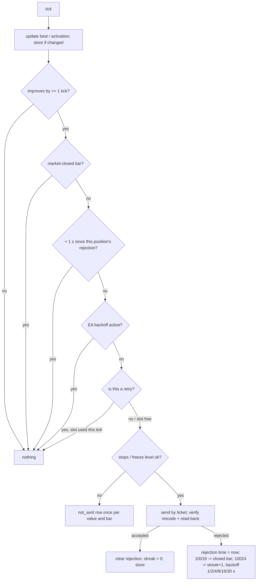

# Trailing Stop Retry, Persistence, Checker Completeness and Evidence Provenance - Plan

## Goal Capsule

- **Objective:** The optional 1R trailing stop handles broker rejections without flooding, keeps its observed best price across a restart, and its tester evidence is checked completely and only against the EA version that produced it. Rejections, persistence and run provenance stop being silent gaps. The trail rule itself does not change.
- **Means:**
  - fixed retry and backoff constants plus split persistence in `mql5/Experts/ob_m1_structure.mq5` (KTD1–KTD5);
  - the same policy in the reference model and the independent checker (KTD6, KTD7);
  - provenance-checked runs under new IDs in `research/trail_cli.py` (KTD8).
- **Product authority:** the user's request of 2026-10-05.
  - **Approved:** these four fixes; isolated-tester runs on March 2026 only; PR + merge per `CLAUDE.md`.
  - **Not approved:** a change to entries, R0, activation, trail distance or the 2R target; optimization; a longer window; any connected-account action; a further trail-rule change from March results.
- **Stop conditions:**
  - the live terminal is running when a tester run is due: ask the user to close it, never close it;
  - with the trail off, the trades do not match the baseline: stop and diagnose;
  - any step would edit a frozen pre-registration or existing evidence (including `results/trailing_v1/`);
  - an existing run folder fails the provenance check: refuse, never delete or overwrite it.
- **Who finishes:** `ce-work` implements and verifies; LFG simplifies, reviews, commits, opens and merges the PR.

---

## Product Contract

### Summary

Four targeted fixes to the 1R trailing stop merged in PR #6:
- a rejected stop update is retried only after a short fixed wait, with an EA-wide backoff when the broker reports too many requests;
- the best price is saved whenever it changes, and the saved state is written to disk on a schedule and at shutdown;
- the checker requires exactly one trail row per filled position in a trailed run;
- the development CLI never reuses a run folder produced by a different EA, EX5, input set or window.

The trail stays off by default.

### Problem Frame

The code review of PR #6 and the user's follow-up left four gaps:
- **Retries could flood.** After a rejection other than "market closed", an improving price sent a new request almost every tick.
- **Restart could lose the best price.** `best` was saved only at activation and on an accepted move, and every save flushed to disk.
- **The checker could pass silently.** `trail_r23` walked only the `rl_trail` rows that existed. A missing row, a duplicate, or missing trail files passed.
- **Stale evidence could be reused.** `trail_cli` reused any existing folder, so a run of an older EA could be reported against the current code.

The March 2026 comparison stays a development comparison only. Net and expectancy fell and the equity drawdown rose slightly in both variants. The higher win rate is not an improvement claim.

### Key Decisions

- **The trail rule does not change.** Governs R1. (session-settled: user-directed — chosen over a rule change based on March results: March is exposed development data, and its net, expectancy and drawdown did not improve.)
- **Tracking never pauses.** Governs R2. (session-settled: user-directed — chosen over pausing tracking during rejections: the trail must not lose information.)
- **Failed requests wait; a success restores normal behaviour.** Governs R3–R7. (session-settled: user-directed — chosen over immediate per-tick resends: avoid flooding the broker.)
- **Delays are execution constants.** Governs R8. (session-settled: user-directed — chosen over tunable inputs: no optimization is approved.)
- **Exactly one trail row per filled position.** Governs R12–R14. (session-settled: user-directed — chosen over checking only the rows that exist: that check passes silently.)
- **Run folders are reused only on matching provenance.** Governs R15, R16. (session-settled: user-directed — chosen over reuse whenever the folder exists: stale evidence.)

### Requirements

**Trail rule and tracking**

- R1. Entries, R0 = |E − SL0|, activation at +1R, the 1R trail distance and the 2R TP stay exactly as merged in PR #6. `EnableTrailingStop` stays false by default.
- R2. Every tick updates the best price and the desired stop of every trailed position, including while a request for that position is held.

**Rejection handling**

- R3. After a rejected modification of a position, the next request for that position is sent only at least 1 second (tick time) after the rejection, even when the desired stop improved in between. Once the wait is over, a valid request may be sent, including the same value.
- R4. After `TRADE_RETCODE_TOO_MANY_REQUESTS`, no request is sent by the EA for 1, 2, 4, 8, 16, then 30 seconds (cap) as the consecutive streak of such answers grows. A verified success clears the streak.
- R5. The market-closed rule stays: after `TRADE_RETCODE_MARKET_CLOSED`, nothing is sent for that position until the next M1 bar. When it overlaps the 1-second wait, the later of the two applies.
- R6. Every request, including a retry, is built from the position re-read on that tick. It is sent only if it still improves the stop on the position by at least one tick and passes the stops and freeze levels.
- R7. At most one retry is sent per tick across the whole EA, and held requests are never queued or sent later as old values. A retry is a request for a position whose last request was rejected, or any request while the too-many-requests streak is above zero.
- R8. The wait, the backoff steps and the flush interval are fixed constants, not inputs. The documentation states that, when rejections occur, this policy delays when the stop is updated.

**Persistence**

- R9. A new best price is written to the position's saved state when it is observed, including when the update is rejected, held or not sent.
- R10. Writing the saved state to terminal global variables is separate from flushing them to disk. The state is flushed at registration, at activation, at least every 10 seconds of tick time while it has unflushed changes, and on normal deinitialization.
- R11. The documentation states the flush interval and the limits on a sudden crash. A unit test covers this sequence without losing the observed best: new best, rejected update, save, restore. It is not presented as verification of a real restart on a connected account.

**Checker completeness**

- R12. In a run whose inputs have `EnableTrailingStop=true`, the checker requires exactly one `rl_trail` row for every filled position, including a position whose trail never activated and one the EA could not trail.
- R13. A missing row, a duplicate row, a row with no matching filled position, or a missing trail file fails verification. In a run with the trail off, the presence of trail files fails it.
- R14. Negative tests delete one row and duplicate one row of a valid stored run, and show that the checker catches both.

**Evidence provenance**

- R15. `trail_cli` uses an existing run folder only when its recorded EA source hash, EX5 hash, inputs and window match the current ones. Otherwise it refuses and leaves the folder untouched.
- R16. The new runs use new run IDs and folders. `results/trailing_v1/`, the frozen pre-registrations and all other earlier evidence stay unchanged.

**Verification and reporting**

- R17. Controlled tests cover repeated rejections and a continuously improving price, for long and short. The report names the paths that did not occur in the tester.
- R18. Both builds compile. On March 2026 only:
  - with the trail off, the trades match the previous baseline;
  - with the trail on, the delivered and research builds produce the same trades.
- R19. The report states whether the trail-on trades changed compared with the PR #6 runs (`tr1_on_a`, `tr1_on_b`) because of the retry policy. It does not assume they stay identical.
- R20. The report is a development comparison only, with no improvement claim and no proposal for a further trail-rule change.

### Acceptance Examples

- AE1. Covers R3. A long position's request at 10:00:00.200 is rejected with retcode 10006. The best Bid improves on every tick until 10:00:01.100. No request is sent before 10:00:01.200. On the first tick at or after that time, one request is sent from the current best.
- AE2. Covers R4, R7. Two positions are waiting. A request is answered 10024 at t. Nothing is sent before t + 1 s. At t + 1 s exactly one request is sent; if it is answered 10024 again, nothing is sent before t' + 2 s. After an accepted request the next tick behaves normally, and several positions may send on it.
- AE3. Covers R5. A request at 01:00:59.800 is answered 10018. The next M1 bar opens at 01:01:00.000, but the earliest retry is 01:01:00.800.
- AE4. Covers R9, R11. The best Bid rises from 2007.50 to 2008.20, and the request is rejected. The saved state, read back, holds 2008.20.
- AE5. Covers R12, R13. A trailed run has 56 filled positions and 55 `rl_trail` rows. The checker reports a `trail_r23` violation naming the missing position.

### Scope Boundaries

- No change to entries, risk, the position cap, the initial SL, R0, the activation level, the trail distance or the TP (R1).
- No tuning of the wait, the backoff or the flush interval. No new inputs (R8).
- No windows other than March 2026, no optimization, no connected account.
- Considered and not built: logging held ticks as `rl_sl_moves` rows. It would add a row per tick per held position, and the spacing rules can be checked from the sent rows alone. It would be built if the checker ever needs to prove *when* a held request became eligible.
- Considered and not built: a per-tick check in the research build that the stored state equals memory. A reload at position close (KTD5) proves the final stored values; a per-tick check would add a global-variable read per tick for no new failure class.

---

## Planning Contract

### Key Technical Decisions

- KTD1. **Per-position wait and EA-wide backoff are both measured in tick time.** Use `tk.time_msc`, not `GetTickCount`, so the tester replays them and the checker can verify them from logged `tick_msc`. Each position keeps the time of its last rejection, and the EA keeps a backoff-until time and a too-many-requests streak. The order of gates on each tick:
  1. update best and activation;
  2. require at least one tick of improvement;
  3. market-closed bar;
  4. the position's 1-second wait;
  5. the EA backoff;
  6. the per-tick retry slot;
  7. stops level and freeze level;
  8. send.

  Held ticks log nothing. (session-settled: user-directed — chosen over a fixed delay or per-position backoff: the too-many-requests limit applies to the whole terminal.)
- KTD2. **Separate failure memories.** A rejected request sets the position's rejection time (and the closed bar on 10018). A not-sent request (stops or freeze level) keeps the existing once-per-value-per-bar guard on its own fields. The old "same rejected value in the same bar" guard is removed, because the 1-second wait replaces it (R3). Gates 1–5 run before the stops and freeze checks, so no `not_sent` row is written while a position is held.
- KTD3. **One retry slot per tick.** A retry, as R7 defines it, uses the EA's single slot for that `tick_msc`. Normal requests, from positions with no pending rejection while the streak is zero, are unaffected, so several positions may still send on one tick (1,766 such ticks in `tr1_on_a`). A not-sent request does not use the slot. The registry is walked in its existing order, and the first eligible retry wins.
- KTD4. **Store and flush are separate functions.**
  - **The store:** writes `best`, activation and activation time whenever they change, and marks the state dirty.
  - **The flush:** runs when the state is dirty:
    - immediately after registration and after activation;
    - from `ManageTrails` once 10 seconds of tick time have passed since the last flush;
    - in `OnDeinit` after all trailed positions are stored.

  There is no `OnTimer`. Without ticks nothing changes, so a tick-driven flush loses nothing. (session-settled: user-directed — chosen over flushing on every write: write load.)

  Crash limits, for the documentation:
  - an EA re-initialization keeps all stored values, because global variables live in terminal memory;
  - a terminal or OS crash loses changes made since the last flush, up to 10 seconds of tick time;
  - ticks while the EA is not running are never seen.
- KTD5. **Every filled position gets a registry entry and a row.** `TrailRegister` always adds an entry. A position it cannot trail is marked so it never sends a request: either it was not selectable at the fill, or it has no initial risk. Its row records `not_trailed:<reason>` in `state_roundtrip`.
  - **Reload check at close:** when a position closes, the research build reloads the stored state before forgetting it. It records in a new `rl_trail` column, `state_final`, whether the stored best, activation and activation time equal memory (`ok` or `mismatch`).
  - **Not-trailed entries** store no state and write `state_final=not_trailed`. Their row carries the fill from the setup and SL0/TP as 0 when the position was not selectable.
  - **Fix for unselectable positions:** `ManageTrails` no longer drops an unselectable position that `SyncPosition` still tracks as filled. It drops only restored positions that have no setup. This keeps a trailed exit labelled `trail` and its row written when the closing deal is late.
- KTD6. **The reference model carries the same policy.** `research/mt5r/trailing.py` gains:
  - a per-position rejection time;
  - an EA-wide context: the backoff-until time, the streak, and the last slot tick;
  - `msc` in `on_result`;
  - a store/restore of the persisted fields, with a dirty flag.

  It stays the executable spec for KTD1–KTD5. The checker re-implements the rules independently and does not import the model's decision logic.
- KTD7. **The checker replays all positions together.**
  - **Timing rules:** `check_trails` merges every position's sent rows by `tick_msc` (stable on file order) to verify:
    - the 1-second wait after a rejection;
    - the market-closed bar;
    - the backoff spacing derived from the logged 10024 streak;
    - at most one retry per `tick_msc`.
  - **Every sent row:** must improve the replayed stop by at least one tick. Stops level is not logged, so it is checked only through the existing `not_sent:stops_level` rows.
  - **Completeness:** `full`/`check` take a `trailing` flag, default false. Callers derive it from the run's full input values, where the code default false fills a missing key, and parse it tolerantly (`true`/`"true"`/`1`). An unparseable value is a `trail_r23` violation. There is no fallback to the presence of the trail files.
  - **Not-trailed rows:** `state_final=not_trailed` is accepted only with `state_roundtrip=not_trailed:<reason>`. Such a row must have zero `rl_sl_moves` rows, no activation, and `final_sl` equal to its `sl0`. The E/SL0/TP, R0, activation-completeness and best-price checks are skipped for it. Every other row must have `state_final=ok`.
  - **Schema:** the new `rl_trail` columns are required. A run missing them fails `fields`, so PR #6 evidence is not re-certified under the new rules.
- KTD8. **Provenance-checked runs under `tr2_`.**
  - **Location:** the study moves to `results/trailing_v2` and `deliverables/trailing_v2` with prefix `tr2_`.
  - **Each `record.json` holds:**
    - the EA source hash, over both `.mq5` files with CRLF read as LF (the research file is only a define plus an include, so the main source must be in the hash);
    - the EX5 hash from the run manifest;
    - the full input set;
    - the window.
  - **Reuse check:**
    - an existing folder is reused only when all four match;
    - a folder with any field missing or different is refused with the field named;
    - a raw `runs/<id>` without a curated folder is refused, because the runner would delete it;
    - `write_set` refuses an existing `.set` whose content differs from a fresh render.

  - **Attempts:** a refused folder or a failed run is never retried under its own ID.
    - Each `runs` invocation is an attempt `n`, reserved exclusively in `results/trailing_v2/attempts/a<n>.started.json` before any tester call and closed in `a<n>.json`. Neither file is ever overwritten.
    - Attempt 1 uses `tr2_<name>`; attempt `n >= 2` uses `tr2_<name>_a<n>`, which must not exist yet in `runs/` or `results/trailing_v2/`.
    - `analyze` uses, per run name, the latest attempt whose provenance matches the current EA source, EX5, inputs and window. Earlier attempts stay untouched.
    - `install` recompiles. If the EX5 bytes change, every earlier attempt fails the EX5 check and a new attempt runs.

  (session-settled: user-directed — chosen over `dest.exists()` reuse: stale evidence.) Pattern: the attempt and refusal rules of `research/numeric_cli.py` (attempt files, `_a<n>` IDs).

### High-Level Technical Design

Per-tick decision for one trailed position (directional):

Flush lifecycle: registration → flush; activation → flush; store marks dirty → flush when 10 s of tick time passed; `OnDeinit` → store all → flush.

### Assumptions

- `TRADE_RETCODE_TOO_MANY_REQUESTS` (10024) does not occur in the tester; the backoff is proven by the model, the checker's synthetic tests and static EA tests only.
- The one-retry-per-tick rule may delay a market-closed retry by a tick when two positions were rejected together (positions 85 and 88 in `tr1_on_a`), so March trades may change; R19 reports it.
- Global variables in the tester are fresh for every test run, so no stale state leaks between runs.

### Sequencing

U1 (model) → U2 (EA + contract) → U3 (checker) → U4 (CLI provenance) → U5 (compile, runs, analysis, stored-run tests) → U6 (docs). U5 needs the live terminal closed.

---

## Implementation Units

### U1. Reference model: retry policy and persistence

**Goal:** The model encodes R2–R11 as executable spec.
**Requirements:** R2–R11, R17; KTD1, KTD2, KTD3, KTD4, KTD6.
**Dependencies:** none.
**Files:** `research/mt5r/trailing.py`, `research/tests/test_trailing.py`.
**Approach:**
1. Add `RETCODE_TOO_MANY_REQUESTS = 10024`, the wait, backoff steps and flush interval as module constants.
2. Add the per-position rejection time, an EA-wide context object passed to `decide`/`on_result`, and `msc` on `on_result`.
3. Split rejected-request memory from the not-sent guard (KTD2) and apply the gate order of KTD1.
4. Add store/restore of the persisted fields with a dirty flag, set whenever best, activation or activation time change.
5. Rewrite the existing test that sends an improved value in the same bar after a rejection; it contradicts R3.
**Test scenarios:**
- Covers AE1. Long: rejection at t, best improves every tick, nothing sent before t + 1000 ms, one send at the first tick ≥ t + 1000 ms from the current best.
- Short: the same sequence on Ask.
- Repeated rejections: five consecutive rejections at 1-second spacing produce exactly five sends over five seconds, never two in one second.
- Continuously improving price with no rejections: one send per tick-size improvement, as before.
- Covers AE2. Backoff: consecutive 10024 answers wait 1, 2, 4, 8, 16, 30, 30 s; an accepted request clears the streak, and the next tick allows normal sends for two positions.
- One retry slot: two positions with pending rejections become eligible on the same tick; one sends, the other sends on the next tick.
- Covers AE3. 10018 at :59.800: no send at the new bar's first tick before :00.800.
- A not-sent stops-level value is logged once per value and bar and does not start the 1-second wait.
- Covers AE4. New best, rejected update, store, restore: the restored best equals the observed best and the state was marked dirty.
- R0, TP and activation level unchanged across all sequences.
**Verification:** the model tests pass; the earlier activation, rounding and concurrency tests still pass.

### U2. EA: retry policy, persistence, registry and contract

**Goal:** The EA implements KTD1–KTD5 with no change to the trail rule.
**Requirements:** R1–R12; KTD1–KTD5.
**Dependencies:** U1.
**Files:** `mql5/Experts/ob_m1_structure.mq5`, `research/mt5r/m1_contract.py`, `research/tests/test_ea_m1_static.py`.
**Approach:**
1. Add `#define` constants for the wait, the backoff steps and the flush interval (no inputs).
2. Per-position: rejection time; split not-sent fields; a not-trailed marker. EA-wide: backoff-until, streak, last retry tick, dirty flag, last flush time.
3. Split `TrailSave` into a store (set only) and a flush; flush per KTD4. `OnDeinit` stores all entries and flushes before `TrailClose`.
4. `ManageTrails`: store best when it changes, before any gate; apply the gate order; keep `closedBar == bar` before `RoundTick(`.
5. `TrailSend`: on 10024 advance the streak and backoff; on verified success clear the rejection time and the streak.
6. `TrailRegister` always adds an entry (KTD5); `ManageTrails` drops only restored positions with no setup.
7. Research build: reload the stored state at `TrailClose` before forgetting it; add `state_final` to the `rl_trail` header and `TRAIL_COLUMNS`.
8. Update the static tests that pin the old shape (flush inside `TrailSave`, the same-bar guard), keeping the existing guarantees: modify by ticket, read-back, `r0` assigned only at fill or load, no spread term, every effect behind the input.
**Test scenarios:**
- Static: no `GlobalVariablesFlush` inside the store function; flush called at registration, activation, in `ManageTrails` under the interval constant, and in `OnDeinit` before `TrailClose`.
- Static: the best store in `ManageTrails` comes before the market-closed, wait and backoff gates.
- Static: the wait and backoff use `time_msc`; the backoff steps are 1, 2, 4, 8, 16, 30 s; no new `input` lines.
- Static: `TrailRegister` adds a registry entry on both early-exit paths, and the not-trailed entry never reaches `PositionModify`.
- Static: CSV headers equal `m1_contract` columns, including `state_final`.
- Compile both builds with 0 errors and 0 warnings (U5 gate).
**Verification:** static tests pass; the compile in U5 is clean.

### U3. Checker: completeness and the retry policy

**Goal:** `trail_r23` fails on any missing, duplicate or unmatched row, on missing trail files in a trailed run, and on any request that breaks the retry policy.
**Requirements:** R3–R7, R12–R14; KTD7.
**Dependencies:** U2 (contract columns).
**Files:** `research/mt5r/conformance_m1.py`, `research/cli.py`, `research/tests/test_conformance_trail.py`.
**Approach:**
1. `full`/`check` take `trailing`; `cli.conformance_report` passes it from the run values, parsed tolerantly.
2. Completeness per R12/R13 against filled `rl_setups` rows, with the not-trailed and trailing-flag rules of KTD7.
3. Replace the "same failed value in the same minute" rule for rejected rows with the 1-second rule; keep the not-sent guard rule; add the merged-replay backoff and retry-slot rules (KTD7); check one-tick improvement on every sent row.
4. Add `RETCODE_TOO_MANY_REQUESTS` locally in the checker (no import of the model's decision logic).
5. The existing stored-run test that pins `results/trailing_v1/tr1_on_b` now expects a `fields` violation for the missing `state_final` column, proving old evidence is not re-certified.
**Test scenarios:**
- Covers AE5. A trail table missing one filled position fails `trail_r23` naming it.
- A duplicated row fails; a row whose position has no filled setup fails.
- `trailing=True` with no trail files fails; `trailing=False` with trail files fails.
- A request 600 ms after the same position's rejection fails; 1000 ms passes.
- A 10024 streak of two followed by a request 1.5 s later fails (needs 2 s); 2 s passes.
- Two retries on one `tick_msc` fail; two normal sends on one tick pass.
- A sent row that does not improve by a tick fails.
- The PR #6 `tr1_on_b` run fails `fields` for `state_final` and nothing else.
**Verification:** checker tests pass; the full suite passes.

### U4. CLI provenance and new run IDs

**Goal:** `trail_cli` never reuses a folder produced by another EA, EX5, input set or window.
**Requirements:** R15, R16; KTD8.
**Dependencies:** none (independent of U1–U3).
**Files:** `research/trail_cli.py`, `research/tests/test_trail_cli.py`.
**Approach:**
1. `STUDY = "trailing_v2"`, `PREFIX = "tr2_"`; deliverables under `deliverables/trailing_v2`.
2. Write the source hash, EX5 hash, inputs and window into each `record.json`.
3. Before a run: reuse a folder only on a full match; otherwise refuse with the differing fields; refuse a raw `runs/<id>` with no curated folder.
4. Attempt files and `_a<n>` IDs per KTD8; `analyze` selects the latest matching attempt per run name.
5. `write_set` refuses a differing existing `.set`.
6. Pass the trailing flag to the checker in `conformance`.
**Test scenarios:**
- A matching record is reused without a tester call.
- Each of the four fields differing causes a refusal naming that field, and the folder is unchanged.
- A legacy record with no hashes is refused.
- A raw run folder with no curated folder is refused before any tester call.
- After a refusal, the next `runs` reserves attempt 2, uses `tr2_<name>_a2`, and leaves the refused folder byte-identical.
- An attempt reservation that already exists is never overwritten.
- `analyze` picks the latest attempt whose provenance matches and ignores older ones.
- A differing existing `.set` is refused; an identical one is reused.
- Run IDs carry `tr2_`; the study log is `results/trailing_v2/experiment_log.jsonl`.
**Verification:** CLI tests pass.

### U5. Compile, March 2026 runs, analysis and stored-run tests

**Goal:** The fixed EA is verified in the isolated tester and compared with the PR #6 runs.
**Requirements:** R14, R17–R20; KTD5, KTD7, KTD8.
**Dependencies:** U1–U4. The live terminal must be closed.
**Files:** `results/trailing_v2/` (new), `deliverables/trailing_v2/ob_m1_structure_trailing.set` (new), `results/trailing_v2/dev_comparison_he.md` (new), `research/tests/test_conformance_trail.py`.
**Approach:**
1. `install`: compile both builds.
2. `runs` (a new attempt whenever an earlier one is refused): `tr2_off_a/b` must match `nv1_f1_oos_baseline_a/b` deal for deal; `tr2_on_a/b` plus delivered twins.
3. `analyze`: conformance with the trailing flag, build equivalence, baseline match, summary, stop-path charts.
4. Compare `tr2_on_*` deals with `tr1_on_*` and list every difference and its cause (R19).
5. List the policy paths that occurred in the tester (rejection retcodes, waits, slot use) and those that did not (expected: 10024, freeze level).
6. Add the stored-run tests on `results/trailing_v2/tr2_on_b`: a clean pass with `trail_r23` checked equal to the filled count; one deleted row fails; one duplicated row fails (R14).
7. Write `dev_comparison_he.md` as a development comparison only (R20).
**Test scenarios:**
- Covers R14. Deleting one `rl_trail` row of `tr2_on_b` produces a `trail_r23` violation for that position.
- Covers R14. Duplicating one row produces a duplicate violation.
- The unmodified `tr2_on_b` passes with 0 violations.
**Verification:** compile clean; trail-off baseline match; build equivalence; 0 conformance violations on all `tr2_` runs; the report answers R19.

### U6. Documentation and status

**Goal:** The policy, its timing effect and the persistence limits are documented.
**Requirements:** R8, R11, R20.
**Dependencies:** U5.
**Files:** `docs/PROJECT_STATUS.md`, `CONCEPTS.md`, `README.md`.
**Approach:** State the retry policy and that it delays stop updates under rejections; state the flush interval and the crash limits; replace the PR #6 open risks that this work closes; keep the development-only framing.
**Test expectation:** none -- documentation only.
**Verification:** the docs match the code constants and the U5 results.

---

## Verification Contract

| Gate | Command / check | Applies to |
|---|---|---|
| Unit tests | `python -m pytest research/tests -q` | U1–U5 |
| Compile | `python research/trail_cli.py install` → 0 errors, 0 warnings for both builds | U2, U5 |
| Trail off equals baseline | `tr2_off_{a,b}` deals equal `nv1_f1_oos_baseline_{a,b}` | U5 |
| Build equivalence | `tr2_on_{a,b}` deals equal the delivered twins | U5 |
| Conformance | 0 violations including `trail_r23` on every `tr2_` run, with the trailing flag | U3, U5 |
| Evidence untouched | no diff under `results/` outside `results/trailing_v2/`, none in `research/preregistration*.json` | all |
| Safety | runner live-terminal guard; no connected-account action | U5 |
| Public repo | staged diff scanned for the account number | all |

---

## Definition of Done

- U1–U6 are implemented and every gate above passes.
- The report answers whether the trail-on trades changed and why, and names the policy paths the tester did not exercise.
- The persistence test exists and is described as a model and tester-reload check, not a connected-account restart.
- The reported runs' recorded EA source hash equals the merged EA source. If simplification or review changes the EA after U5, U5 runs again as a new attempt before the merge.
- No abandoned experimental code remains; the work is merged to `main` with a merge commit.
